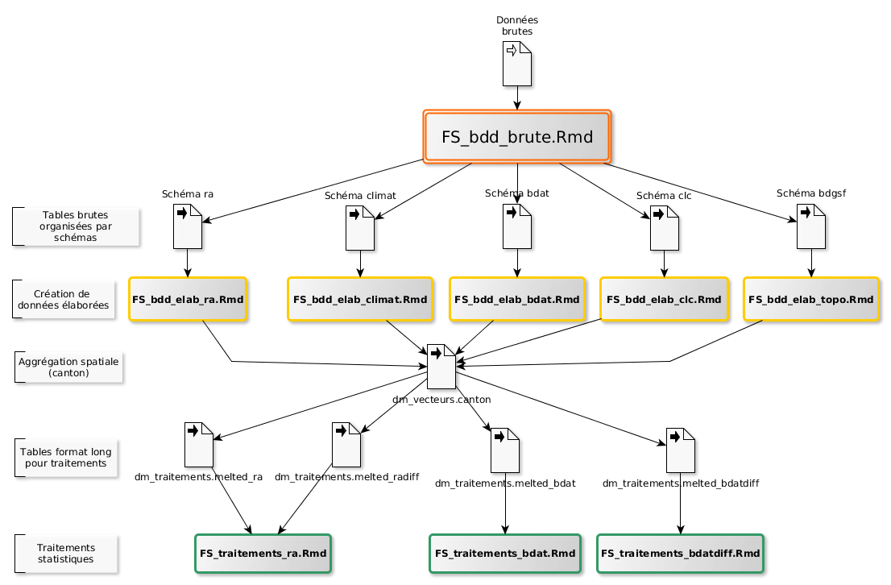

```{r, tidy=FALSE,eval=TRUE,echo=FALSE}
mo_url <- "https://github.com/GisEDSol/Carbo_elevage/tree/master/Documentation/Modes_operatoires/"
raw_mo_url <- "https://rawgit.com/GisEDSol/Carbo_elevage/master/Documentation/Modes_operatoires/"
```

# Objectif et domaine d'application

Ce document présente la démarche et l'organisation du projet appelé par facilité `Carbo_elevage`. Le projet a pour objectif d'étudier l'évolution des teneurs en carbone organique en France sous le regard de l'évolution de l'occupation du sol en lien avec l'élevage. Le travail est basé sur les analyses de la [BDAT](https://www.gissol.fr/le-gis/programmes/base-de-donnees-danalyses-des-terres-bdat-62) et il se divise en deux grandes phases :

- La construction d'une base de données regroupant des données sols (essentiellement la BDAT) et les facteurs potentiellement explicatifs de la distribution spatiale et temporelle des teneurs en carbone organique et des évolutions associées,
- L'analyse statistique de la distribution des teneurs en carbone organique et de ces évolutions.
 
L'objectif du document est de fournir l'ensemble des éléments pratiques pour reprendre le projet en 4 étapes :

- **Etape 1** Accès aux scripts de travail
- **Etape 2** Accès à la base de données
- **Etape 3** Mise en place des connexions entre les scripts et la base de données
- **Etape 4** Exploitation des scripts

# Démarche de travail

## Le choix des scripts en R+markdown

L'ensemble des scripts développés dans le projet est développé en `R+markdown` (ou **Rmd**). Il s'agit d'un langage en balisage léger qui offre une syntaxe facile à lire et à écrire (comme le langage wiki) et permet d'y inclure le code R. Pour plus d'informations, [voir](https://rstudio-pubs-static.s3.amazonaws.com/32239_0956f02cef24443abd9525551368ef12.html#1) cette présentation. 

L'utilisation de ce type de langage permet de bien documenter les scripts et d'assurer la reproductibilité des différents scripts. Ainsi, la création de la base de données ainsi que l'ensemble des traitements associés (figures, résultats statistiques, cartographie) sont **reproductibles**.

## L'organisation

L'organisation des fichiers suit la chaine de traitement générale présentée dans la figure ci-dessous (ou en dynamique à cette [adresse](https://rawgit.com/Rosalien/GISEDSol/master/Documentation/Modes_operatoires/Figures/workflow.html)).



Ce schéma décrit l'organisation générale des scripts et leur lien avec la base de données. Il suit la démarche suivante : 

- les données brutes (données sur les sol + autres données) sont intégrées dans la base de données à travers plusieurs commandes centralisées dans le fichier `FS_bdd_brute`. Ces données sont organisées dans la base à travers plusieurs schémas portant le nom des données intégrées (par ex. `bdat`) ou la thématique (par ex. `climat`),
- Plusieurs scripts exploitent ces tables brutes pour générer des indicateurs à l'échelle du canton. Ils portent le nom de la donnée manipulée. L'ensemble de ces scripts permet d'alimenter les tables de travail appelé data_mart (préfixe `dm`),
- Ces tables de travail sont exploitées pour analyser les teneurs et les évolutions des teneurs en carbone organique. L'analyse de ces données a lieu dans les scripts portant le nom du traitement réalisé.

Pour faciliter la navigation dans l'arborescence et le contenu des fichiers, le nom des scripts (type .Rmd) est nommé selon la règle suivante :

- Répertoire Mode_opératoire : préfixe `MO_`
- Répertoire Fonctions : préfixe `F_`
- Tous les fichiers de suivi : préfixe `FS_`
- Les fichiers de suivi relatifs à la création de la base de données `FS_bdd`
- Les fichiers de suivi relatifs à la création des données élaborées la base de données `FS_elab`
- Les fichiers de suivi relatifs aux traitements des données `FS_traitements`

# Etape 1 : Accès aux scripts de travail

L'ensemble du travail (création de la BDD et les analyses statistiques) est développé sous forme de scripts utilisant principalement le langage Rmd, SQL et bash. 

Tous les scripts sont centralisés et organisés dans un dépôt [GitHub](https://fr.wikipedia.org/wiki/GitHub). Il s'agit d'un service web d'hébergement et de gestion de développement de scripts utilisant le logiciel de gestion de versions **git**. Dans ce type de logiciel, le dépôt représente une copie du projet. Chaque ordinateur d’un développeur qui travaille sur le projet possède donc une copie du dépôt. Dans chaque dépôt, on trouve les fichiers du projet ainsi que leur historique.

**Dans la suite**, le mode opératoire est principalement dédié à un système basé sous linux. Des liens vers des modes opératoires spécifiques à Windows seront proposés.

## Le dépôt GitHub

### Caractéristiques

Le dépôt GitHub du projet `Carbo_elevage` est hébergé à cette adresse [https://github.com/GisEDSol/Carbo_elevage](https://github.com/GisEDSol/Carbo_elevage). Les paramètres de connexion sont les suivants: 

- **Nom d'utilisateur** : GisEDSol ou giselevagesdemain.groupesol@gmail.com
- **Mot de passe** : Adressez une demande à stephanie.potok@inra.fr

### Importation du dépôt en local

L'importation et la connexion au dépôt du projet est réalisé de la manière suivante sous linux. Les commandes suivantes permettent :

- d'installer le logiciel git,
- de configurer git,
- de cloner le projet (consiste à récupérer tout l’historique et tous les codes source du projet).

De nombreuses documentations existent sur internet pour faciliter l'utilisation de git. Parmi celles-ci, ce [tutoriel](https://openclassrooms.com/courses/gerez-vos-codes-source-avec-git) présente bien les concepts associés à Git et guide l'utilisateur à son utilisation sur windows et linux. Une partie des commandes ci-dessous provient de ce tutoriel.

```{r,echo=TRUE,eval=FALSE}
# Installation du paquet git 
sudo apt-get install git

# Configuration pour la couleur dans Git
git config --global color.diff auto
git config --global color.status auto
git config --global color.branch auto

# Configuration du pseudo et de l'email (Si vous avez déjà un compte GitHub, rajouter vos propres identifiants)
git config --global user.name "GisEDSol"
git config --global user.email giselevagesdemain.groupesol@gmail.com

# Clonage du projet (se placer dans l'arborescence voulue)
git clone https://github.com/GisEDSol/Carbo_elevage.git
```

### Organisation du dépôt

L'organisation du dépôt est décrit dans le fichier [Readme.md](https://github.com/GisEDSol/Carbo_elevage/blob/master/Readme.md). 

```{r,eval=FALSE,echo=TRUE}
├── Documentation
│   ├── Metadonnees
│   ├── Modes_operatoires
│   └── Readme.md
├── Fichiers_suivis
│   ├── BDD
│   ├── Readme.md
│   └── Traitements
├── Fonctions
│   ├── bash
│   ├── python
│   ├── R
│   └── Readme.md
└── Readme.md
```
**Important :** pour faciliter la navigation dans l'arborescence du projet, plusieurs fichier `Readme.md` sont présents, il est important de les maintenir à jour.

# Etape 2 : Importation de la base de données

Deux formats de système de gestion de base de données sont proposées :

- PostgreSQL/PostGIS : la base initiale a été développée sous PostgreSQL/PostGIS et une copie de cette base est disponible. L'ensemble des scripts de traitements de données sont directement est lié à ce type de format. **L'importation de la base PostgreSQL est donc indispensable pour exploiter les scripts**.
- SQLIte/SpatiaLite : une version au format sqLite/SpatiaLite est proposée pour l'utilisateur souhaitant visualiser et exploiter les données présente dans la base. En revanche, la base n'est pas organisée, ne contient pas de métadonnées et ne pourra pas être directement exploitée avec les scripts de traitements du dépôt.

**Important** Pour une description de la base de données, voir ce [mode opératoire](`r raw_mo_url`MO_bdd.html).

## Chargement de la base sous SQLite/SpatiaLite

## Importation de la base de données en PostgreSQL/PostGIS

### Création d'un serveur PostgreSQL/PostGIS

*Pour une création de base de données sous windows, vous pouvez consulter ce [mode opératoire](http://www.supinfo.com/articles/single/977-creer-une-base-donnees-avec-postgresql-windows)*

L'imporation de la base de données sous le format PostgreSQL/PostGIS nécessite la création d'un serveur dédié. Celui-ci peut être créé en local ou être déposé sur un serveur à distance.
Les commandes suivantes permettent d'installer un serveur postgreSQL et de le configurer pour importer la base de données :

- Copier/coller ces commandes pour l'installation des paquets postgreSQL/postGIS, du logiciel pgadmin3 ainsi que des librairies ODBC :

```{r, engine='bash',highlight=TRUE,eval=FALSE}
sudo su -
apt-add-repository ppa:flexiondotorg/postgres
apt-get update
apt-get install -y pgadmin3 pgadmin3-data postgresql-contrib postgresql-9.5-plr pgadmin3 unixodbc odbc-postgresql unixodbc-dev postgis #Ensemble des paquets pour les bases de données
apt-get install build-essential cmake  libgdal1-dev libproj-dev #paquets pour utiliser les librairies de traitements de données spatiales de gdal/ogr 
```

- Ci-dessous, les commandes permettent de créer un utilisateur et d'installer les extensions postgis. L'utilisateur devra définir son nom d'utilisateur ainsi que le mot de passe. Ces paramètres de connexion seront par la suite utilisés pour la connexion entre R et la base de données (avec ODBC). Lancer les lignes suivantes une à une dans un terminal et modifier *nomutilisateur* pour le nom d'utilisateur de la base et "******" pour le mot de passe :

```{r, engine='bash',highlight=TRUE,eval=FALSE}
sudo -i -u postgres
psql
CREATE USER nomutilisateur;
ALTER ROLE nomutilisateur WITH CREATEDB;
CREATE DATABASE sol_elevage OWNER nomutilisateur;
ALTER USER nomutilisateur WITH ENCRYPTED PASSWORD '******';
ALTER USER nomutilisateur with superuser;
\q
exit
psql sol_elevage
CREATE EXTENSION postgis;
CREATE EXTENSION postgis_topology;
```    

### Importation de la base de données 

*Pour plus d'informations sur la sauvegarde et la restauration d'une base de données postgresql, voir la [documentation officielle](http://doc.postgresql.fr/9.5/backup.html)*

Pour l'importation de la base, copier/coller les commandes ci-dessous dans un terminal pour intégrer les rasters (selon cette [discussion](http://postgis.17.x6.nabble.com/Error-on-a-raster-table-restore-td5009569.html)) :

```{r, engine='bash',highlight=TRUE,eval=FALSE}
psql sol_elevage
Alter Function _raster_constraint_nodata_values (raster) SET Search_path="$user", pg_catalog,public;
Alter Function _raster_constraint_out_db (raster) SET Search_path="$user", pg_catalog,public;
Alter Function _raster_constraint_pixel_types(raster) SET Search_path="$user", pg_catalog,public;
Alter Function _overview_constraint(raster, integer, name, name, name)  SET Search_path="$user", pg_catalog,public;
```

L'importation de la base est ensuite réalisée simplement avec la commande suivante. Pour la lancer, vous devez vous placer dans l'arborescence contenant le fichier `sol_elevage.sql`. **La commande donne de nombreux messages d'erreur, c'est normal.**

```{r, engine='bash',highlight=TRUE,eval=FALSE}
psql -U nomutilisateur sol_elevage < sol_elevage.sql
```

# Etape 3 : Définition des paramètres de connexion entre les scripts et la base de données

## Connexion à la base de données

L'accès à la base de données peut être réalisé avec :

- Un client PostgreSQL à jour ([PgAdminIII](https://www.pgadmin.org/) par exemple),
- Le logiciel R avec une connexion [ODBC](https://fr.wikipedia.org/wiki/Open_Database_Connectivity)
- Un client PostGis (comme par exemple QGIS)

Quoi qu'il en soit, les paramètres de connexion à retenir pour se connecter à la base sont les suivants :
 
- Hôte : localhost
- Port TCP : 5432
- Base : sol_elevage
- Nom d'utilisateur : Défini par l'utilisateur
- Mot de passe : Défini par l'utilisateur

### Connexion ODBC

*Pour un système basé sous windows, le lecteur intéressé peut consulter la page [suivante](http://informatique-mia.inra.fr/r4ciam/ODBC.html).*

Les connexions odbc servent de lien entre le logiciel R et la base de données sous postgreSQL/postGIS. Dans linux, les paramètres de connexion sont configurées dans le fichier `/etc/odbc.ini`. Pour configurer une connexion, une modification de ce fichier est nécessaire. Tapez dans un terminal `sudo gedit /etc/odbc.ini` puis apporter les modifications nécessaires. 

Voici ci-dessous les différents paramètres de connexions relatifs aux différents alias présentés précédemment. Vous pouvez directement copier ces lignes vers le fichier `/etc/odbc.ini` en remplaçant nomutilisateur et mdp par votre nom d'utilisateur et votre mot de passe.

```{r, tidy=FALSE,eval=FALSE}
[ODBC]
InstallDir = /usr/lib

[solelevage]
Driver = /usr/lib/x86_64-linux-gnu/odbc/psqlodbcw.so
Database = sol_elevage
Servername = localhost
Username = ******
Password = ******
Port=5432
Protocol = 8.1
ReadOnly = 0
```
Les connexions ODBC dans R sont possibles avec le paquet `RODBC`. Pour l'installer, tapez la commande suivante dans un terminal R : `install.packages("RODBC")`. **Pour l'installation de R, voir l'étape 4**.
Ensuite, vous pouvez utiliser l'alias des paramètres de connexion du fichier `odbc.ini` dans la fonction décrivant les paramètres de connexion `odbcConnect`. Pour vérifier les modifications apportées au fichier de configuration `odbc.ini`, vous pouvez lancer les lignes de commandes suivantes dans le logiciel R. La liste des paramètres de connexion doit alors s'afficher comme ci-dessous:

```{r, tidy=FALSE,eval=TRUE}
library(RODBC)
print(odbcConnect("solelevage",case="postgresql", believeNRows=FALSE))
```

## Import des paquets et des variables locales

La gestion des fonctions, des paquets et des variables locales utilisées dans le projet est centralisée au sein d'une seule fonction, appelée `importparametres.R`. En important cette fonction dans R, les paquets utiles au projet seront installés, les fonctions et les variables locales seront chargées.
Sur linux, il est nécessaire d'installer certaines dépendances avant d'installer certains paquets (comme rgdal par exemple) :

```{r, tidy=FALSE,eval=FALSE}
sudo apt-get install libgdal1-dev
```

Voici les commandes utiles pour charger les paramètres dans une session R. **Attention, dans le cas d'une première utilisation, l'installation des paquets peut être longue (entre 30 minutes et 1 heure)**

```{r chargement, echo=TRUE,eval=FALSE}
repmaster <- "/media/sf_GIS_ED/Dev/Scripts/master/" #Chemin du dépôt GitHub en local (A changer pour l'utilisateur)
repdata <- "/media/sf_GIS_ED/Dev/Data/" #Chemin d'accès aux répertoires de données brutes
source(paste(repmaster,"Fonctions/R/importparametres.R",sep=""))
importparametres(repmaster=repmaster,repdata=repdata,dsn="PG:dbname='sol_elevage' host='localhost' port='5432' user='nomutilisateur'")
```
Une fois lancé, les différents scripts du dépôt peuvent être utilisés. C'est l'objet de l'étape 4

# Etape 4 : Exploitation des scripts

Cette étape présente rapidement les modalités d'action pour exploiter les scripts.

## Installation de RStudio

### Préparation/installation des paquets

1. Télécharger et installer la dernière version de Rstudio.

- Pour linux :
	- Ouvrir un terminal linux est taper `sudo apt-get install libjpeg62 libgstreamer0.10-0 libgstreamer-plugins-base0.10-0`	
	- Ouvrir un terminal linux et taper `wget https://download1.rstudio.org/rstudio-1.0.136-amd64.deb` pour une machine en 64-bit ou `wget http://download1.rstudio.org/rstudio-0.98.1080-i386.deb` pour une machine en 32-bit (voir [le site web](http://www.rstudio.com/products/rstudio/download/) pour récupérer le nom de la dernière version de Rstudio)
	- Lancer la commande suivante dans le même terminal en fonction du nom du fichier que vous venez de télécharger : `sudo dpkg -i rstudio-1.0.136-amd64.deb`
- Pour windows : Vous pouvez télécharger la dernière version en cliquant sur ce [lien](https://download1.rstudio.org/RStudio-1.0.136.exe)

2. (Pour linux) Configurer le système et installer les paquets R nécessaires :
- Toujours dans un terminal, lancer les commandes suivantes pour créer un lien symbolique : `sudo ln -s /usr/lib/rstudio/bin/pandoc/pandoc /usr/local/bin` et `sudo ln -s /usr/lib/rstudio/bin/pandoc/pandoc-citeproc /usr/local/bin`

3. Une fois installer Rstudio. Vous pouvez 
- Dans une console `R`, installer les paquets suivants avec la commande : `install.packages(c("knitr","htmltools","caTools","bitops","rmarkdown"))`

### Création d'un fichier dans Rstudio

Une fois le modèle de fichier de suivi importé dans votre espace de travail (plus d'infos sur l'organisation d'un projet [ici](`r mo_url`MO_accesdepot.html)) :

- Double clics sur le fichier `.Rmd`
- Assurez-vous que `KnitR` soit bien configuré par défault (Tools>>Global Options>> Sweave >> sélectionnez KnitR)
- Compiler le document : 
	* cliquez sur knitHTML pour compiler le document en html


*En cas de problème (ou pour avoir davantage d'information) avec la compilation des fichiers de suivi, vous pouvez consulter la [documentation officielle](http://rmarkdown.rstudio.com/lesson-1.html) de R+Markdown.*

### Création d'un fichier en dehors de Rstudio (en ligne de commande pour linux)

Si vous souhaitez utiliser ces fonctionnalités en dehors de Rstudio (le logiciel peut se révéler parfois très lent lors de la génération de rapport complexe et long), il est possible de créer les fichiers de suivi à travers une ligne de commande (en **bash**). Le rendu est identique aux sorties de Rstudio (selon https://stat.ethz.ch/pipermail/r-help/2014-August/421215.html) :

- Ouvrir un terminal linux et lancer la commande suivante dans le répertoire où se trouve le fichier `.Rmd` : `echo "rmarkdown::render('nomfichier.Rmd')" | R --vanilla`

- Vous pouvez également utiliser cette ligne dans une boucle afin de créer à la volée les fichiers de suivi présent dans un répertoire : 

```{r, tidy=FALSE,eval=FALSE,echo=TRUE}
for i in *.Rmd; do
	echo "Sys.setenv(RSTUDIO_PANDOC=\"/usr/lib/rstudio/bin/pandoc/\") & rmarkdown::render('$i')" | R --vanilla
done
```

## Utilisation du dépôt GitHub

Nous avons vu précédemment (étape 1) comment importer le projet stocker sur GitHub. Cette section a pour objectif de présenter rapidement les principales commandes utiles pour mettre à jour le dépôt. Pour aller plus loin dans l'utilisation de Git (surtout si plusieurs personnes travaillent sur le dépôt), consultez ce [tutoriel](https://openclassrooms.com/courses/gerez-vos-codes-source-avec-git).

*Le commit consiste à mettre à jour le dépôt à partir de la copie de travail locale. Une nouvelle révision est alors créée. Un log (simple message texte contenant une description des modifications effectuées) doit être saisi à cette occasion. À noter que pour qu'un commit soit possible, il faut que la copie de travail corresponde à la dernière version du dépôt (modifications locales exceptées). Si ce n'est pas le cas, il est nécessaire d'effectuer d'abord un update et de résoudre les conflits éventuels avant de réessayer le commit.*

```{r,echo=TRUE,eval=FALSE}
git status # Pour connaître le status du dépôt
git add nomfichier ou * # Pour ajouter un fichier ou tous les fichiers au dépôt
git commit -m "Mon premier commit" # Pour réaliser un commit en local. 
git push --set-upstream origin master # Pour mettre les corrections vers le dépôt GitHub
```