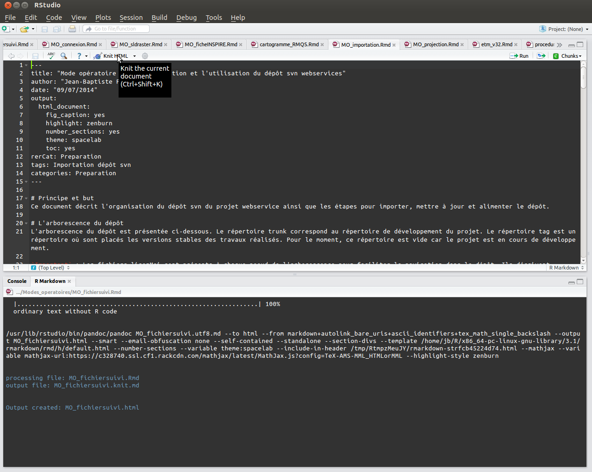

```{r, tidy=FALSE,eval=TRUE,echo=FALSE}
mo_url <- "https://github.com/Rosalien/GISEDSol/tree/master/Documentation/Modes_operatoires/"
#pro_url <- "https://forge.orleans.inra.fr/projects/infosol/repository/entry/Procedure/"
#tmp_url <- "https://forge.orleans.inra.fr/projects/infosol/repository/entry/Template/"
```

# Objectif et domaine d'application
Ce mode opératoire décrit le projet dans sa globalité pour faciliter la reprise en main du travail.

# Vue globale du projet


## La méthode de travail

Ici, on parle de la méthode de travail

Important de bien décrire la fonction `importparametres.R` pour faciliter la configuration des scripts R vers la base de données et l'arborescence du projet

## Le dépôt GitHub

Description de l'arborescence des fichiers et comment importer le dépôt GitHub.


## La base de données

Description de la base de données. Ici, renvoyer vers un mode opératoire basé un fichier sqlite/spatialite.

# Les logiciels utilisés

## R

## Les fonctions gdal/ogr

## Les logiciels SIG


Pour prendre en main cette méthode de travail, voici un exemple d'application.

## Préparation/installation des paquets

1. Télécharger et installer la dernière version de Rstudio :

- Ouvrir un terminal linux est taper `sudo apt-get install libjpeg62`	
- Ouvrir un terminal linux et taper `wget http://download1.rstudio.org/rstudio-0.98.1080-amd64.deb` pour une machine en 64-bit ou `wget http://download1.rstudio.org/rstudio-0.98.1080-i386.deb` pour une machine en 32-bit (voir [le site web](http://www.rstudio.com/products/rstudio/download/) pour récupérer le nom de la dernière version de Rstudio)
- Lancer la commande suivante dans le même terminal en fonction du nom du fichier que vous venez de télécharger : `sudo dpkg -i rstudio-0.98.1080-amd64.deb`

2. Configurer le système et installer les paquets R nécessaires :
- Toujours dans un terminal, lancer les commandes suivantes pour créer un lien symbolique : `sudo ln -s /usr/lib/rstudio/bin/pandoc/pandoc /usr/local/bin` et `sudo ln -s /usr/lib/rstudio/bin/pandoc/pandoc-citeproc /usr/local/bin`
- Dans une console `R`, installer les paquets suivants avec la commande : `install.packages(c("knitr","htmltools","caTools","bitops","rmarkdown"))`

3. Télécharger le modèle de fichier de suivi de la forge
- Télécharger ce [document](`r tmp_url`Modele_FichierSuivi.Rmd) et copier dans un répertoire de travail.

## Création d'un fichier dans Rstudio
Une fois le modèle de fichier de suivi importé dans votre espace de travail (plus d'infos sur l'organisation d'un projet [ici](`r mo_url`MO_accesdepot.html)) :

- Double clics sur le fichier `.Rmd`
- Assurez-vous que `KnitR` soit bien configuré par défault (Tools>>Global Options>> Sweave >> sélectionnez KnitR)
- Essayez de compiler le document : 
	* cliquez sur knitHTML pour compiler le document en html


## Création d'un fichier en dehors de Rstudio (en ligne de commande pour linux)
Si vous souhaitez utiliser ces fonctionnalités en dehors de Rstudio (le logiciel peut se révéler parfois très lent lors de la génération de rapport complexe et long), il est possible de créer les fichiers de suivi à travers une ligne de commande (en **bash**). Le rendu est identique aux sorties de Rstudio (selon https://stat.ethz.ch/pipermail/r-help/2014-August/421215.html) :

- Ouvrir un terminal linux et lancer la commande suivante dans le répertoire où se trouve le fichier `.Rmd` : `echo "rmarkdown::render('nomfichier.Rmd')" | R --vanilla`

- Vous pouvez également utiliser cette ligne dans une boucle afin de créer à la volée les fichiers de suivi présent dans un répertoire : 

```{r, tidy=FALSE,eval=TRUE,echo=FALSE}
for i in *.Rmd; do
	echo "rmarkdown::render('$i')" | R --vanilla
done
```
