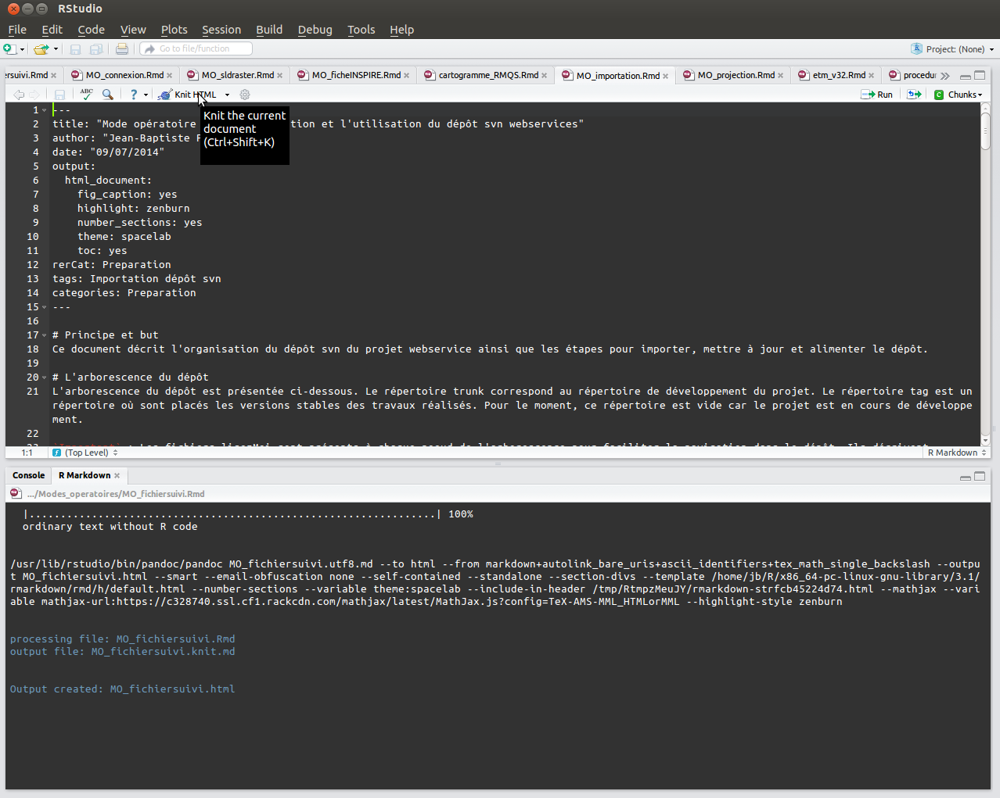

Mode opératoire pour reprendre en main le projet Carbo\_elevage
================
Jean-Baptiste Paroissien

-   [Objectif et domaine d'application](#objectif-et-domaine-dapplication)
-   [Démarche de travail](#demarche-de-travail)
    -   [Le nom des fichiers dans le dépôt](#le-nom-des-fichiers-dans-le-depot)
-   [Etape 1 : Accès aux scripts de travail](#etape-1-acces-aux-scripts-de-travail)
    -   [Le dépôt GitHub](#le-depot-github)
-   [Etape 2 : Importation de la base de données](#etape-2-importation-de-la-base-de-donnees)
    -   [Chargement de la base sous SQLite/SpatiaLite](#chargement-de-la-base-sous-sqlitespatialite)
    -   [Importation de la base de données en PostgreSQL/PostGIS](#importation-de-la-base-de-donnees-en-postgresqlpostgis)
-   [Etape 3 : Définition des paramètres de connexion entre les scripts et la base de données](#etape-3-definition-des-parametres-de-connexion-entre-les-scripts-et-la-base-de-donnees)
    -   [Connexion à la base de données](#connexion-a-la-base-de-donnees)
    -   [Import des paquets et des variables locales](#import-des-paquets-et-des-variables-locales)
-   [Les logiciels utilisés](#les-logiciels-utilises)
    -   [R](#r)
    -   [Préparation/installation des paquets](#preparationinstallation-des-paquets)
    -   [Création d'un fichier dans Rstudio](#creation-dun-fichier-dans-rstudio)
    -   [Création d'un fichier en dehors de Rstudio (en ligne de commande pour linux)](#creation-dun-fichier-en-dehors-de-rstudio-en-ligne-de-commande-pour-linux)

Objectif et domaine d'application
=================================

Ce mode opératoire décrit le projet appelé `Carbo_elevage` dans sa globalité. Le projet `Carbo_elevage` consiste à d'étudier l'évolution des teneurs en carbone organique en France sous le regard de l'évolution de l'occupation du sol en lien avec l'élevage. Le travail est basé sur les analyses de la [BDAT]() et il se divise en deux grandes phases :

-   La construction d'une base de données regroupant des données sols (essentiellement la BDAT) et les facteurs potentiellement explicatif de ces teneurs et des évolutions associées,
-   L'analyse statistique de la distribution des teneurs en carbone organique et de ces évolutions.

L'objectif du document est de fournir l'ensemble des éléments pratiques pour reprendre le projet en 3 étapes :

-   **Etape 1** Un accès aux scripts de travail
-   **Etape 2** Un accès à la base de données
-   **Etape 3** La connexion entre les scripts de données et la base de données

Démarche de travail
===================

L'organisation des fichiers suit la chaine de traitement générale présentée dans la figure ci-dessous (ou en dynamique à cette [adresse](https://rawgit.com/Rosalien/GISEDSol/master/Documentation/Modes_operatoires/Figures/workflow.html)).


Le nom des fichiers dans le dépôt
---------------------------------

Pour faciliter la navigation dans l'arborescence et le contenu des fichiers, le nom des fichiers de suivi (type .Rmd) est nommé selon la règle suivante :

-   Répertoire Mode\_opératoire : préfixe `MO_`
-   Répertoire Fonctions : préfixe `F_`
-   Tous les fichiers de suivi : préfixe `FS_`
-   Les fichiers de suivi relatifs à la création de la base de données `FS_bdd`
-   Les fichiers de suivi relatifs à la création des données élaborées la base de données `FS_elab`

Etape 1 : Accès aux scripts de travail
======================================

L'ensemble du travail (création de la BDD et les analyses statistiques) est développé sous forme de scripts utilisant principalement le langage R, SQL et bash. Tous les rapports du projet sont écrits en `R+markdown` ce qui permet d'inclure dans le corps du texte du code `R` (les chunks). C'est un langage en balisage léger qui offre une syntaxe facile à lire et à écrire (comme le langage wiki).

Tous les scripts sont centralisés et organisés dans un dépôt [GitHub](). Il s'agit d'un service web d'hébergement et de gestion de développement de scripts utilisant le logiciel de gestion de versions [Git](). Dans ce type de logiciel, le dépôt représente une copie du projet. Chaque ordinateur d’un développeur qui travaille sur le projet possède donc une copie du dépôt. Dans chaque dépôt, on trouve les fichiers du projet ainsi que leur historique.

**Dans la suite**, le mode opératoire est principalement dédié à un système basé sous linux. Des liens vers des modes opératoires spécifiques à Windows seront proposés.

Le dépôt GitHub
---------------

### Caractéristiques

Le dépôt GitHub du projet `Carbo_elevage` est hébergé à cette adresse <https://github.com/GisEDSol/Carbo_elevage>. Les paramètres de connexion sont les suivants:

-   **Nom d'utilisateur** : GisEDSol ou <giselevagesdemain.groupesol@gmail.com>
-   **Mot de passe** : Adressez une demande à <stephanie.potok@inra.fr>

### Importation du dépôt en local

L'importation et la connexion au dépôt du projet est réalisé de la manière suivante sous linux. Les commandes suivantes permettent :

-   d'installer le logiciel git,
-   de configurer git,
-   de cloner le projet (consiste à récupérer tout l’historique et tous les codes source du projet).

De nombreuses documentations existent sur internet pour faciliter l'utilisation de git. Parmi celles-ci, ce [tutoriel](https://openclassrooms.com/courses/gerez-vos-codes-source-avec-git) présente bien les concepts associés à Git et guide l'utilisateur à son utilisation sur windows et linux. Une partie des commandes ci-dessous provient de ce tutoriel.

``` r
# Installation du paquet git 
sudo apt-get install git

# Configuration pour la couleur dans Git
git config --global color.diff auto
git config --global color.status auto
git config --global color.branch auto

# Configuration du pseudo et de l'email (Si vous avez déjà un compte GitHub, rajouter vos propres identifiants)
git config --global user.name "GisEDSol"
git config --global user.email giselevagesdemain.groupesol@gmail.com

# Clonage du projet (se placer dans l'arborescence voulu)
git clone https://github.com/GisEDSol/Carbo_elevage.git
```

### Organisation du dépôt

L'organisation du dépôt est décrit dans le fichier [Readme.md](https://github.com/GisEDSol/Carbo_elevage/blob/master/Readme.md).

**Important :** pour faciliter la navigation dans l'arborescence du projet, plusieurs fichier `Readme.md` sont présents, il est important de les maintenir à jour.

``` r
├── Documentation
│   ├── Metadonnees
│   └── Modes_operatoires
├── Fichiers_suivis
│   ├── BDD
│   ├── Readme.md
│   ├── Shiny
│   └── Traitements
├── Fonctions
│   ├── bash
│   ├── python
│   ├── R
│   └── Readme.md
```

Etape 2 : Importation de la base de données
===========================================

Description de la base de données. Ici, renvoyer vers un mode opératoire basé un fichier sqlite/spatialite.
Rapidement présenter le deux types de base de données

**Important** Pour une description de la base de données, voir ce [mode opératoire](https://github.com/Rosalien/GISEDSol/tree/master/Documentation/Modes_operatoires/MO_bdd.Rmd).

Chargement de la base sous SQLite/SpatiaLite
--------------------------------------------

Importation de la base de données en PostgreSQL/PostGIS
-------------------------------------------------------

### Création d'un serveur PostgreSQL/PostGIS

L'imporation de la base de données sous le format PostgreSQL/PostGIS nécessite la création d'un serveur PostgreSQL/PostGIS. Les commandes suivantes permettent d'installer les

La création de la base postgresql/postgis est réalisée selon la procédure suivante dans un terminal linux :

-   Installation des paquets postgreSQL/postGIS et autres logiciels pour l'utilisation de postgreSQL/postGIS.

``` bash
sudo su -
apt-add-repository ppa:flexiondotorg/postgres
apt-get update
apt-get install -y pgadmin3 pgadmin3-data postgresql-contrib postgresql-9.5-plr pgadmin3 unixodbc odbc-postgresql unixodbc-dev postgis
```

-   Ci-dessous, les commandes permettent de créer un utilisateur et d'installer les extensions postgis. L'utilisateur devra définir son nom d'utilisateur ainsi que le mot de passe. Ces paramètres de connexion seront par la suite utilisés pour la connexion entre R et la base de données.

``` bash
sudo -i -u postgres
CREATE USER nomutilisateur;
ALTER ROLE nomutilisateur WITH CREATEDB;
CREATE DATABASE sol_elevage OWNER nomutilisateur;
ALTER USER nomutilisateur WITH ENCRYPTED PASSWORD '******';
CREATE DATABASE sol_elevage OWNER nomutilisateur;
CREATE EXTENSION postgis;
CREATE EXTENSION postgis_topology;
```

### Importation de la base de données

L'importation de la base est réalisée de la manière suivante :

``` bash
sol_elevage.sql
```

Etape 3 : Définition des paramètres de connexion entre les scripts et la base de données
========================================================================================

Connexion à la base de données
------------------------------

La connexion à la base de données peut être réalisé avec :

-   Un client PostgreSQL à jour ([PgAdminIII](https://www.pgadmin.org/) par exemple)
-   Le logiciel R avec une connexion ODBC.

Quoi qu'il en soit, les paramètres de connexion à retenir pour se connecter à la base sont les suivants :

-   Hôte : localhost
-   Port TCP : 5432
-   Base : sol\_elevage
-   Nom d'utilisateur : Défini par l'utilisateur
-   Mot de passe : Défini par l'utilisateur

### Connexion ODBC

*Dans la suite, le mode opératoire est proposé pour un système linux. Pour un système basé sous windows, le lecteur intéressé peut consulter la page [suivante](http://informatique-mia.inra.fr/r4ciam/ODBC.html).*

Les connexions odbc servent de lien entre le logiciel R et la base de données sous postgreSQL/postGIS. Dans linux, les paramètres de connexion sont configurées dans le fichier `\etc\odbc.ini`. Pour configurer une connexion, une modification de ce fichier est nécessaire. Tapez dans un terminal `sudo gedit \etc\odbc.ini` puis apporter les modifications nécessaires.

Voici ci-dessous les différents paramètres de connexions relatifs aux différents alias présentés précédemment. Vous pouvez directement copier ces lignes vers le fichier `\etc\odbc.ini` en remplaçant nomutilisateur\_ldap et mdp\_ldap par votre nom d'utilisateur et votre mot de passe LDAP.

-   Database : Nom de la base de données
-   Servername : Nom du serveur
-   Username : Nom d'utilisateur
-   Password : Mot de passe
-   Port : Port de la base de données

``` r
[ODBC]
InstallDir = /usr/lib

[solelevage] # A garder
Driver = /usr/lib/x86_64-linux-gnu/odbc/psqlodbcw.so # A garder
Database = sol_elevage # A garder
Servername = localhost # A garder
Username = ****** # Changer en fonction du nom d'utilisateur
Password = ****** # Changer en fonction du mdp défini par l'utilisateur
Port=5432 # A garder
Protocol = 8.1 # A garder
ReadOnly = 0 # A garder
```

Les connexions ODBC dans R sont possibles avec le paquet `RODBC`. Pour l'installer, tapez la commande suivante dans un terminal R : `install.packages("RODBC")`.
Ensuite, vous pouvez utiliser l'alias des paramètres de connexions du fichier `odbc.ini` dans la fonction décrivant les paramètres de connexion `odbcConnect`. Pour vérifier les modifications apportées au fichier de configuration `odbc.ini`, vous pouvez lancer les lignes de commandes suivantes dans le logiciel R. La liste des paramètres de connexion doit alors s'afficher comme ci-dessous:

``` r
library(RODBC)
print(odbcConnect("solelevage",case="postgresql", believeNRows=FALSE))
```

    ## RODBC Connection 1
    ## Details:
    ##   case=tolower
    ##   DSN=solelevage
    ##   DATABASE=sol_elevage
    ##   SERVER=localhost
    ##   PORT=5432
    ##   UID=jb
    ##   PWD=******
    ##   SSLmode=disable
    ##   ReadOnly=0
    ##   Protocol=8.1
    ##   FakeOidIndex=0
    ##   ShowOidColumn=0
    ##   RowVersioning=0
    ##   ShowSystemTables=0
    ##   ConnSettings=
    ##   Fetch=100
    ##   Socket=4096
    ##   UnknownSizes=0
    ##   MaxVarcharSize=255
    ##   MaxLongVarcharSize=8190
    ##   Debug=0
    ##   CommLog=1
    ##   Optimizer=0
    ##   Ksqo=1
    ##   UseDeclareFetch=0
    ##   TextAsLongVarchar=1
    ##   UnknownsAsLongVarchar=0
    ##   BoolsAsChar=1
    ##   Parse=0
    ##   CancelAsFreeStmt=0
    ##   ExtraSysTablePrefixes=dd_
    ##   
    ##   LFConversion=0
    ##   UpdatableCursors=1
    ##   DisallowPremature=0
    ##   TrueIsMinus1=0
    ##   BI=0
    ##   ByteaAsLongVarBinary=0
    ##   UseServerSidePrepare=1
    ##   LowerCaseIdentifier=0

Import des paquets et des variables locales
-------------------------------------------

La gestion des fonctions, des paquets et des variables locales utilisées dans le projet est centralisée au sein d'une seule fonction, appelée `importparametres.R`. En important cette fonction dans R, les paquets utiles au projet seront installés, les fonctions et les variables locales seront chargées.
Voici les commandes utiles pour charger les paramètres :

``` r
repmaster <- "/media/sf_GIS_ED/Dev/Scripts/master/" #Chemin du dépôt GitHub en local
source(paste(repmaster,"Fonctions/R/importparametres.R",sep=""))
importparametres(repmaster=repmaster,repdata="/media/sf_GIS_ED/Dev/Data/",dsn="PG:dbname='sol_elevage' host='localhost' port='5432' user='jb'")
```

Les logiciels utilisés
======================

R
-

Préparation/installation des paquets
------------------------------------

1.  Télécharger et installer la dernière version de Rstudio :

-   Ouvrir un terminal linux est taper `sudo apt-get install libjpeg62`
-   Ouvrir un terminal linux et taper `wget http://download1.rstudio.org/rstudio-0.98.1080-amd64.deb` pour une machine en 64-bit ou `wget http://download1.rstudio.org/rstudio-0.98.1080-i386.deb` pour une machine en 32-bit (voir [le site web](http://www.rstudio.com/products/rstudio/download/) pour récupérer le nom de la dernière version de Rstudio)
-   Lancer la commande suivante dans le même terminal en fonction du nom du fichier que vous venez de télécharger : `sudo dpkg -i rstudio-0.98.1080-amd64.deb`

1.  Configurer le système et installer les paquets R nécessaires :

-   Toujours dans un terminal, lancer les commandes suivantes pour créer un lien symbolique : `sudo ln -s /usr/lib/rstudio/bin/pandoc/pandoc /usr/local/bin` et `sudo ln -s /usr/lib/rstudio/bin/pandoc/pandoc-citeproc /usr/local/bin`
-   Dans une console `R`, installer les paquets suivants avec la commande : `install.packages(c("knitr","htmltools","caTools","bitops","rmarkdown"))`

1.  Télécharger le modèle de fichier de suivi de la forge

Création d'un fichier dans Rstudio
----------------------------------

Une fois le modèle de fichier de suivi importé dans votre espace de travail (plus d'infos sur l'organisation d'un projet [ici](https://github.com/Rosalien/GISEDSol/tree/master/Documentation/Modes_operatoires/MO_accesdepot.html)) :

-   Double clics sur le fichier `.Rmd`
-   Assurez-vous que `KnitR` soit bien configuré par défault (Tools&gt;&gt;Global Options&gt;&gt; Sweave &gt;&gt; sélectionnez KnitR)
-   Essayez de compiler le document :
    -   cliquez sur knitHTML pour compiler le document en html
        

Création d'un fichier en dehors de Rstudio (en ligne de commande pour linux)
----------------------------------------------------------------------------

Si vous souhaitez utiliser ces fonctionnalités en dehors de Rstudio (le logiciel peut se révéler parfois très lent lors de la génération de rapport complexe et long), il est possible de créer les fichiers de suivi à travers une ligne de commande (en **bash**). Le rendu est identique aux sorties de Rstudio (selon <https://stat.ethz.ch/pipermail/r-help/2014-August/421215.html>) :

-   Ouvrir un terminal linux et lancer la commande suivante dans le répertoire où se trouve le fichier `.Rmd` : `echo "rmarkdown::render('nomfichier.Rmd')" | R --vanilla`

-   Vous pouvez également utiliser cette ligne dans une boucle afin de créer à la volée les fichiers de suivi présent dans un répertoire :

``` r
for i in *.Rmd; do
    echo "Sys.setenv(RSTUDIO_PANDOC=\"/usr/lib/rstudio/bin/pandoc/\") & rmarkdown::render('$i')" | R --vanilla
done
```
