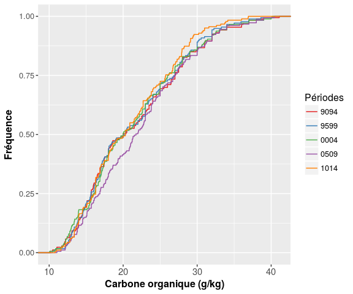
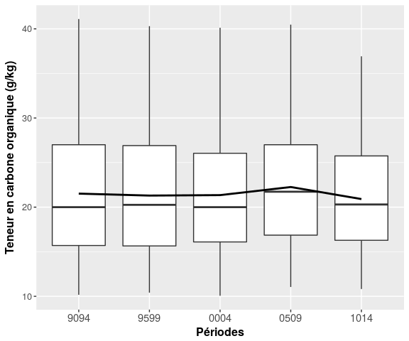
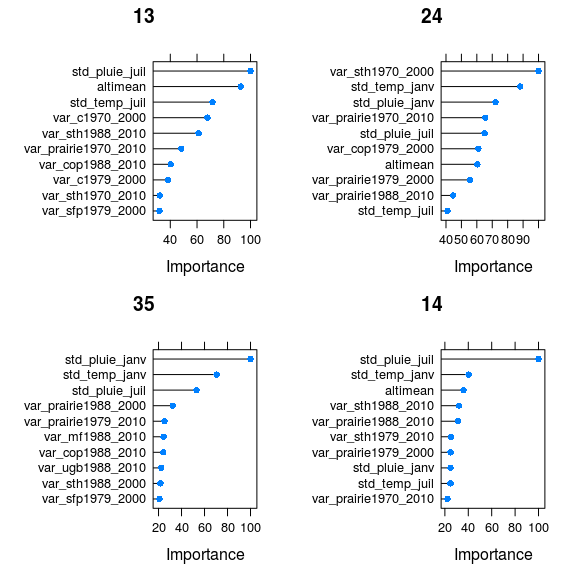
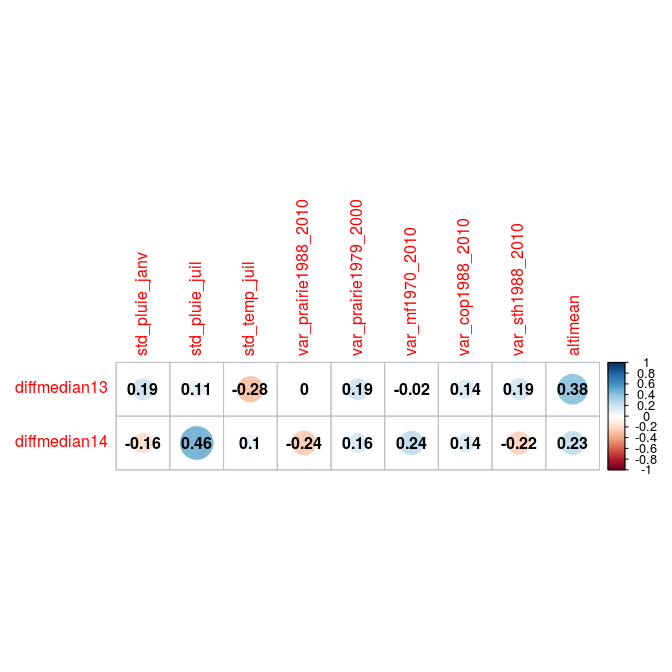
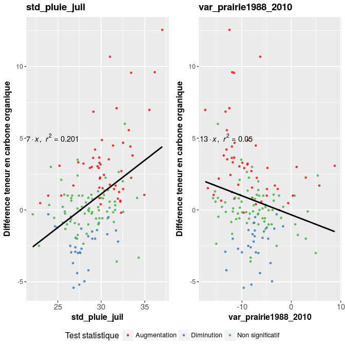
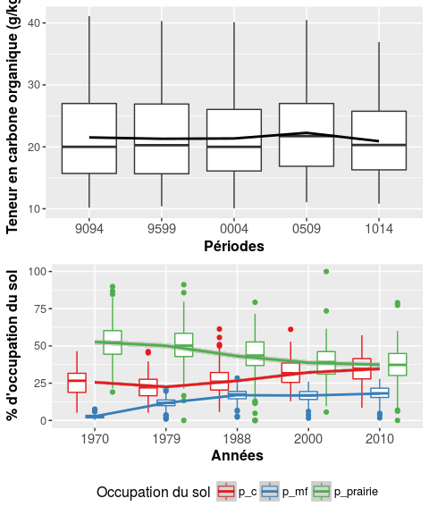
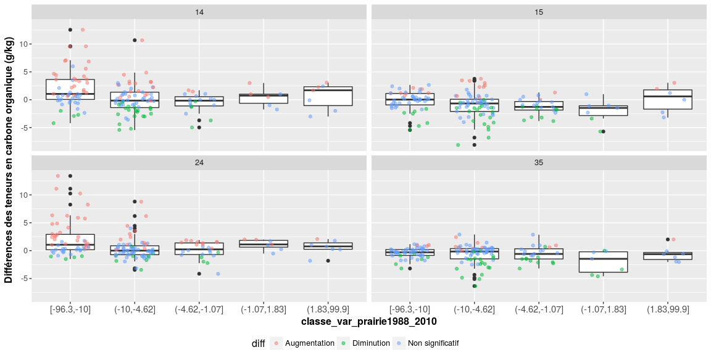

Evolution des teneurs en carbone organique en Bretagne
================
Jean-Baptiste Paroissien
07/02/2017

-   [Objectifs](#objectifs)
-   [Cartographie](#cartographie)
-   [Analyse de la distribution pour les différentes périodes](#analyse-de-la-distribution-pour-les-differentes-periodes)
    -   [GBM](#gbm)
    -   [Analyses des variables sélectionnées pour les périodes 13 et 14](#analyses-des-variables-selectionnees-pour-les-periodes-13-et-14)
    -   [Cartographie des variations](#cartographie-des-variations)
    -   [Analyses simples avec boxplot](#analyses-simples-avec-boxplot)

Objectifs
=========

Cartographie
============

  

**En conclusion**
On observe plusieurs tendances :
- Une diminution des teneurs en C localisée dans le Morbihan pour les 13 et 14
- Une augmentation localisée en Ile et Vilaine sur les périodes 24 et 14.

Analyse de la distribution pour les différentes périodes
========================================================

<figure style="text-align:center;">
<a name="cdf_bretagne"></a>
<figcaption>
</figcaption>
</figure>
<figure style="text-align:center;">
<a name="boxplot_bretagne"></a>
<figcaption>
</figcaption>
</figure>
**Important** Pour la période 0509, il y a une nette augmentation des teneurs en C. La médiane passe de 20 en 2000-2004 à 21.73 en 2005-2009. Globalement, la distribution des valeurs au sein de chaque période n'a pas évolué et le test statistique met en valeur des différences significatives entre les périodes 9599-0004, 9094-1014, 9599-0004, 9599-0509 et 0004-1014.
**A noter** que l'augmentation constatée entre 0004-0509 n'est pas significative.

<table style="width:83%;">
<caption>Statistiques descriptives des teneurs en carbone organique par périodes en Bretagne</caption>
<colgroup>
<col width="15%" />
<col width="9%" />
<col width="13%" />
<col width="12%" />
<col width="9%" />
<col width="13%" />
<col width="8%" />
</colgroup>
<thead>
<tr class="header">
<th align="center"> </th>
<th align="center">Min.</th>
<th align="center">1st Qu.</th>
<th align="center">Median</th>
<th align="center">Mean</th>
<th align="center">3rd Qu.</th>
<th align="center">Max.</th>
</tr>
</thead>
<tbody>
<tr class="odd">
<td align="center"><strong>9094</strong></td>
<td align="center">10.17</td>
<td align="center">15.7</td>
<td align="center">20</td>
<td align="center">21.52</td>
<td align="center">27</td>
<td align="center">41.1</td>
</tr>
<tr class="even">
<td align="center"><strong>9599</strong></td>
<td align="center">10.41</td>
<td align="center">15.65</td>
<td align="center">20.26</td>
<td align="center">21.3</td>
<td align="center">26.9</td>
<td align="center">40.3</td>
</tr>
<tr class="odd">
<td align="center"><strong>0004</strong></td>
<td align="center">10.06</td>
<td align="center">16.1</td>
<td align="center">20</td>
<td align="center">21.35</td>
<td align="center">26.04</td>
<td align="center">40.12</td>
</tr>
<tr class="even">
<td align="center"><strong>0509</strong></td>
<td align="center">11.05</td>
<td align="center">16.86</td>
<td align="center">21.73</td>
<td align="center">22.26</td>
<td align="center">27</td>
<td align="center">40.47</td>
</tr>
<tr class="odd">
<td align="center"><strong>1014</strong></td>
<td align="center">10.82</td>
<td align="center">16.28</td>
<td align="center">20.3</td>
<td align="center">20.91</td>
<td align="center">25.75</td>
<td align="center">36.92</td>
</tr>
</tbody>
</table>

``` r
pairwise.wilcox.test(melted.bdat[,"value"], melted.bdat[,"annees"])
```

    ## 
    ##  Pairwise comparisons using Wilcoxon rank sum test 
    ## 
    ## data:  melted.bdat[, "value"] and melted.bdat[, "annees"] 
    ## 
    ##      9094    9599    0004    0509   
    ## 9599 0.29250 -       -       -      
    ## 0004 0.04997 1.1e-05 -       -      
    ## 0509 0.29250 0.00047 0.75842 -      
    ## 1014 0.77627 0.11941 0.04997 0.29250
    ## 
    ## P value adjustment method: holm

GBM
---

<figure style="text-align:center;">
<a name="gbm_bretagne"></a>
<figcaption>
</figcaption>
</figure>
    ## TableGrob (2 x 2) "arrange": 4 grobs
    ##    z     cells    name                      grob
    ## 13 1 (1-1,1-1) arrange lattice[GRID.lattice.164]
    ## 24 2 (1-1,2-2) arrange lattice[GRID.lattice.165]
    ## 35 3 (2-2,1-1) arrange lattice[GRID.lattice.166]
    ## 14 4 (2-2,2-2) arrange lattice[GRID.lattice.167]

**En conclusion** de cette modélisatoin, on observe la pré-dominance des variables climatiques en sortie des modèles. L'importance et la prédominance de ces variables vis-à-vis des variables d'occupation du sol dépend des périodes analysées. Pour les périodes 13, 14 et 35, la variabilité des pluies mensuelles en Janvier et Juillet représentent les principaux facteurs explicatifs.
La proportion des facteurs d'occupation du sol est plus importante pour les évolutions des teneurs en carbone pour la période 24, avec notamment les variation des surfaces de prairie entre 1988 et 2010. Par la suite, on regardera dans le détail les variables les plus mobilisées dans les modèles.

Analyses des variables sélectionnées pour les périodes 13 et 14
---------------------------------------------------------------

Dans cette section, on regarde dans le détail le comportement des variables isolées vis-à-vis des teneurs en carbone organique pour les périodes 13 et 14. Ces deux périodes présentent une diminution importante des teneurs en C, essentiellement localisées dans le Morhiban...

### Graphiques de comparaison

<figure style="text-align:center;">
<a name="corplot_Bretagne1"></a>
<figcaption>
</figcaption>
</figure>
<figure style="text-align:center;">
<a name="corplot_Bretagne2"></a>
<figcaption>
</figcaption>
</figure>
    ## TableGrob (2 x 1) "arrange": 2 grobs
    ##   z     cells    name              grob
    ## 1 1 (1-1,1-1) arrange   gtable[arrange]
    ## 2 2 (2-2,1-1) arrange gtable[guide-box]

Cartographie des variations
---------------------------

 

Analyses simples avec boxplot
-----------------------------

<figure style="text-align:center;">
<a name="boxplot_occup_C_bretagne"></a>
<figcaption>
</figcaption>
</figure>
<figure style="text-align:center;">
<a name="boxplot_finaux"></a>
<figcaption>
</figcaption>
</figure>
    ## TableGrob (2 x 1) "arrange": 2 grobs
    ##   z     cells    name              grob
    ## 1 1 (1-1,1-1) arrange   gtable[arrange]
    ## 2 2 (2-2,1-1) arrange gtable[guide-box]
