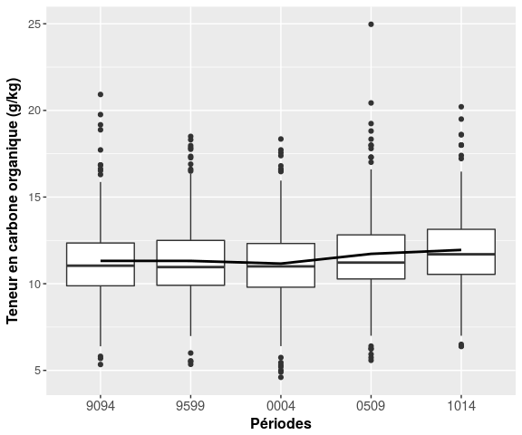
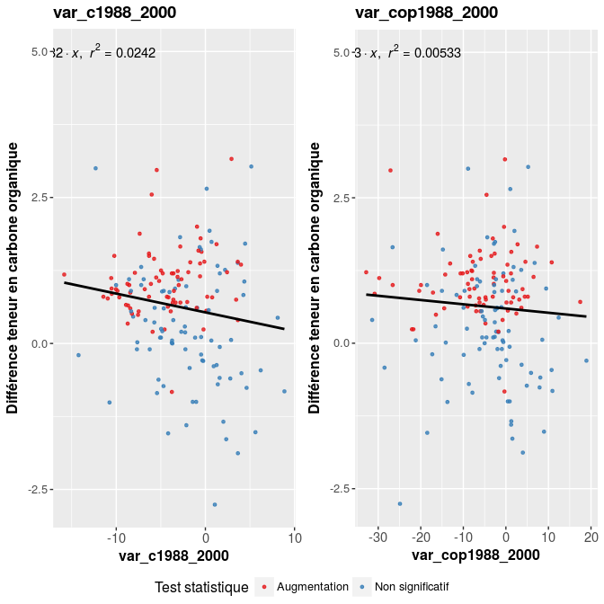
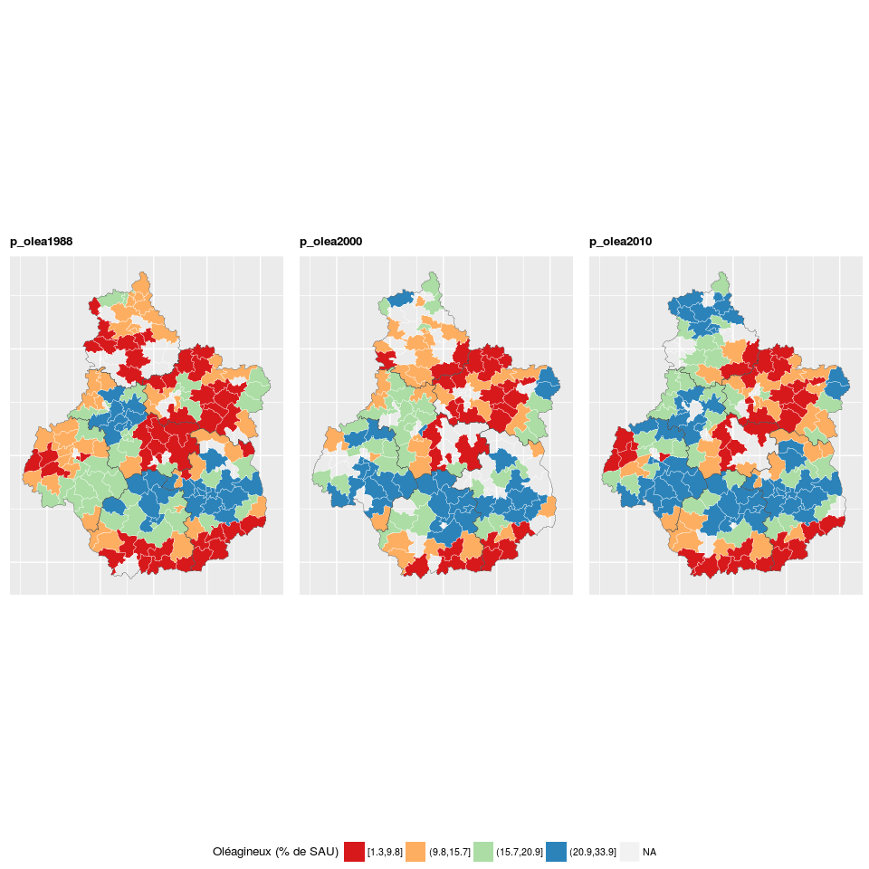
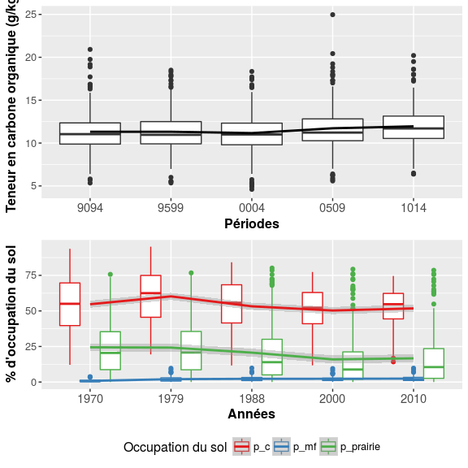
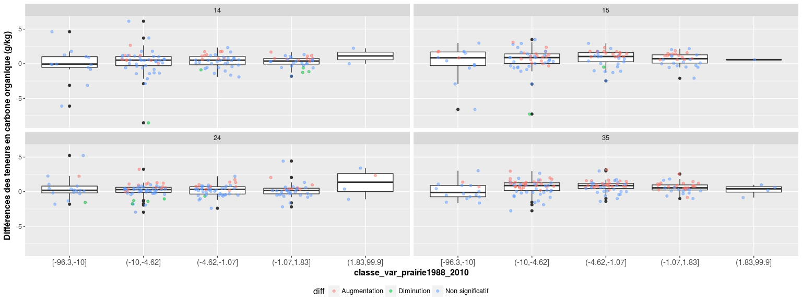

Evolution des teneurs en carbone organique en région Centre
================
Jean-Baptiste Paroissien
07/02/2017

-   [Objectifs](#objectifs)
-   [Cartographie](#cartographie)
-   [Analyse de la distribution pour les différentes périodes](#analyse-de-la-distribution-pour-les-differentes-periodes)
    -   [GBM](#gbm)
    -   [Analyses des variables sélectionnées pour la période 35](#analyses-des-variables-selectionnees-pour-la-periode-35)
    -   [Analyses](#analyses)
    -   [Cartographie des variations](#cartographie-des-variations)
    -   [Analyses simples avec boxplot](#analyses-simples-avec-boxplot)

Objectifs
=========

Cartographie
============

  

**En conclusion**

Analyse de la distribution pour les différentes périodes
========================================================

<figure style="text-align:center;">
<a name="cdf_centre"></a>
<figcaption>
</figcaption>
</figure>
<figure style="text-align:center;">
<a name="boxplot_centre"></a>
<figcaption>
</figcaption>
</figure>
**Important** Après une période de baisse observée entre 9094-9599 (non significative), on observe une augmentation croissante des teneurs en carbone organique à partir de la péroide 9599. La médiane passe ainsi de 10.96 pour 9599 à 11 en 0004 puis 11.22 et 11.7 pour 0509 et 1014 respectivement. Ces augmentations sont significatives entre 9599-0004 et 9599-0509.

<table style="width:83%;">
<caption>Statistiques descriptives des teneurs en carbone organique par périodes en région Centre</caption>
<colgroup>
<col width="15%" />
<col width="9%" />
<col width="13%" />
<col width="12%" />
<col width="9%" />
<col width="13%" />
<col width="8%" />
</colgroup>
<thead>
<tr class="header">
<th align="center"> </th>
<th align="center">Min.</th>
<th align="center">1st Qu.</th>
<th align="center">Median</th>
<th align="center">Mean</th>
<th align="center">3rd Qu.</th>
<th align="center">Max.</th>
</tr>
</thead>
<tbody>
<tr class="odd">
<td align="center"><strong>9094</strong></td>
<td align="center">5.34</td>
<td align="center">9.88</td>
<td align="center">11.04</td>
<td align="center">11.32</td>
<td align="center">12.35</td>
<td align="center">20.92</td>
</tr>
<tr class="even">
<td align="center"><strong>9599</strong></td>
<td align="center">5.35</td>
<td align="center">9.91</td>
<td align="center">10.96</td>
<td align="center">11.32</td>
<td align="center">12.5</td>
<td align="center">18.5</td>
</tr>
<tr class="odd">
<td align="center"><strong>0004</strong></td>
<td align="center">4.6</td>
<td align="center">9.8</td>
<td align="center">11</td>
<td align="center">11.16</td>
<td align="center">12.32</td>
<td align="center">18.35</td>
</tr>
<tr class="even">
<td align="center"><strong>0509</strong></td>
<td align="center">5.58</td>
<td align="center">10.27</td>
<td align="center">11.22</td>
<td align="center">11.72</td>
<td align="center">12.82</td>
<td align="center">24.97</td>
</tr>
<tr class="odd">
<td align="center"><strong>1014</strong></td>
<td align="center">6.38</td>
<td align="center">10.54</td>
<td align="center">11.7</td>
<td align="center">11.95</td>
<td align="center">13.14</td>
<td align="center">20.21</td>
</tr>
</tbody>
</table>

``` r
pairwise.wilcox.test(melted.bdat[,"value"], melted.bdat[,"annees"])
```

    ## 
    ##  Pairwise comparisons using Wilcoxon rank sum test 
    ## 
    ## data:  melted.bdat[, "value"] and melted.bdat[, "annees"] 
    ## 
    ##      9094    9599    0004    0509   
    ## 9599 0.29250 -       -       -      
    ## 0004 0.04997 1.1e-05 -       -      
    ## 0509 0.29250 0.00047 0.75842 -      
    ## 1014 0.77627 0.11941 0.04997 0.29250
    ## 
    ## P value adjustment method: holm

GBM
---

**En conclusion**

Analyses des variables sélectionnées pour la période 35
-------------------------------------------------------

Dans cette section, on regarde dans le détail le comportement des variables isolées vis-à-vis des teneurs en carbone organique pour la période 35 (0004-1014). Entre ces deux périodes, on enregistre une forte disparité dans l'évolution des teneurs avec :
- une augmentation visible à l'Ouest (en partie dans le Perche)
- une diminution dans la Beauce, la Sologne et le Gatinais.

Analyses
--------

<figure style="text-align:center;">
<a name="corplot_centre2"></a>
<figcaption>
</figcaption>
</figure>
    ## TableGrob (2 x 1) "arrange": 2 grobs
    ##   z     cells    name              grob
    ## 1 1 (1-1,1-1) arrange   gtable[arrange]
    ## 2 2 (2-2,1-1) arrange gtable[guide-box]

Cartographie des variations
---------------------------

    ## rgeos version: 0.3-21, (SVN revision 540)
    ##  GEOS runtime version: 3.5.1-CAPI-1.9.1 r4246 
    ##  Linking to sp version: 1.2-3 
    ##  Polygon checking: TRUE

    ## 
    ## Attaching package: 'rgeos'

    ## The following object is masked from 'package:Hmisc':
    ## 
    ##     translate

    ## Warning in gpclibPermit(): support for gpclib will be withdrawn from
    ## maptools at the next major release

    ## No id variables; using all as measure variables

<figure>

<figcaption>
</figcaption>
</figure>
    ## TableGrob (2 x 1) "arrange": 2 grobs
    ##   z     cells    name              grob
    ## 1 1 (1-1,1-1) arrange   gtable[arrange]
    ## 2 2 (2-2,1-1) arrange gtable[guide-box]

Analyses simples avec boxplot
-----------------------------

<figure style="text-align:center;">
<a name="boxplot_occup_Centre"></a>
<figcaption>
</figcaption>
</figure>
<figure style="text-align:center;">
<a name="boxplot_occupCentre2"></a>
<figcaption>
</figcaption>
</figure>
    ## TableGrob (2 x 1) "arrange": 2 grobs
    ##   z     cells    name              grob
    ## 1 1 (1-1,1-1) arrange   gtable[arrange]
    ## 2 2 (2-2,1-1) arrange gtable[guide-box]
