Evolution des teneurs en carbone organique en Picardie et Nord-Pas-De-Calais
================
Jean-Baptiste Paroissien
27/01/2017

-   [Objectifs](#objectifs)
-   [Cartographie des évolutions en teneurs en carbone organique](#cartographie-des-evolutions-en-teneurs-en-carbone-organique)
    -   [Analyse de la distribution pour les différentes périodes](#analyse-de-la-distribution-pour-les-differentes-periodes)
    -   [Analyses des facteurs explicatifs](#analyses-des-facteurs-explicatifs)
    -   [Analyses des variables sélectionnées pour les périodes 13 et 14](#analyses-des-variables-selectionnees-pour-les-periodes-13-et-14)
    -   [Cartographie des variations](#cartographie-des-variations)
    -   [Analyses des variables sélectionnées pour la période 35](#analyses-des-variables-selectionnees-pour-la-periode-35)
    -   [Analyses des variables sélectionnées pour la période 24](#analyses-des-variables-selectionnees-pour-la-periode-24)

    ## Warning in readLines(rmdCon): ligne finale incomplète trouvée dans
    ## 'FS_traitements_NPCPicardie.Rmd'

Objectifs
=========

Cartographie des évolutions en teneurs en carbone organique
===========================================================

  

Analyse de la distribution pour les différentes périodes
--------------------------------------------------------

<figure style="text-align:center;">
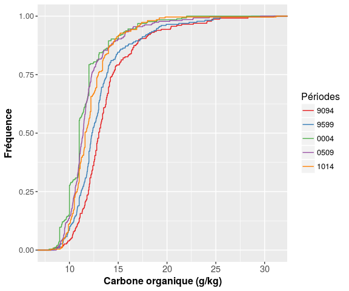
<figcaption>
</figcaption>
</figure>
<figure style="text-align:center;">
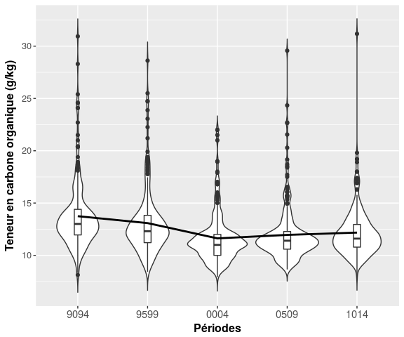
<figcaption>
</figcaption>
</figure>
<table style="width:83%;">
<caption>Statistiques descriptives des teneurs en carbone organique par périodes</caption>
<colgroup>
<col width="15%" />
<col width="9%" />
<col width="13%" />
<col width="12%" />
<col width="9%" />
<col width="13%" />
<col width="8%" />
</colgroup>
<thead>
<tr class="header">
<th align="center"> </th>
<th align="center">Min.</th>
<th align="center">1st Qu.</th>
<th align="center">Median</th>
<th align="center">Mean</th>
<th align="center">3rd Qu.</th>
<th align="center">Max.</th>
</tr>
</thead>
<tbody>
<tr class="odd">
<td align="center"><strong>9094</strong></td>
<td align="center">8.13</td>
<td align="center">11.95</td>
<td align="center">13</td>
<td align="center">13.74</td>
<td align="center">14.4</td>
<td align="center">30.94</td>
</tr>
<tr class="even">
<td align="center"><strong>9599</strong></td>
<td align="center">8.43</td>
<td align="center">11.22</td>
<td align="center">12.31</td>
<td align="center">13.08</td>
<td align="center">13.82</td>
<td align="center">28.62</td>
</tr>
<tr class="odd">
<td align="center"><strong>0004</strong></td>
<td align="center">7.91</td>
<td align="center">10</td>
<td align="center">11</td>
<td align="center">11.62</td>
<td align="center">12</td>
<td align="center">22</td>
</tr>
<tr class="even">
<td align="center"><strong>0509</strong></td>
<td align="center">8.65</td>
<td align="center">10.59</td>
<td align="center">11.4</td>
<td align="center">11.96</td>
<td align="center">12.28</td>
<td align="center">29.57</td>
</tr>
<tr class="odd">
<td align="center"><strong>1014</strong></td>
<td align="center">8.1</td>
<td align="center">10.78</td>
<td align="center">11.6</td>
<td align="center">12.18</td>
<td align="center">12.96</td>
<td align="center">31.18</td>
</tr>
</tbody>
</table>

Analyses des facteurs explicatifs
---------------------------------

Dans un premier temps, l'ensemble des variables potentiellement explicatives est écrémé à travers une ACP et une modélisation avec un arbre de régression boosté. Ce dernier permet d'identifier les principaux facteurs explicatifs. Dans un deuxième temps, ces facteurs sont analysés dans le détail.

### ACP

<figure style="text-align:center;">
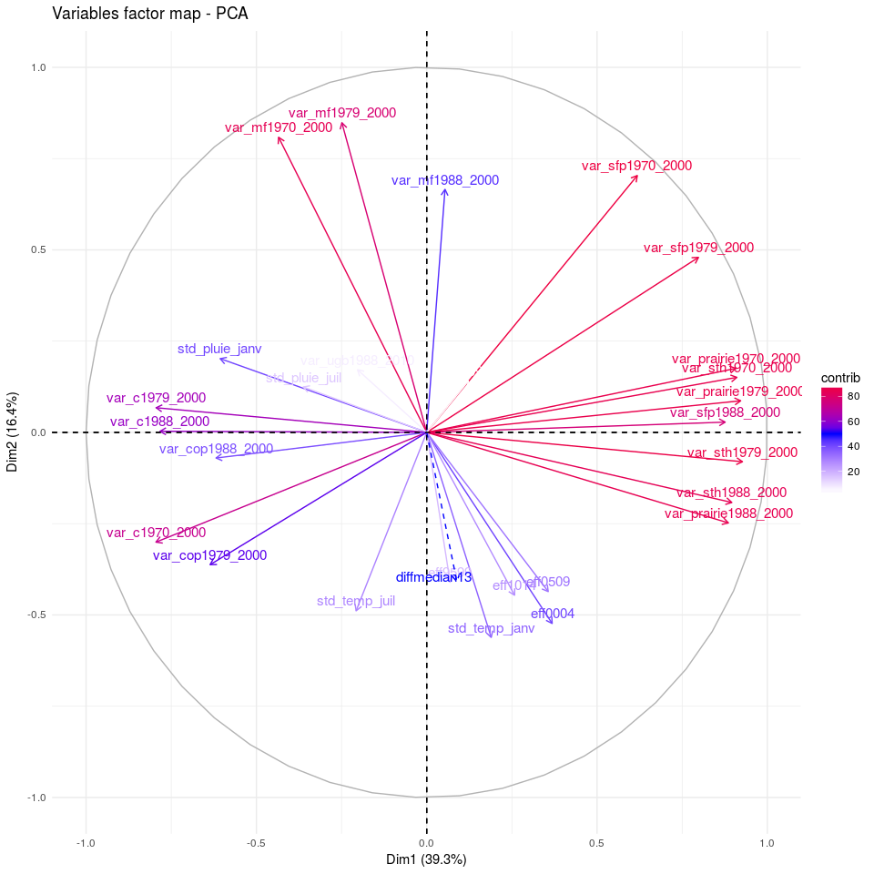
<figcaption>
</figcaption>
</figure>
<figure style="text-align:center;">
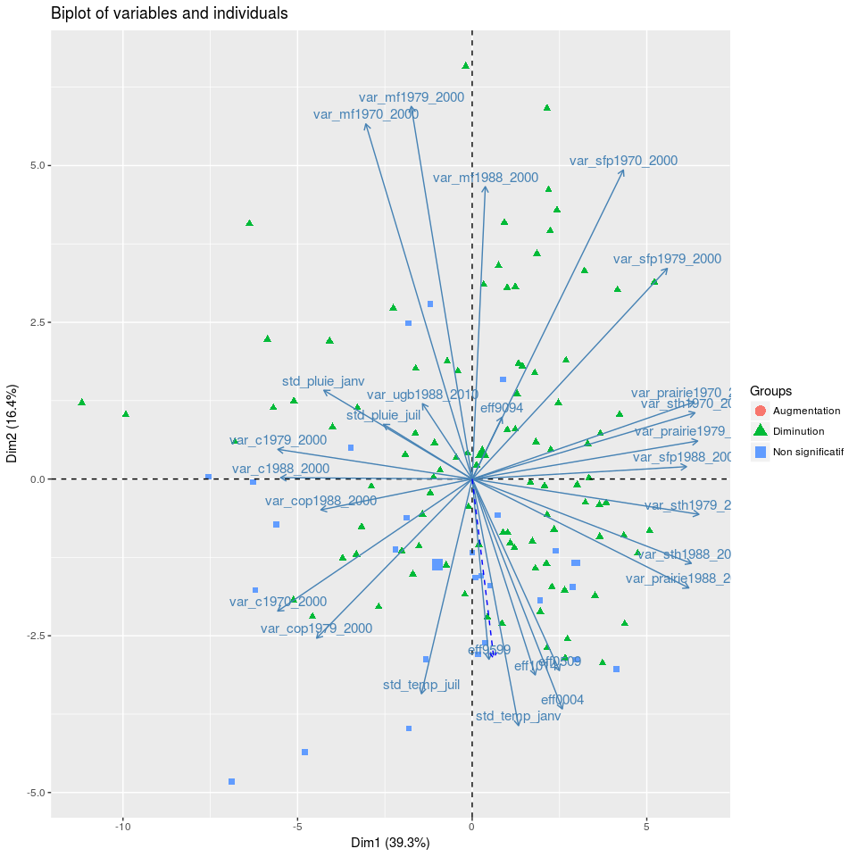
<figcaption>
Figure 3: Différentes ACP
</figcaption>
</figure>
### GBM

<figure style="text-align:center;">
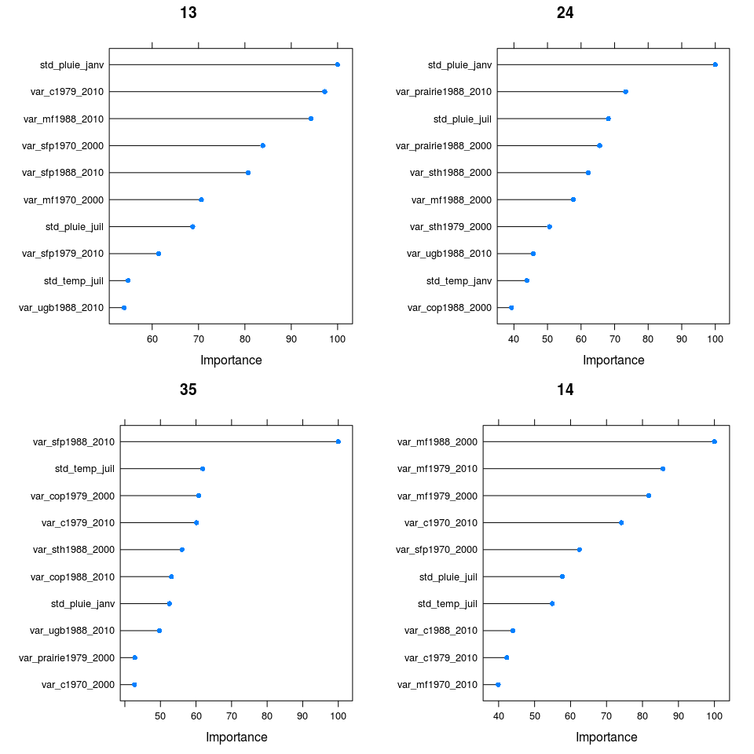
<figcaption>
</figcaption>
</figure>
**En conclusion** de ce travail exploratoire, l'ordre d'importance des variables explicatives varie en fonction des variations étudiées. D'une manière générale, la variabilité du cumul de pluie pour les mois de janvier entre 1971-2000 est l'une des principales variables explicatives, celle-ci ressort en tête pour les variations 13 et 24. Dans plusieurs cas, la distinction de l'importance entre les variables est délicat.

Analyses des variables sélectionnées pour les périodes 13 et 14
---------------------------------------------------------------

<figure style="text-align:center;">
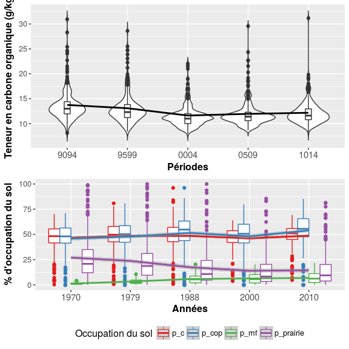
<figcaption>
</figcaption>
</figure>
### Tests avec des correlations

<figure style="text-align:center;">
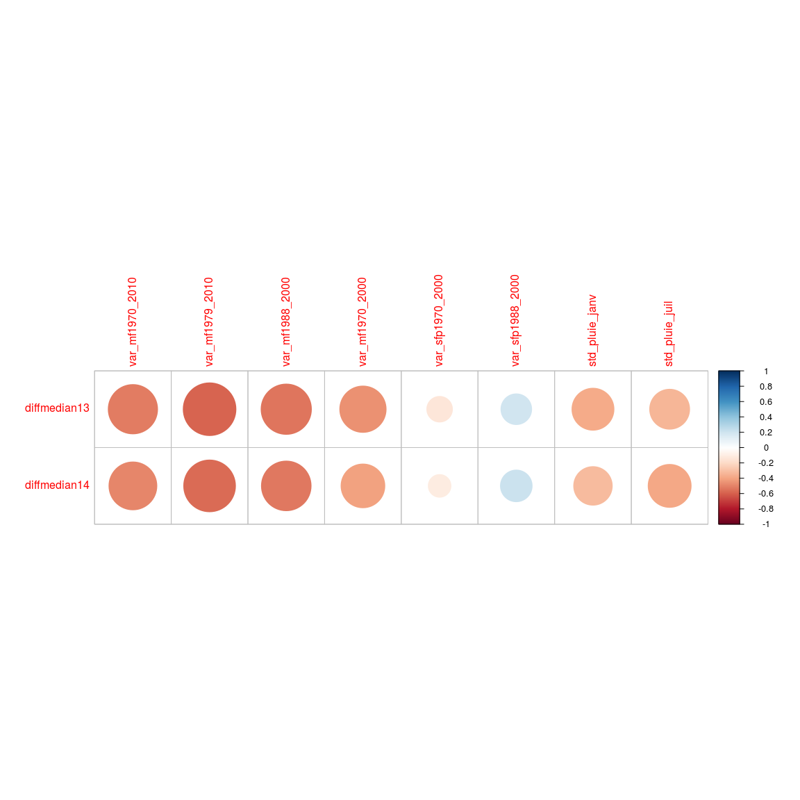
<figcaption>
</figcaption>
</figure>
<figure style="text-align:center;">
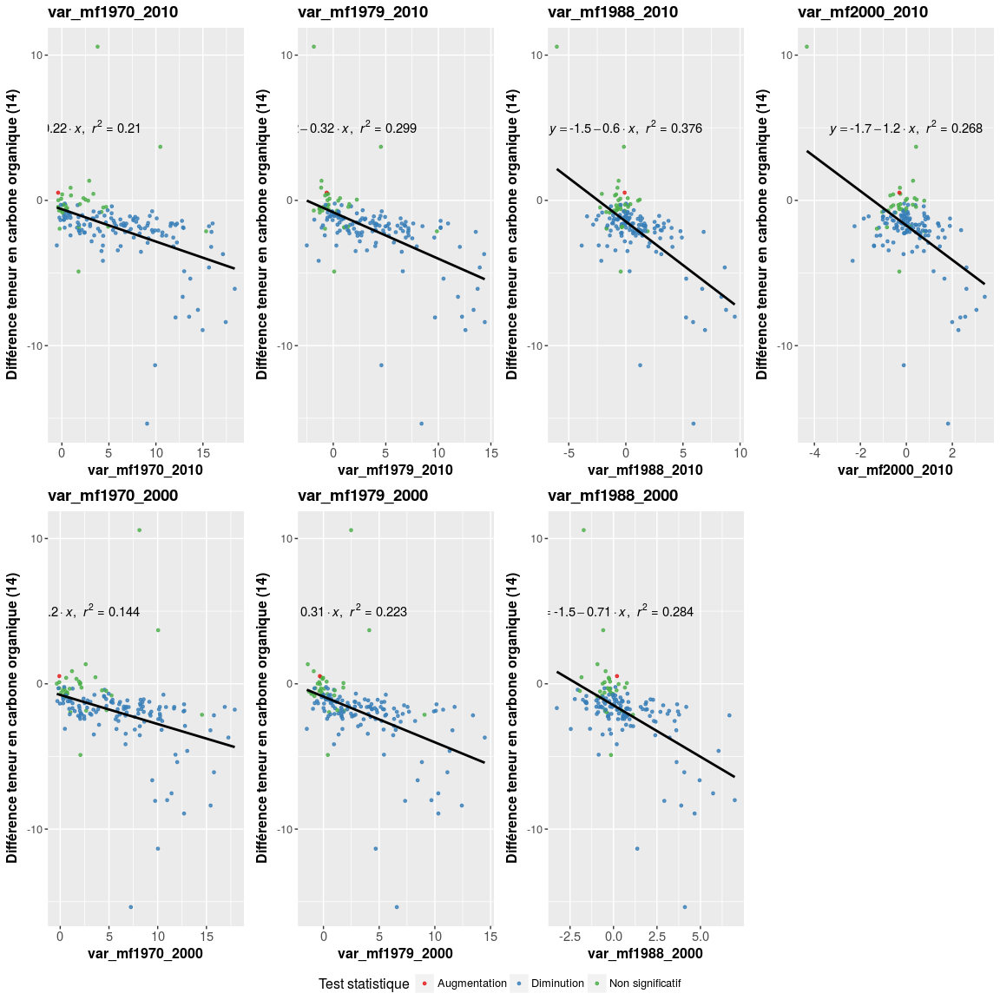
<figcaption>
</figcaption>
</figure>
    ## TableGrob (2 x 1) "arrange": 2 grobs
    ##   z     cells    name              grob
    ## 1 1 (1-1,1-1) arrange   gtable[arrange]
    ## 2 2 (2-2,1-1) arrange gtable[guide-box]

    ## Warning: In lm.fit(x, y, offset = offset, singular.ok = singular.ok, ...) :
    ##  extra argument 'na.rm' will be disregarded

    ## Warning: Removed 109 rows containing non-finite values (stat_smooth).

    ## Warning: Removed 109 rows containing missing values (geom_point).

<figure style="text-align:center;">
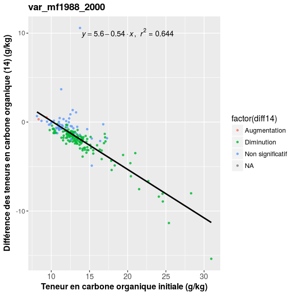
<figcaption>
</figcaption>
</figure>
Cartographie des variations
---------------------------

Analyses des variables sélectionnées pour la période 35
-------------------------------------------------------

<figure style="text-align:center;">

<figcaption>
</figcaption>
</figure>
<figure style="text-align:center;">
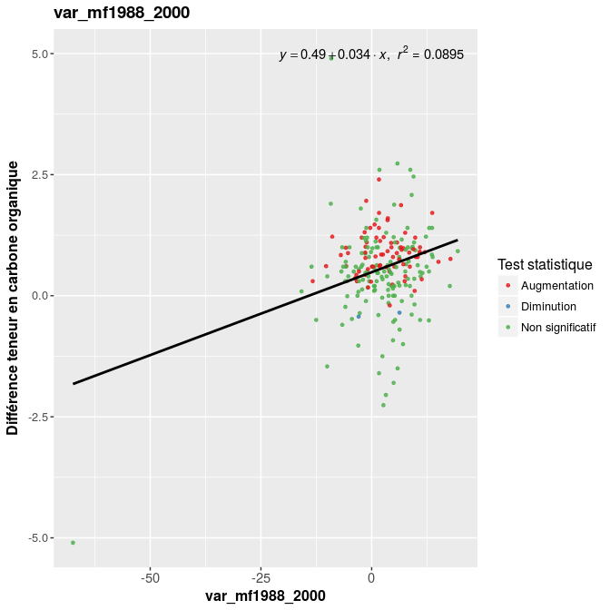
<figcaption>
Figure 9: boxplot NPC\_picardie
</figcaption>
</figure>
Analyses des variables sélectionnées pour la période 24
-------------------------------------------------------

<figure style="text-align:center;">
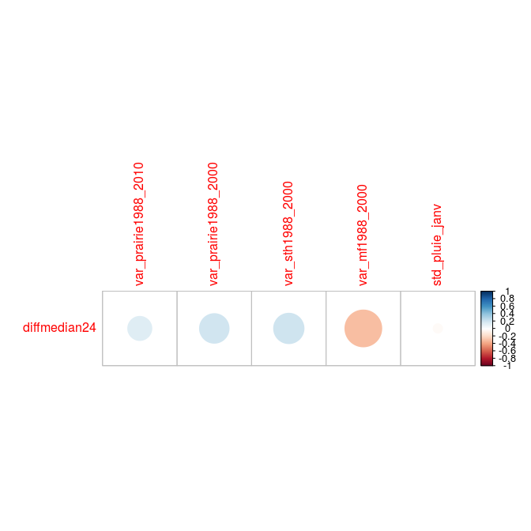
<figcaption>
</figcaption>
</figure>
<figure style="text-align:center;">
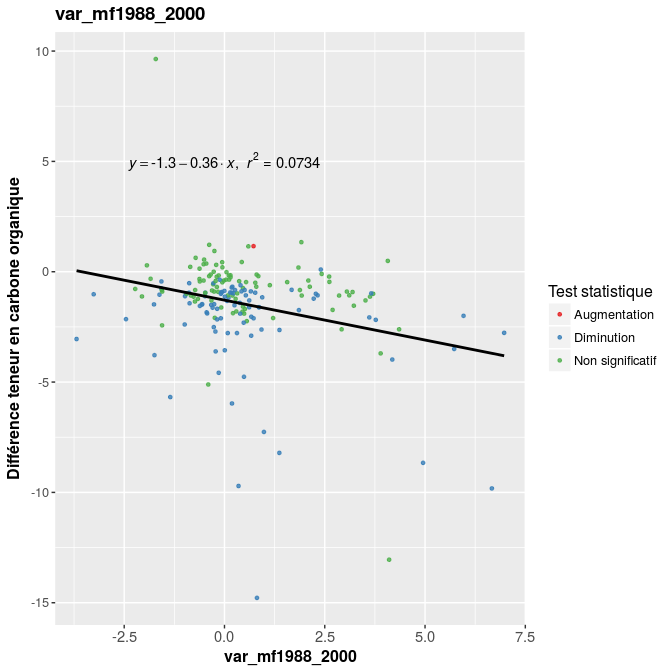
<figcaption>
Figure 10: boxplot NPC\_picardie
</figcaption>
</figure>
<figure style="text-align:center;">
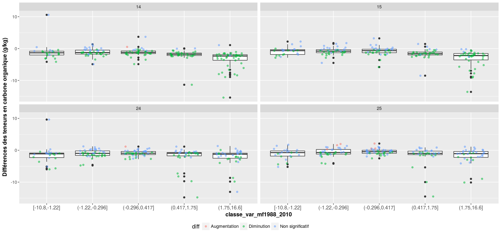
<figcaption>
</figcaption>
</figure>
    ## TableGrob (2 x 1) "arrange": 2 grobs
    ##   z     cells    name              grob
    ## 1 1 (1-1,1-1) arrange   gtable[arrange]
    ## 2 2 (2-2,1-1) arrange gtable[guide-box]
