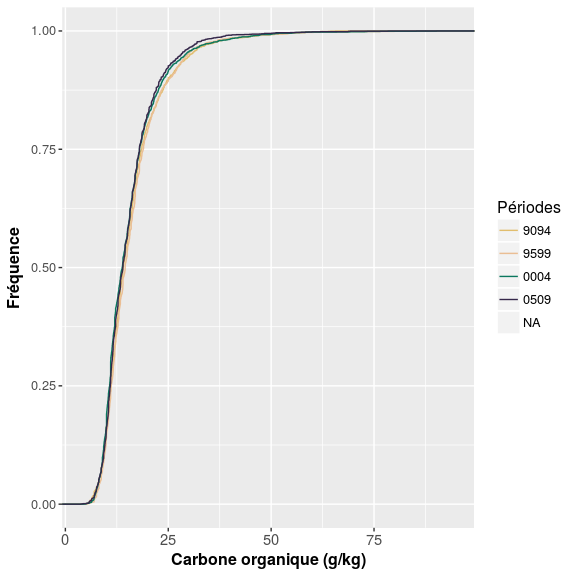
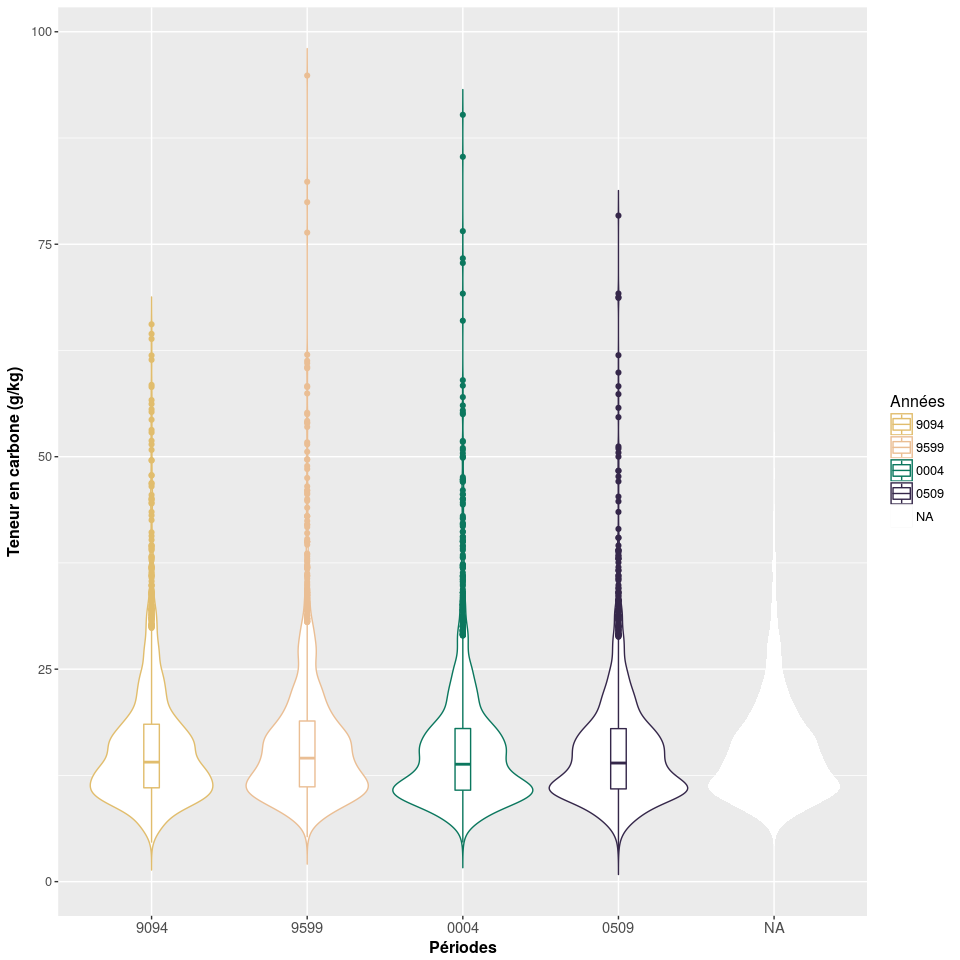
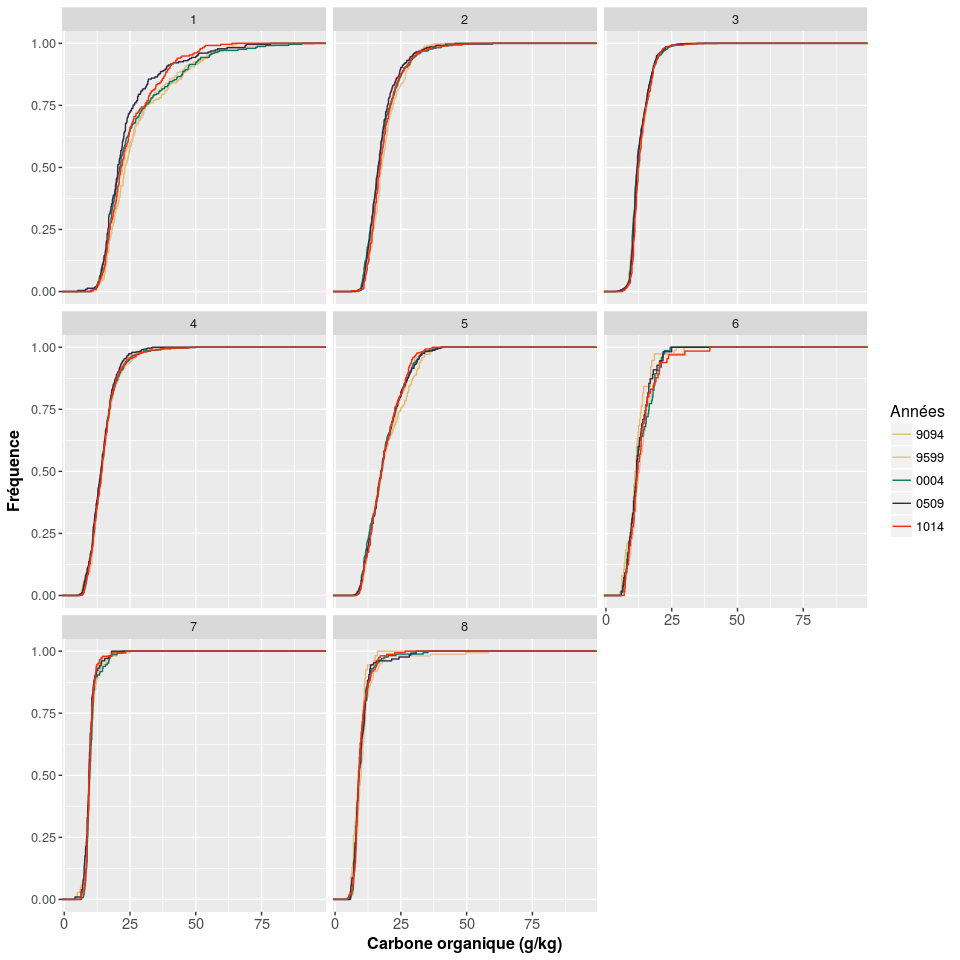
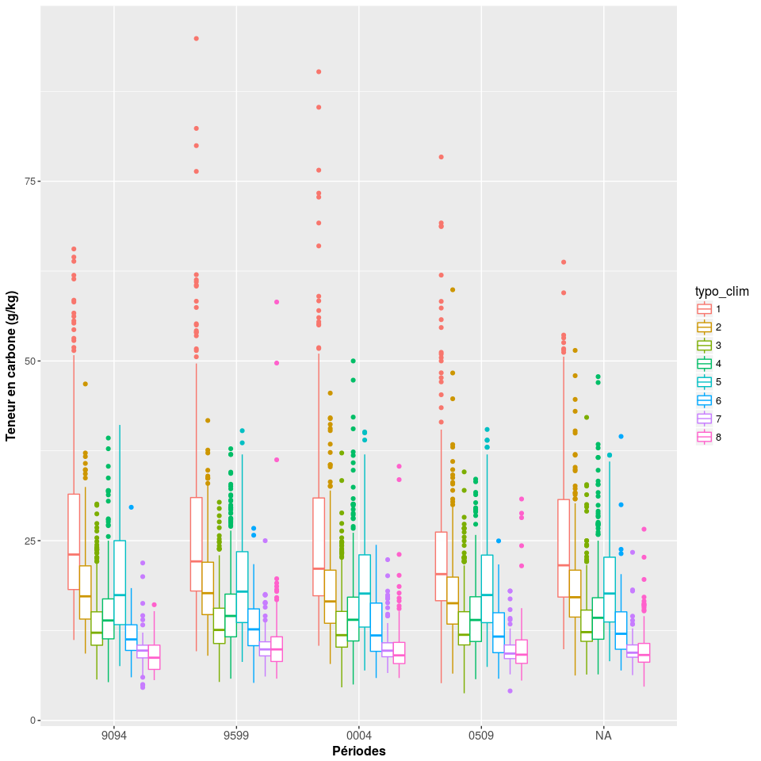
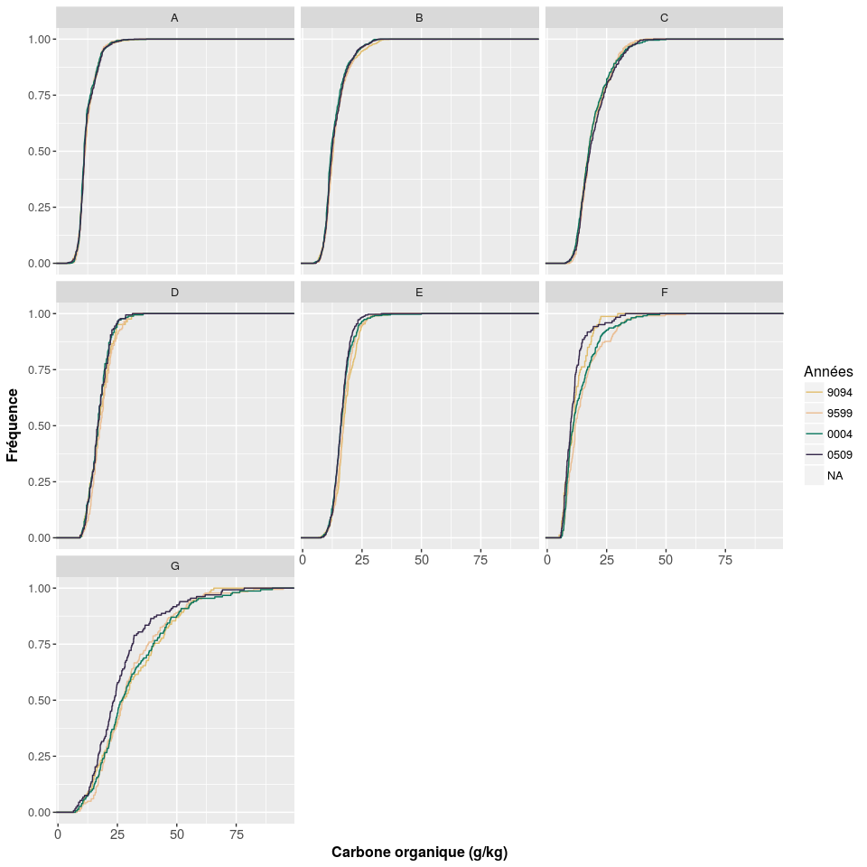
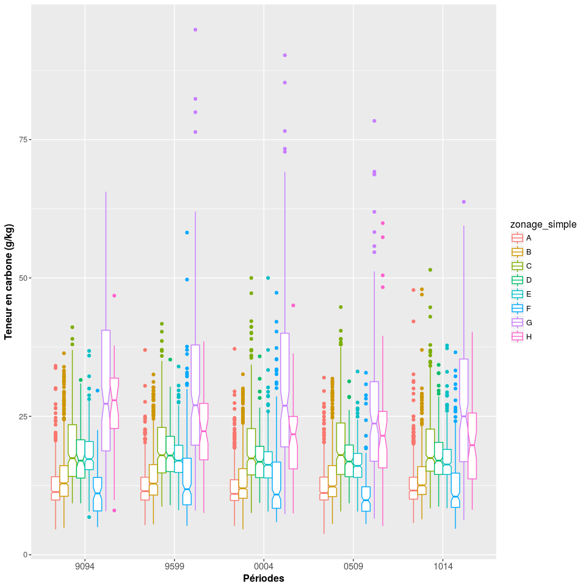
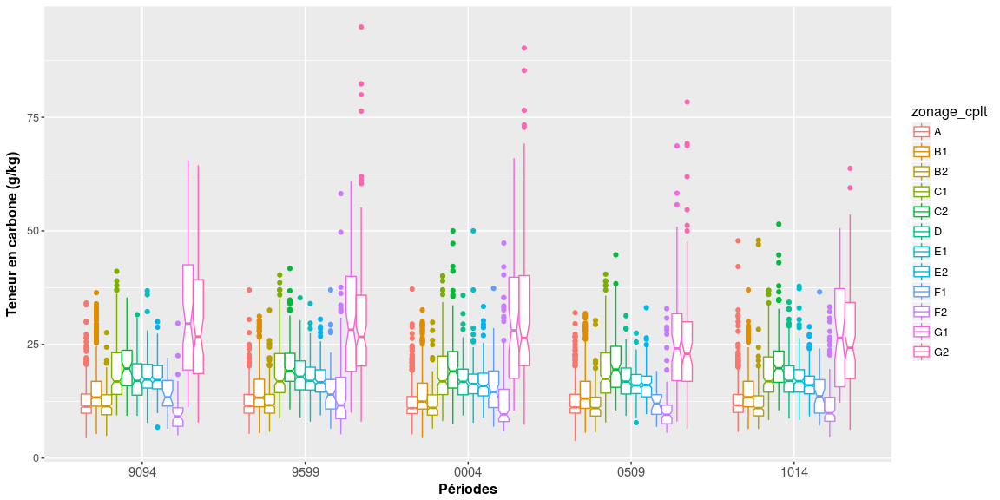

Analyse des teneurs en carbone organique de la BDAT
================
Jean-Baptiste Paroissien

-   [Objectifs](#objectifs)
    -   [Chargement des données et des principaux paramètres d'étude](#chargement-des-donnees-et-des-principaux-parametres-detude)
-   [Analyse des teneurs en carbone organique par période (France métropolitaine)](#analyse-des-teneurs-en-carbone-organique-par-periode-france-metropolitaine)
    -   [France entière](#france-entiere)
    -   [Par type de climat](#par-type-de-climat)
    -   [Par régions d'élevage](#par-regions-delevage)
    -   [Par classe de pourcentage d'occupation du sol (données du recensement agricole)](#par-classe-de-pourcentage-doccupation-du-sol-donnees-du-recensement-agricole)
-   [Résumé des statistiques](#resume-des-statistiques)
    -   [Graphique de correlation](#graphique-de-correlation)
    -   [Cartographie](#cartographie)
-   [test avec les différences](#test-avec-les-differences)
-   [Analyse des facteurs explicatifs](#analyse-des-facteurs-explicatifs)
    -   [Graphique de correlation](#graphique-de-correlation-1)
-   [Modélisation avec GBM](#modelisation-avec-gbm)

Objectifs
=========

Dans ce fichier, les analyses cantonales de la BDAT sont analysées afin appréhender la distribution statistiques géographiques des teneurs en carbone organique de plusieurs périodes de temps, regroupées en 5 périodes : 1990-1994, 1995-1999, 2000-2004, 2005-2009 et 2010-2014. Les résultats présentés font suite à différents scripts de préparations de données dont la chaîne de traitements générale est consultable à cette adresse.

Globalement, le travail est organisé de la manière suivante :
- [Statistiques descriptives](#) : Analyse des histogrammes de fréquence et tests statistiques pour chacune des périodes de temps analysées,
- [Représentation cartographique](#) : Représentation cartographique par canton,
- [Analyse des facteurs explicatifs](#) : Analyse des facteurs explicatifs.

Plus d'information, voir [le chapitre](#boxplot)

**Date : `{r print(date)}`**

Chargement des données et des principaux paramètres d'étude
-----------------------------------------------------------

Analyse des teneurs en carbone organique par période (France métropolitaine)
============================================================================

Cette première étape a pour but d'analyser les différences des teneurs en carbone organique pour chacune des périodes de temps analysées. Celles-ci comportent les années 1990-1994;1995-1999;2000-2004;2005-2009 et 2010-2014. Les statistiques descriptives et les courbes de fréquences cumulées sont présentées dans un premier temps. Dans un second temps, des boxplots accompagnés de tests de « significacité » des différences entre les périodes sont mis en oeuvre. Au cours de ces travaux, le regard est porté sur l'emprise nationale mais avec plusieurs niveaux de stratification (régions administratives, zonages climatiques, principales région d'élevage).

France entière
--------------

La figure <A HREF="#cdf_fr">1</A> présente les courbes de fréquences cumulées des teneurs en carbone organique distribuées pour les 5 périodes. Les courbes de fréquences des 5 périodes présentent la même forme en "S" et s'individualisent juste avant le plateau, présentant une différence affectant les sols riches en teneurs organiques. Sur cette zone, la figure montre un décalage des courbes des périodes 2000-2004, 2005-2009 et 2010-2014 vers des valeurs plus faibles. Parmi ces 3 périodes, la période 2005-2009 est celle qui se décale le plus vers des teneurs plus faible tandis que la période 2010-2014 se rapproche des valeurs de 1990-1994 et 1995-1999, présentant ainsi une inversion de la tendance observée. Ces trois périodes se distinguent clairement des périodes de 1990-1994 et 1995-1999 qui sont rapprochées. Ces observations mettent en évidence une diminution des teneurs en carbone entre les périodes 1990-1999 et les périodes de 2000-2009.

``` r
period <- c("9094","9599","0004","0509","1014")
xlabel <- "Carbone organique (g/kg)"
ylabel <- "Fréquence"
nperiod <- length(period)
colors <- wes_palette("Rushmore",nperiod,type="continuous")

# Courbe de fréquence cumulée
cdf <- ggplot(melted.bdat, aes(x=value))+
       stat_ecdf(aes(colour=annees))+
       scale_color_manual(values=colors, 
                          name="Périodes")+
       scale_x_continuous(xlabel)+scale_y_continuous(ylabel)+
       theme(plot.title = element_text(size = 14, face = "bold"), 
             text = element_text(size = 12),
             axis.title = element_text(face="bold"),
             axis.text.x=element_text(size = 11))
cdf
```

<figure style="text-align:center;">
<a name="cdf_fr"></a>
<figcaption>
</figcaption>
</figure>
``` r
# Ajout d'un zoom
zoomtheme <- theme(legend.position="none", axis.line=element_blank(),axis.text.x=element_blank(),
            axis.text.y=element_blank(),axis.ticks=element_blank(),
            axis.title.x=element_blank(),axis.title.y=element_blank(),
            panel.grid.major = element_blank(), panel.grid.minor = element_blank(), 
            panel.background = element_rect(color='red', fill="white"),
            plot.margin = unit(c(0,0,-6,-6),"mm"))

cdf_zoom <- ggplot(melted.bdat, aes(x=value))+
       stat_ecdf(aes(colour=annees))+
       scale_color_manual(values=colors,name="Années")+zoomtheme+
       coord_cartesian(xlim=xlim, ylim=ylim)

# Problème lors de la compilation avec knit     
#cdf_zoom_grob <- ggplotGrob(cdf_zoom)
#cdfcpt <- cdf + annotation_custom(grob = cdf_zoom_grob, xmin = 65, xmax = 90, ymin = 0.1, ymax = 0.50)  
#cdfcpt
```

``` r
# Résumé des statistiques 
bdatsummary <- apply(melted.bdat["value"],2, function(x) tapply(x, melted.bdat[,"annees"],summary))
bdatsummary <- lapply(bdatsummary, do.call, what = rbind)


#On retrouve ces tendances dans le tableau présentant les statistiques descriptives par période. La période 2000-2004 montre la valeur médiane la plus faible avec une valeur de `r bdatsummary$value["0004","Median"]` g/kg. Les valeurs les plus importantes sont observées pour les périodes 1990-1994 et 1995-1999 avec respectivement des teneurs en carbone organique de `r bdatsummary$value["9094","Median"]` et `r bdatsummary$value["9599","Median"]`. En terme de tendance, on remarque une augmentation des teneurs pour la période 2010-2014 avec une médiane des valeurs de `r bdatsummary$value["1014","Median"]`.

#pander(bdatsummary[[1]],caption = "Statistiques descriptives par période des teneurs en CO")
```

Les différences entre les périodes

``` r
tt <- pairwise.wilcox.test(melted.bdat[,"value"], melted.bdat[,"annees"])
pander(c(tt[1],tt[2],tt[3]))
```

La représentation sous forme de boxplot des teneurs en carbone organique est présentée dans la figure ci-dessous. Présenter rapidement la distribution des valeurs. Les valeurs extrêmes...
Rajouter aussi une courbe de tendance?

``` r
# Voir pour rajouter les tendances...
p <- ggplot(melted.bdat, aes(x=annees,y=value,col=annees)) + 
  geom_violin(trim=FALSE)+
  geom_boxplot(width=0.1, fill="white")+
  scale_color_manual(values=colors,name="Années")+
  scale_x_discrete("Périodes")+scale_y_continuous("Teneur en carbone (g/kg)")+
  theme(plot.title = element_text(size = 14, face = "bold"), 
        text = element_text(size = 12),
        axis.title = element_text(face="bold"),
        axis.text.x=element_text(size = 11))
p  
```

<figure>

<figcaption>
</figcaption>
</figure>
``` r
#ggsave(p,file = paste(repsortie,"boxplotbdat.png",sep=""), width = 10, height = 10)  
```

Par type de climat
------------------

Pour le climat, on pourra s'intéresser à quelques zones, en fonction de la densité des données que nous avons à disposition.

Faire un commentaire par type de climat

``` r
melted.bdat_clim <- melted.bdat[complete.cases(melted.bdat$typo_clim),]

cdf <- ggplot(melted.bdat_clim, aes(x=value))+
       facet_wrap(~typo_clim)+
       stat_ecdf(aes(colour=annees))+
       scale_color_manual(values=colors, 
                          name="Années")+
       scale_x_continuous(xlabel)+scale_y_continuous(ylabel)+
       theme(plot.title = element_text(size = 14, face = "bold"), 
             text = element_text(size = 12),
             axis.title = element_text(face="bold"),
             axis.text.x=element_text(size = 11))
cdf
```

<figure>

<figcaption>
</figcaption>
</figure>
<figure>

<figcaption>
</figcaption>
</figure>
``` r
ylim1 <- boxplot.stats(melted.bdat$value)$stats[c(1, 5)]

p <- ggplot(melted.bdat) +
            geom_boxplot(aes(x=annees,y=value,col=annees),outlier.shape = NA,outlier.size=NA)+
            facet_wrap(~typo_clim,scales="free")+
            scale_color_manual(values=colors,name="Années")+
            #geom_smooth(aes(x=as.integer(annees),y=value,color=nom_region,fill=nom_region),method=loess)+
            scale_x_discrete("Années")+scale_y_continuous("Teneur en carbone (g/kg)")+
            theme(plot.title = element_text(size = 14, face = "bold"), 
                  text = element_text(size = 12),
                  axis.title = element_text(face="bold"),
                  axis.text.x=element_text(size = 11))+
            coord_cartesian(ylim = ylim1*1.05)
p  
ggsave(p,file = paste(repsortie,"boxplotbdat_typoclim2.png",sep=""), width = 10, height = 10)  
```

Par régions d'élevage
---------------------

Egalement, ce concentrer sur les zones où les données sont importantes. On peut supprimer les zones de hautes de montagnes...
Test également en fonction des différentes régions d'élevage

``` r
melted.bdat_regelevage <- melted.bdat[complete.cases(melted.bdat$zonage_simple),]
melted.bdat_regelevage <- melted.bdat_regelevage[melted.bdat_regelevage$zonage_simple != "H",]

cdf <- ggplot(melted.bdat_regelevage, aes(x=value))+
       facet_wrap(~zonage_simple)+
       stat_ecdf(aes(colour=annees))+
       scale_color_manual(values=colors, 
                          name="Années")+
       scale_x_continuous(xlabel)+scale_y_continuous(ylabel)+
       theme(plot.title = element_text(size = 14, face = "bold"), 
             text = element_text(size = 12),
             axis.title = element_text(face="bold"),
             axis.text.x=element_text(size = 11))
cdf
```

<figure>

<figcaption>
</figcaption>
</figure>
<figure>

<figcaption>
</figcaption>
</figure>
### Zoom sur les 3 régions d'élevage affectées par la baisse du pourcentage de STH, prairies et surface fourragères

<figure>

<figcaption>
</figcaption>
</figure>
``` r
#ylim1 <- boxplot.stats(melted.bdat$value)$stats[c(1,5)]
ylim1 <- c(min(melted.bdat$value,na.rm=TRUE),quantile(melted.bdat$value,0.99,na.rm=TRUE))

p <- ggplot(melted.bdat) +
            geom_boxplot(aes(x=annees,y=value,col=annees),outlier.shape = NA,outlier.size=NA)+
            facet_wrap(~zonage_simple,scales="free")+
            scale_color_manual(values=colors,name="Années")+
            #geom_smooth(aes(x=as.integer(annees),y=value,color=nom_region,fill=nom_region),method=loess)+
            scale_x_discrete("Années")+scale_y_continuous("Teneur en carbone (g/kg)")+
            theme(plot.title = element_text(size = 14, face = "bold"), 
                  text = element_text(size = 12),
                  axis.title = element_text(face="bold"),
                  axis.text.x=element_text(size = 11))+
            coord_cartesian(ylim = ylim1*1.05)
p  
ggsave(p,file = paste(repsortie,"boxplotbdat_typoclim2.png",sep=""), width = 10, height = 10)  
```

Par classe de pourcentage d'occupation du sol (données du recensement agricole)
-------------------------------------------------------------------------------

``` r
for(i in id_class){
  melted.bdat_ra <- melted.bdat[complete.cases(melted.bdat[,i]),]
  names(melted.bdat_ra)[names(melted.bdat_ra)==i] <- "classe"
  
  p <- ggplot(melted.bdat_ra) +
            geom_boxplot(aes(x=annees,y=value,col=classe),notch=TRUE)+
            #scale_color_manual(name="Années")+
            scale_x_discrete("Périodes")+scale_y_continuous("Teneur en carbone (g/kg)")+
            theme(plot.title = element_text(size = 14, face = "bold"), 
                  text = element_text(size = 12),
                  axis.title = element_text(face="bold"),
                  axis.text.x=element_text(size = 11))
  p  
  ggsave(p,file = paste("boxplotbdat_",i,".png",sep=""), width = 15, height = 10)  
}
```

Résumé des statistiques
=======================

``` r
# Ici, voir pour rajouter année+zonage_simple ou année+climato ou année+région
bdatsummary_regelevage <- apply(melted.bdat["value"],2, function(x) tapply(x, list(melted.bdat[,"zonage_simple"],melted.bdat[,"annees"]),summary))
bdatsummary_regelevage <- data.frame(bdatsummary_regelevage[[1]])
bdatsummary_regelevage <- lapply(bdatsummary_regelevage, do.call, what = rbind)
names(bdatsummary_regelevage) <- period

# Revoir pour construire une table plus lisible
#pander(bdatsummary_regelevage,caption = "Statistiques descriptives par période des teneurs en CO pour les principales régions d'élevage")


# Ici, voir pour rajouter année+zonage_simple ou année+climato ou année+région
bdatsummary_regadmin<- apply(melted.bdat["value"],2, function(x) tapply(x, list(melted.bdat[,"nom_region"],melted.bdat[,"annees"]),summary))
bdatsummary_regadmin <- data.frame(bdatsummary_regadmin[[1]])
bdatsummary_regadmin <- lapply(bdatsummary_regadmin, do.call, what = rbind)
names(bdatsummary_regadmin) <- period

# Revoir pour construire une table plus lisible
#pander(bdatsummary_regadmin,caption = "Statistiques descriptives par période des teneurs en CO pour les différentes régions administratives")
```

### Graphique de correlation

``` r
# Voir les graphiques de "différence" réalisés durant le M1
# Rajouter les types de climat ou autre niveau de stratification pour voir l'influence de ces régions sur les pertes 
# Voir également pour rajouter ces données sur une table au format melt
plot(dcast.bdat$corgox_med9599,dcast.bdat$varcorgox_med0004_9599)

plot(dcast.bdat$corgox_med9599,dcast.bdat$diffcorgox_med0004_9599)

# Calculer les évolutions
varcorgox_med0004_9599 
varcorgox_med0509_9599
varcorgox_med0509_9094
varcorgox_med0004_9094
diffcorgox_med0004_9599
diffcorgox_med0509_9599
diffcorgox_med0509_9094
diffcorgox_med0004_9094

test <- dcast.bdat[,c("corgox_med9094","corgox_med9599","corgox_med0004","corgox_med0509")]
ggpairs(test)
```

Cartographie
------------

Dans cette partie, des cartes peuvent être produites selon plusieurs arguments (reste à définir) :

-   stratification spatiale (région ou autre entités spatiales),
-   stratification temporelle (groupe de plusieurs années).

``` r
# Paramètres #################
tablecarto <- "dm_vecteurs.canton" #Nom de la table utilisée pour la cartographie (table postgis)
period <- c("9094","9599","0004","0509","1014") #
variable <- "corgox_medequi"
variablecarto <- paste(variable,period,sep="")#variables à cartographier
nclasse <- 5 
style_classe <- "quantile"#Nombre de classes de valeurs pour la cartographie
couleur <- "Spectral" #Nom de la palette couleur (selon RColorBrewer)display.brewer.all() pour connaître les différentes palettes
l_variable <- "Teneur en carbone organique (g/kg)" #label de la variable
nomfichier <- "corgoxmed_period_fr" #Nom du fichier

carto(dsn,tablecarto,variablecarto,nclasse,style_classe,couleur,l_legend,repsortie,nomfichier,dept=FALSE,reg=FALSE,nrowlayout=1,ncollayout=5,position="bottom",ggsaveheight=5,ggsavewidth=20)  
```

test avec les différences
=========================

``` r
# Paramètres #################
tablecarto <- "dm_vecteurs.canton" #Nom de la table utilisée pour la cartographie (table postgis)
period <- c("14","15","24","25")#
variable <- "diff"
variablecarto <- paste(variable,period,sep="")#variables à cartographier
nclasse <- 5 #Nombre de classes de valeurs pour la cartographie
style_classe <- "quantile"
couleur <- "Spectral" #Nom de la palette couleur (selon RColorBrewer)display.brewer.all() pour connaître les différentes palettes
l_variable <- "Teneur en carbone organique (g/kg)" #label de la variable
nomfichier <- "corgoxmed_period" #Nom du fichier de sortie (.png)

cartoperiod(dsn,tablecarto,variablecarto,nclasse,style_classe,couleur,l_legend,repsortie,nomfichier,dept="37",reg=FALSE)
```

Analyse des facteurs explicatifs
================================

``` r
# Sélection des variables de travail
Rcovar <- c("ugbgrani_sau2010","ttemp_an","jfroids_an","jchauds_an","hpluie_an","ugbta1988","p_prairie1970","p_prairie1979","p_prairie1988","p_sth1970","p_sth1979","p_sth1988","p_sfp1970","p_sfp1979","p_sfp1988","p_mf1970","p_mf1979","p_mf1988","p_c1970","p_c1979","p_c1988")
vNames <- c("corgox_medequi9094",Rcovar)

# Lecture de la table sans les NA
dcast.bdat_variables <- dcast.bdat[complete.cases(dcast.bdat[,vNames]),vNames]

res.pca <- PCA(dcast.bdat_variables, graph = FALSE)
eigenvalues <- res.pca$eig
head(eigenvalues[, 1:2])
fviz_screeplot(res.pca, ncp=10)

fviz_pca_var(res.pca, col.var="contrib") +
scale_color_gradient2(low="white", mid="blue", 
                  high="red", midpoint=50) + theme_minimal()
`r round(res.pca$eig[1,2]+res.pca$eig[2,2])`
```

Environ pourcent de l'information est contenu dans les deux premiers axes.

Graphique de correlation
------------------------

``` r
# Stratifier les plots par les régions et autres facteurs (voir pour la classification climatique)
plot(dcast.bdat$hpluie_an,dcast.bdat$corgox_medequi9094)
plot(dcast.bdat$p_sth2000,dcast.bdat$corgox_medequi9094)


plot(dcast.bdat$hpluie_an,dcast.bdat$corgox_medequi9094)


# Voir le développement de ce type de graphique
ggplot(dcast.bdat, aes(hpluie_an, corgox_medequi9094,shape=factor(classe_p_prairie2000))) +
  geom_point(aes(colour = factor(classe_p_prairie2000)), size = 4) +
  geom_point(colour="grey10", size = 1.5)
```

Modélisation avec GBM
=====================

L'application de ces modèles demande une bonne configuration de leurs paramètres. Pour déterminer la meilleur combinaison de paramètres, la fonction *train* du package *caret* est utilisée.

1.  Boosted regression tree (BRT)
    Les modèles d'arbres de régression boostés sont connus pour améliorer la précision de prédiction par rapport aux simples arbres de régression.
    L'algo permet d'ajuster un modèle en fonction d'un processus itératif. A chaque itération, les arbres de régresssions sont ajustés et montés sur une fraction de l'ensemble des données échantillongées. Les principaux paramètres d'un modèle sont :
    1.  le taux d'apprentissage *(skrinkage)* : il correspond à une constante déterminant l'influence de la combinaison individuelle des arbres qui forme le forme le modèle final. Lorsque ce coefficient est faible, le modèle est très spécialisé et est difficilement applicable sur un autre jeu de données.
    2.  la taille des arbres *(interaction depth)* correspond à la taille des arbres de régression. Lorsque la taille est égale à 1, chaque arbre est constitué d'un seul noeud, on modélise l'effet d'une seule variable prédictive. Ainsi, le modèle final additionne séparément l'effet prédictif des variables et les intéractions des variables ne sont pas explicitement prise en compte. Lorsque la taille des arbres est supérieur à 1, chaque arbre de régression individuelle modélise l'interaction d'au moins deux variables prédictives. Celà permet l'utilisation de modèle prenant en compte les intéractions d'ordre i entre les variables prédictives. La capacité de représenter les interactions entre les variables prédictives sans connaissance a priori est l'un des avantages des arbres de régression.
    3.  le nombre d'arbre *(n.tree)*correspond au nombre d'arbre pour l'ajustement. C'est l'équivalent du nombre d'itérations.

``` r
Rcovar <- c("ugbgrani_sau2010","ttemp_an","jfroids_an","jchauds_an","hpluie_an","ugbta1988","p_prairie1970","p_prairie1979","p_prairie1988","p_sth1970","p_sth1979","p_sth1988","p_sfp1970","p_sfp1979","p_sfp1988","p_mf1970","p_mf1979","p_mf1988","p_c1970","p_c1979","p_c1988",id_class)
vNames <- c("corgox_medequi9094",Rcovar)

dcast.bdat_gbm <- dcast.bdat[complete.cases(dcast.bdat[,vNames]),vNames] # Pour supprimer les NA
datax <- dcast.bdat_gbm[, vNames[-1]]
datay <- dcast.bdat_gbm[, vNames[1]]

#tuneGrid <- expand.grid(interaction.depth = c(13),n.trees = c(150),shrinkage = 0.05,n.minobsinnode=10)
#fitControl <- trainControl(method = "repeatedcv",p=0.8,number=10,repeats=10)

tuneGrid <- expand.grid(.interaction.depth = c(1,5,9,13),.n.trees = c(150,500,1000,1500),.shrinkage = 0.05)
trControl <- trainControl(method = "cv",p=0.8)

tuneGrid <-  expand.grid(interaction.depth = c(1, 5, 9),n.trees = (1:30)*50,shrinkage = 0.1,n.minobsinnode = 20)


# Utilisation de caret, car plus rapide qu'une simple fonction gbm
registerDoMC(4) # Nombre de processeurs activés
mgbm <- train(x = datax , y = datay,method="gbm",tuneGrid = tuneGrid,trControl = fitControl,verbose = F,keep.data = T)

#best.iter <- gbm.perf(mgbm,method="cv")
save(mgbm,file=paste(repsortie,"mgbm_1.RData",sep=""))

plot(varImp(mgbm), top = 5)

#f.predict <- predict(mgbm, learningx , neighbors = mgbm$bestTune$.n.trees)
            
### GBM Model parameters ###

# interaction.depth : The maximum depth of variable interactions. 1 implies an additive model, 2 implies a model with up to 2-way interactions, etc
# .n.trees : The total number of trees to fit. This is equivalent to the number of iterations and  the number of basis functions in the additive expansion.
# shrinkage : a shrinkage parameter applied to each tree in the expansion. Also known as the learning rate or step-size reduction.


### Cubist Model parameters ###

#.committees : an integer: how many committee models (e.g.. boosting iterations) should be used

#.neighbors : an integer from 0 to 9: how many instances to use to correct the rule-based prediction? if neighbors is greater than zero, these predictions are adjusted by training set instances nearby using the approach of Qunilan (1993)
```
