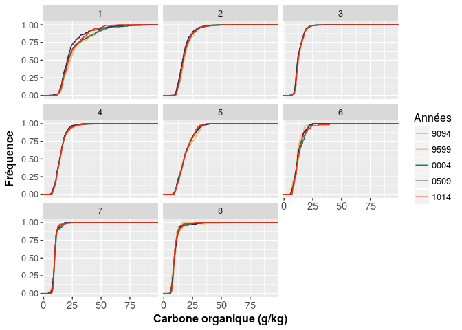
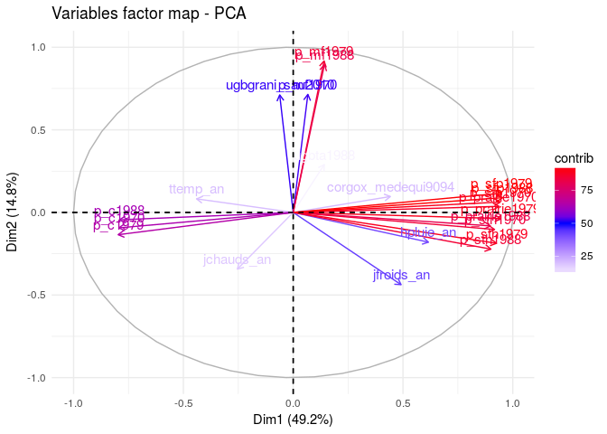

Traitement des données de la BDAT
================
Jean-Baptiste Paroissien

``` r
Sys.Date()
```

    ## [1] "2017-01-11"

``` r
sessionInfo()
```

    ## R version 3.3.2 (2016-10-31)
    ## Platform: x86_64-pc-linux-gnu (64-bit)
    ## Running under: Ubuntu 16.04.1 LTS
    ## 
    ## locale:
    ##  [1] LC_CTYPE=fr_FR.UTF-8       LC_NUMERIC=C              
    ##  [3] LC_TIME=fr_FR.UTF-8        LC_COLLATE=fr_FR.UTF-8    
    ##  [5] LC_MONETARY=fr_FR.UTF-8    LC_MESSAGES=fr_FR.UTF-8   
    ##  [7] LC_PAPER=fr_FR.UTF-8       LC_NAME=C                 
    ##  [9] LC_ADDRESS=C               LC_TELEPHONE=C            
    ## [11] LC_MEASUREMENT=fr_FR.UTF-8 LC_IDENTIFICATION=C       
    ## 
    ## attached base packages:
    ## [1] grid      stats     graphics  grDevices utils     datasets  methods  
    ## [8] base     
    ## 
    ## other attached packages:
    ##  [1] plyr_1.8.4         caret_6.0-73       factoextra_1.0.3  
    ##  [4] GGally_1.3.0       pander_0.6.0       knitr_1.15.1      
    ##  [7] FactoMineR_1.34    wesanderson_0.3.2  mapproj_1.2-4     
    ## [10] gridExtra_2.2.1    Hmisc_4.0-0        Formula_1.2-1     
    ## [13] survival_2.40-1    lattice_0.20-34    reshape2_1.4.2    
    ## [16] devtools_1.12.0    classInt_0.1-23    RColorBrewer_1.1-2
    ## [19] maptools_0.8-40    rgdal_1.2-4        sp_1.2-3          
    ## [22] ggplot2_2.2.0      stringr_1.1.0      fields_8.4-1      
    ## [25] maps_3.1.1         spam_1.4-0         gdata_2.17.0      
    ## [28] RODBC_1.3-14      
    ## 
    ## loaded via a namespace (and not attached):
    ##  [1] ggrepel_0.6.5        Rcpp_0.12.7          class_7.3-14        
    ##  [4] gtools_3.5.0         assertthat_0.1       rprojroot_1.1       
    ##  [7] digest_0.6.10        foreach_1.4.3        MatrixModels_0.4-1  
    ## [10] backports_1.0.4      acepack_1.4.1        stats4_3.3.2        
    ## [13] evaluate_0.10        e1071_1.6-7          lazyeval_0.2.0      
    ## [16] SparseM_1.74         minqa_1.2.4          data.table_1.10.0   
    ## [19] nloptr_1.0.4         car_2.1-4            rpart_4.1-10        
    ## [22] Matrix_1.2-7.1       rmarkdown_1.3        splines_3.3.2       
    ## [25] lme4_1.1-12          foreign_0.8-67       munsell_0.4.3       
    ## [28] mgcv_1.8-16          htmltools_0.3.5      nnet_7.3-12         
    ## [31] flashClust_1.01-2    tibble_1.2           htmlTable_1.7       
    ## [34] codetools_0.2-15     reshape_0.8.6        withr_1.0.2         
    ## [37] MASS_7.3-45          leaps_2.9            ModelMetrics_1.1.0  
    ## [40] nlme_3.1-128         gtable_0.2.0         magrittr_1.5        
    ## [43] scales_0.4.1         stringi_1.1.2        scatterplot3d_0.3-37
    ## [46] latticeExtra_0.6-28  iterators_1.0.8      tools_3.3.2         
    ## [49] parallel_3.3.2       pbkrtest_0.4-6       yaml_2.1.14         
    ## [52] colorspace_1.2-7     cluster_2.0.5        memoise_1.0.0       
    ## [55] quantreg_5.29

Objectifs
=========

Ce fichier de suivi a pour but de centraliser l'ensemble des analyses des teneurs en carbone organique de la BDAT. Ce travail est organisé de la façon suivante :

-   Analyse des histogrammes de fréquence et tests statistiques pour chacune des périodes de temps analysées,
-   Représentation cartographique par canton,
-   Analyse des facteurs explicatifs.

Chargement des données et des principaux paramètres d'étude
-----------------------------------------------------------

Analyse des teneurs en carbone organique par période
====================================================

Cette première étape a pour but d'analyser les différences des teneurs en carbone organique pour chacune des périodes de temps analysées. Celles-ci comportent les années 1990-1994;1995-1999;2000-2004 et 2005-2009. Les statistiques descriptives et les courbes de fréquences cumulées sont présentées dans un premier temps. Dans un second temps, des boxplots accompagnés de tests de « significacité » des différences entre les périodes sont mis en oeuvre. Au cours de ces travaux, le regard est porté sur l'emprise nationale mais avec plusieurs niveaux de stratification (région, zonage climatique, principales région d'élevage).

Statistiques descriptives et courbes de fréquences cumulées
-----------------------------------------------------------

### France entière et par type de climat

La figure ci-dessous présente les courbes de fréquences cumulées pour la france entière. La figure montre un décalage des courbes des périodes 2000-2004 et 2005-2009 vers des valeurs plus faibles. Ces deux périodes se distinguent clairement des périodes de 1990-1994 et 1995-1999 qui sont plus rapprochées. Ces observations mettent en évidence une diminution des teneurs en carbone entre les périodes 1990-1999 et les périodes de 2000-2009. D'après la figure, ce sont les teneurs médianes les plus concernées par cette baisse de teneur.


Faire un commentaire par type de climat 

Test également en fonction des différentes régions d'élevage


Statistiques descriptives
-------------------------

### Tableaux

Les statistiques par années sont présentées dans le tableau ci-dessous

``` r
# Résumé des statistiques 
bdatsummary <- apply(melted.bdat["value"],2, function(x) tapply(x, melted.bdat[,"annees"],summary))
bdatsummary <- lapply(bdatsummary, do.call, what = rbind)

pander(bdatsummary[[1]],caption = "Statistiques descriptives par période des teneurs en CO pour la France entière")
```

<table style="width:94%;">
<caption>Statistiques descriptives par période des teneurs en CO pour la France entière</caption>
<colgroup>
<col width="15%" />
<col width="9%" />
<col width="13%" />
<col width="12%" />
<col width="9%" />
<col width="13%" />
<col width="9%" />
<col width="9%" />
</colgroup>
<thead>
<tr class="header">
<th align="center"> </th>
<th align="center">Min.</th>
<th align="center">1st Qu.</th>
<th align="center">Median</th>
<th align="center">Mean</th>
<th align="center">3rd Qu.</th>
<th align="center">Max.</th>
<th align="center">NA's</th>
</tr>
</thead>
<tbody>
<tr class="odd">
<td align="center"><strong>9094</strong></td>
<td align="center">4.58</td>
<td align="center">11.04</td>
<td align="center">14.07</td>
<td align="center">16.03</td>
<td align="center">18.52</td>
<td align="center">65.58</td>
<td align="center">1381</td>
</tr>
<tr class="even">
<td align="center"><strong>9599</strong></td>
<td align="center">5.23</td>
<td align="center">11.15</td>
<td align="center">14.53</td>
<td align="center">16.27</td>
<td align="center">18.92</td>
<td align="center">94.85</td>
<td align="center">740</td>
</tr>
<tr class="odd">
<td align="center"><strong>0004</strong></td>
<td align="center">4.6</td>
<td align="center">10.76</td>
<td align="center">13.81</td>
<td align="center">15.61</td>
<td align="center">18.02</td>
<td align="center">90.23</td>
<td align="center">737</td>
</tr>
<tr class="even">
<td align="center"><strong>0509</strong></td>
<td align="center">3.78</td>
<td align="center">10.91</td>
<td align="center">13.96</td>
<td align="center">15.44</td>
<td align="center">18</td>
<td align="center">78.37</td>
<td align="center">956</td>
</tr>
<tr class="odd">
<td align="center"><strong>1014</strong></td>
<td align="center">4.7</td>
<td align="center">11</td>
<td align="center">14.02</td>
<td align="center">15.71</td>
<td align="center">18.3</td>
<td align="center">63.75</td>
<td align="center">748</td>
</tr>
</tbody>
</table>

[comment]( "Voir également http://elcep.legtux.org/?cat=2 pour une autre représentation graphique"): &lt;&gt; voir, selon <http://stackoverflow.com/questions/38861041/knitr-rmarkdown-latex-how-to-cross-reference-figures-and-tables> {r fig1, echo=FALSE, fig.cap="\\label{fig:fig1}This is a caption"}

Résumé des statistiques
=======================

``` r
# Ici, voir pour rajouter année+zonage_simple ou année+climato ou année+région
bdatsummary_regelevage <- apply(melted.bdat["value"],2, function(x) tapply(x, list(melted.bdat[,"zonage_simple"],melted.bdat[,"annees"]),summary))
bdatsummary_regelevage <- data.frame(bdatsummary_regelevage[[1]])
bdatsummary_regelevage <- lapply(bdatsummary_regelevage, do.call, what = rbind)
names(bdatsummary_regelevage) <- period

# Revoir pour construire une table plus lisible
pander(bdatsummary_regelevage,caption = "Statistiques descriptives par période des teneurs en CO pour les principales régions d'élevage")
```

-   **9094**:

    <table style="width:90%;">
    <colgroup>
    <col width="11%" />
    <col width="9%" />
    <col width="13%" />
    <col width="12%" />
    <col width="9%" />
    <col width="13%" />
    <col width="9%" />
    <col width="9%" />
    </colgroup>
    <thead>
    <tr class="header">
    <th align="left"> </th>
    <th align="center">Min.</th>
    <th align="center">1st Qu.</th>
    <th align="center">Median</th>
    <th align="center">Mean</th>
    <th align="center">3rd Qu.</th>
    <th align="center">Max.</th>
    <th align="center">NA's</th>
    </tr>
    </thead>
    <tbody>
    <tr class="odd">
    <td align="left"><strong>A</strong></td>
    <td align="center">4.58</td>
    <td align="center">9.88</td>
    <td align="center">11.33</td>
    <td align="center">12.32</td>
    <td align="center">14.1</td>
    <td align="center">34.13</td>
    <td align="center">388</td>
    </tr>
    <tr class="even">
    <td align="left"><strong>B</strong></td>
    <td align="center">4.89</td>
    <td align="center">10.56</td>
    <td align="center">12.89</td>
    <td align="center">14.1</td>
    <td align="center">16.1</td>
    <td align="center">36.4</td>
    <td align="center">197</td>
    </tr>
    <tr class="odd">
    <td align="left"><strong>C</strong></td>
    <td align="center">9.3</td>
    <td align="center">14.15</td>
    <td align="center">17.44</td>
    <td align="center">19.24</td>
    <td align="center">23.5</td>
    <td align="center">41.1</td>
    <td align="center">128</td>
    </tr>
    <tr class="even">
    <td align="left"><strong>D</strong></td>
    <td align="center">9.3</td>
    <td align="center">13.85</td>
    <td align="center">17</td>
    <td align="center">17.69</td>
    <td align="center">20.76</td>
    <td align="center">31.57</td>
    <td align="center">113</td>
    </tr>
    <tr class="odd">
    <td align="left"><strong>E</strong></td>
    <td align="center">6.8</td>
    <td align="center">15.37</td>
    <td align="center">17.27</td>
    <td align="center">17.84</td>
    <td align="center">20.45</td>
    <td align="center">36.82</td>
    <td align="center">100</td>
    </tr>
    <tr class="even">
    <td align="left"><strong>F</strong></td>
    <td align="center">5</td>
    <td align="center">7.835</td>
    <td align="center">11.14</td>
    <td align="center">11.83</td>
    <td align="center">14.08</td>
    <td align="center">29.65</td>
    <td align="center">219</td>
    </tr>
    <tr class="odd">
    <td align="left"><strong>G</strong></td>
    <td align="center">7.85</td>
    <td align="center">18.76</td>
    <td align="center">27.28</td>
    <td align="center">30.81</td>
    <td align="center">40.56</td>
    <td align="center">65.58</td>
    <td align="center">117</td>
    </tr>
    <tr class="even">
    <td align="left"><strong>H</strong></td>
    <td align="center">8</td>
    <td align="center">22.81</td>
    <td align="center">27.9</td>
    <td align="center">26.9</td>
    <td align="center">31.91</td>
    <td align="center">46.8</td>
    <td align="center">117</td>
    </tr>
    </tbody>
    </table>

-   **9599**:

    <table style="width:90%;">
    <colgroup>
    <col width="11%" />
    <col width="9%" />
    <col width="13%" />
    <col width="12%" />
    <col width="9%" />
    <col width="13%" />
    <col width="9%" />
    <col width="9%" />
    </colgroup>
    <thead>
    <tr class="header">
    <th align="left"> </th>
    <th align="center">Min.</th>
    <th align="center">1st Qu.</th>
    <th align="center">Median</th>
    <th align="center">Mean</th>
    <th align="center">3rd Qu.</th>
    <th align="center">Max.</th>
    <th align="center">NA's</th>
    </tr>
    </thead>
    <tbody>
    <tr class="odd">
    <td align="left"><strong>A</strong></td>
    <td align="center">5.35</td>
    <td align="center">9.88</td>
    <td align="center">11.48</td>
    <td align="center">12.3</td>
    <td align="center">14</td>
    <td align="center">36.99</td>
    <td align="center">284</td>
    </tr>
    <tr class="even">
    <td align="left"><strong>B</strong></td>
    <td align="center">5.5</td>
    <td align="center">10.78</td>
    <td align="center">12.85</td>
    <td align="center">14.04</td>
    <td align="center">16.28</td>
    <td align="center">32.56</td>
    <td align="center">85</td>
    </tr>
    <tr class="odd">
    <td align="left"><strong>C</strong></td>
    <td align="center">8.72</td>
    <td align="center">14.78</td>
    <td align="center">17.97</td>
    <td align="center">19.42</td>
    <td align="center">23</td>
    <td align="center">41.72</td>
    <td align="center">53</td>
    </tr>
    <tr class="even">
    <td align="left"><strong>D</strong></td>
    <td align="center">8.95</td>
    <td align="center">15.03</td>
    <td align="center">17.92</td>
    <td align="center">18.4</td>
    <td align="center">21.39</td>
    <td align="center">35.26</td>
    <td align="center">25</td>
    </tr>
    <tr class="odd">
    <td align="left"><strong>E</strong></td>
    <td align="center">8.04</td>
    <td align="center">14.86</td>
    <td align="center">17</td>
    <td align="center">17.33</td>
    <td align="center">19.77</td>
    <td align="center">34</td>
    <td align="center">58</td>
    </tr>
    <tr class="even">
    <td align="left"><strong>F</strong></td>
    <td align="center">5.23</td>
    <td align="center">9.025</td>
    <td align="center">11.83</td>
    <td align="center">14.75</td>
    <td align="center">17.44</td>
    <td align="center">58.2</td>
    <td align="center">80</td>
    </tr>
    <tr class="odd">
    <td align="left"><strong>G</strong></td>
    <td align="center">8</td>
    <td align="center">19.8</td>
    <td align="center">27</td>
    <td align="center">30.66</td>
    <td align="center">37.89</td>
    <td align="center">94.85</td>
    <td align="center">64</td>
    </tr>
    <tr class="even">
    <td align="left"><strong>H</strong></td>
    <td align="center">7.56</td>
    <td align="center">17.14</td>
    <td align="center">22.31</td>
    <td align="center">22.35</td>
    <td align="center">27.34</td>
    <td align="center">38.51</td>
    <td align="center">89</td>
    </tr>
    </tbody>
    </table>

-   **0004**:

    <table style="width:90%;">
    <colgroup>
    <col width="11%" />
    <col width="9%" />
    <col width="13%" />
    <col width="12%" />
    <col width="9%" />
    <col width="13%" />
    <col width="9%" />
    <col width="9%" />
    </colgroup>
    <thead>
    <tr class="header">
    <th align="left"> </th>
    <th align="center">Min.</th>
    <th align="center">1st Qu.</th>
    <th align="center">Median</th>
    <th align="center">Mean</th>
    <th align="center">3rd Qu.</th>
    <th align="center">Max.</th>
    <th align="center">NA's</th>
    </tr>
    </thead>
    <tbody>
    <tr class="odd">
    <td align="left"><strong>A</strong></td>
    <td align="center">5.2</td>
    <td align="center">9.8</td>
    <td align="center">11</td>
    <td align="center">12.08</td>
    <td align="center">13.55</td>
    <td align="center">37.2</td>
    <td align="center">253</td>
    </tr>
    <tr class="even">
    <td align="left"><strong>B</strong></td>
    <td align="center">4.6</td>
    <td align="center">10.21</td>
    <td align="center">12</td>
    <td align="center">13.44</td>
    <td align="center">15.55</td>
    <td align="center">32.6</td>
    <td align="center">95</td>
    </tr>
    <tr class="odd">
    <td align="left"><strong>C</strong></td>
    <td align="center">7.54</td>
    <td align="center">14.43</td>
    <td align="center">17.4</td>
    <td align="center">19.23</td>
    <td align="center">22.78</td>
    <td align="center">50</td>
    <td align="center">49</td>
    </tr>
    <tr class="even">
    <td align="left"><strong>D</strong></td>
    <td align="center">9.36</td>
    <td align="center">13.93</td>
    <td align="center">16.8</td>
    <td align="center">17.15</td>
    <td align="center">19.58</td>
    <td align="center">35.84</td>
    <td align="center">16</td>
    </tr>
    <tr class="odd">
    <td align="left"><strong>E</strong></td>
    <td align="center">7.79</td>
    <td align="center">13.88</td>
    <td align="center">16.25</td>
    <td align="center">16.68</td>
    <td align="center">18.6</td>
    <td align="center">50</td>
    <td align="center">57</td>
    </tr>
    <tr class="even">
    <td align="left"><strong>F</strong></td>
    <td align="center">5.9</td>
    <td align="center">8.4</td>
    <td align="center">10.88</td>
    <td align="center">13.66</td>
    <td align="center">16.74</td>
    <td align="center">47.33</td>
    <td align="center">79</td>
    </tr>
    <tr class="odd">
    <td align="left"><strong>G</strong></td>
    <td align="center">7.35</td>
    <td align="center">19.49</td>
    <td align="center">26.93</td>
    <td align="center">30.99</td>
    <td align="center">40.02</td>
    <td align="center">90.23</td>
    <td align="center">93</td>
    </tr>
    <tr class="even">
    <td align="left"><strong>H</strong></td>
    <td align="center">7.46</td>
    <td align="center">15.51</td>
    <td align="center">21.76</td>
    <td align="center">20.94</td>
    <td align="center">24.97</td>
    <td align="center">45.04</td>
    <td align="center">93</td>
    </tr>
    </tbody>
    </table>

-   **0509**:

    <table style="width:90%;">
    <colgroup>
    <col width="11%" />
    <col width="9%" />
    <col width="13%" />
    <col width="12%" />
    <col width="9%" />
    <col width="13%" />
    <col width="9%" />
    <col width="9%" />
    </colgroup>
    <thead>
    <tr class="header">
    <th align="left"> </th>
    <th align="center">Min.</th>
    <th align="center">1st Qu.</th>
    <th align="center">Median</th>
    <th align="center">Mean</th>
    <th align="center">3rd Qu.</th>
    <th align="center">Max.</th>
    <th align="center">NA's</th>
    </tr>
    </thead>
    <tbody>
    <tr class="odd">
    <td align="left"><strong>A</strong></td>
    <td align="center">3.78</td>
    <td align="center">9.9</td>
    <td align="center">11.16</td>
    <td align="center">12.27</td>
    <td align="center">14.02</td>
    <td align="center">32</td>
    <td align="center">273</td>
    </tr>
    <tr class="even">
    <td align="left"><strong>B</strong></td>
    <td align="center">5.58</td>
    <td align="center">10.5</td>
    <td align="center">12.33</td>
    <td align="center">13.73</td>
    <td align="center">16.11</td>
    <td align="center">31.82</td>
    <td align="center">127</td>
    </tr>
    <tr class="odd">
    <td align="left"><strong>C</strong></td>
    <td align="center">7.83</td>
    <td align="center">14.5</td>
    <td align="center">18</td>
    <td align="center">19.78</td>
    <td align="center">23.8</td>
    <td align="center">44.74</td>
    <td align="center">65</td>
    </tr>
    <tr class="even">
    <td align="left"><strong>D</strong></td>
    <td align="center">9.3</td>
    <td align="center">14.1</td>
    <td align="center">16.84</td>
    <td align="center">17.19</td>
    <td align="center">19.82</td>
    <td align="center">31.32</td>
    <td align="center">15</td>
    </tr>
    <tr class="odd">
    <td align="left"><strong>E</strong></td>
    <td align="center">7.8</td>
    <td align="center">13.97</td>
    <td align="center">16.05</td>
    <td align="center">16.31</td>
    <td align="center">18.31</td>
    <td align="center">33.1</td>
    <td align="center">80</td>
    </tr>
    <tr class="even">
    <td align="left"><strong>F</strong></td>
    <td align="center">5.54</td>
    <td align="center">7.95</td>
    <td align="center">9.84</td>
    <td align="center">11.16</td>
    <td align="center">12.3</td>
    <td align="center">32.88</td>
    <td align="center">177</td>
    </tr>
    <tr class="odd">
    <td align="left"><strong>G</strong></td>
    <td align="center">6.51</td>
    <td align="center">16.9</td>
    <td align="center">23.7</td>
    <td align="center">26.54</td>
    <td align="center">31.25</td>
    <td align="center">78.37</td>
    <td align="center">114</td>
    </tr>
    <tr class="even">
    <td align="left"><strong>H</strong></td>
    <td align="center">5.18</td>
    <td align="center">16.3</td>
    <td align="center">21.5</td>
    <td align="center">23.75</td>
    <td align="center">26.04</td>
    <td align="center">59.9</td>
    <td align="center">105</td>
    </tr>
    </tbody>
    </table>

-   **1014**:

    <table style="width:90%;">
    <colgroup>
    <col width="11%" />
    <col width="9%" />
    <col width="13%" />
    <col width="12%" />
    <col width="9%" />
    <col width="13%" />
    <col width="9%" />
    <col width="9%" />
    </colgroup>
    <thead>
    <tr class="header">
    <th align="left"> </th>
    <th align="center">Min.</th>
    <th align="center">1st Qu.</th>
    <th align="center">Median</th>
    <th align="center">Mean</th>
    <th align="center">3rd Qu.</th>
    <th align="center">Max.</th>
    <th align="center">NA's</th>
    </tr>
    </thead>
    <tbody>
    <tr class="odd">
    <td align="left"><strong>A</strong></td>
    <td align="center">5.75</td>
    <td align="center">10.05</td>
    <td align="center">11.6</td>
    <td align="center">12.64</td>
    <td align="center">14</td>
    <td align="center">47.82</td>
    <td align="center">214</td>
    </tr>
    <tr class="even">
    <td align="left"><strong>B</strong></td>
    <td align="center">6.4</td>
    <td align="center">10.88</td>
    <td align="center">12.54</td>
    <td align="center">13.88</td>
    <td align="center">15.91</td>
    <td align="center">47.95</td>
    <td align="center">94</td>
    </tr>
    <tr class="odd">
    <td align="left"><strong>C</strong></td>
    <td align="center">8.39</td>
    <td align="center">15.1</td>
    <td align="center">17.45</td>
    <td align="center">19.48</td>
    <td align="center">22.7</td>
    <td align="center">51.47</td>
    <td align="center">39</td>
    </tr>
    <tr class="even">
    <td align="left"><strong>D</strong></td>
    <td align="center">8.7</td>
    <td align="center">14.5</td>
    <td align="center">17</td>
    <td align="center">17.79</td>
    <td align="center">20.3</td>
    <td align="center">34.3</td>
    <td align="center">14</td>
    </tr>
    <tr class="odd">
    <td align="left"><strong>E</strong></td>
    <td align="center">8.4</td>
    <td align="center">14.5</td>
    <td align="center">16.3</td>
    <td align="center">17.03</td>
    <td align="center">19.02</td>
    <td align="center">37.81</td>
    <td align="center">83</td>
    </tr>
    <tr class="even">
    <td align="left"><strong>F</strong></td>
    <td align="center">4.7</td>
    <td align="center">8.522</td>
    <td align="center">10.18</td>
    <td align="center">12.53</td>
    <td align="center">14.83</td>
    <td align="center">36.57</td>
    <td align="center">122</td>
    </tr>
    <tr class="odd">
    <td align="left"><strong>G</strong></td>
    <td align="center">6.25</td>
    <td align="center">16.8</td>
    <td align="center">25</td>
    <td align="center">26.93</td>
    <td align="center">35.36</td>
    <td align="center">63.75</td>
    <td align="center">96</td>
    </tr>
    <tr class="even">
    <td align="left"><strong>H</strong></td>
    <td align="center">8.1</td>
    <td align="center">15.7</td>
    <td align="center">20.35</td>
    <td align="center">21.47</td>
    <td align="center">26.07</td>
    <td align="center">40.27</td>
    <td align="center">86</td>
    </tr>
    </tbody>
    </table>

<!-- end of list -->
``` r
# Ici, voir pour rajouter année+zonage_simple ou année+climato ou année+région
bdatsummary_regadmin<- apply(melted.bdat["value"],2, function(x) tapply(x, list(melted.bdat[,"nom_region"],melted.bdat[,"annees"]),summary))
bdatsummary_regadmin <- data.frame(bdatsummary_regadmin[[1]])
bdatsummary_regadmin <- lapply(bdatsummary_regadmin, do.call, what = rbind)
names(bdatsummary_regadmin) <- period

# Revoir pour construire une table plus lisible
pander(bdatsummary_regadmin,caption = "Statistiques descriptives par période des teneurs en CO pour les différentes régions administratives")
```

-   **9094**:

    <table>
    <caption>Table continues below</caption>
    <colgroup>
    <col width="44%" />
    <col width="9%" />
    <col width="13%" />
    <col width="12%" />
    <col width="9%" />
    <col width="12%" />
    </colgroup>
    <thead>
    <tr class="header">
    <th align="center"> </th>
    <th align="center">Min.</th>
    <th align="center">1st Qu.</th>
    <th align="center">Median</th>
    <th align="center">Mean</th>
    <th align="center">3rd Qu.</th>
    </tr>
    </thead>
    <tbody>
    <tr class="odd">
    <td align="center"><strong>ALSACE</strong></td>
    <td align="center">9.95</td>
    <td align="center">11.49</td>
    <td align="center">12.98</td>
    <td align="center">14.57</td>
    <td align="center">14.82</td>
    </tr>
    <tr class="even">
    <td align="center"><strong>AQUITAINE</strong></td>
    <td align="center">4.89</td>
    <td align="center">8.64</td>
    <td align="center">10.94</td>
    <td align="center">12.28</td>
    <td align="center">15.12</td>
    </tr>
    <tr class="odd">
    <td align="center"><strong>AUVERGNE</strong></td>
    <td align="center">9.64</td>
    <td align="center">15.14</td>
    <td align="center">19.2</td>
    <td align="center">25.15</td>
    <td align="center">30.62</td>
    </tr>
    <tr class="even">
    <td align="center"><strong>BASSE-NORMANDIE</strong></td>
    <td align="center">8.72</td>
    <td align="center">13.36</td>
    <td align="center">17.24</td>
    <td align="center">17.79</td>
    <td align="center">20.38</td>
    </tr>
    <tr class="odd">
    <td align="center"><strong>BOURGOGNE</strong></td>
    <td align="center">7.8</td>
    <td align="center">11.41</td>
    <td align="center">15.01</td>
    <td align="center">16.06</td>
    <td align="center">20.06</td>
    </tr>
    <tr class="even">
    <td align="center"><strong>BRETAGNE</strong></td>
    <td align="center">10.17</td>
    <td align="center">15.7</td>
    <td align="center">20</td>
    <td align="center">21.52</td>
    <td align="center">27</td>
    </tr>
    <tr class="odd">
    <td align="center"><strong>CENTRE</strong></td>
    <td align="center">5.34</td>
    <td align="center">9.88</td>
    <td align="center">11.04</td>
    <td align="center">11.32</td>
    <td align="center">12.35</td>
    </tr>
    <tr class="even">
    <td align="center"><strong>CHAMPAGNE-ARDENNE</strong></td>
    <td align="center">9.4</td>
    <td align="center">15.11</td>
    <td align="center">17.41</td>
    <td align="center">17.36</td>
    <td align="center">19.29</td>
    </tr>
    <tr class="odd">
    <td align="center"><strong>FRANCHE-COMTE</strong></td>
    <td align="center">10.3</td>
    <td align="center">15.54</td>
    <td align="center">20.74</td>
    <td align="center">25.54</td>
    <td align="center">33.42</td>
    </tr>
    <tr class="even">
    <td align="center"><strong>HAUTE-NORMANDIE</strong></td>
    <td align="center">7.55</td>
    <td align="center">10.46</td>
    <td align="center">11.04</td>
    <td align="center">11.63</td>
    <td align="center">12.2</td>
    </tr>
    <tr class="odd">
    <td align="center"><strong>ILE-DE-FRANCE</strong></td>
    <td align="center">5.81</td>
    <td align="center">9.3</td>
    <td align="center">9.6</td>
    <td align="center">10.41</td>
    <td align="center">10.46</td>
    </tr>
    <tr class="even">
    <td align="center"><strong>LANGUEDOC-ROUSSILLON</strong></td>
    <td align="center">5</td>
    <td align="center">6.375</td>
    <td align="center">7</td>
    <td align="center">7.849</td>
    <td align="center">9.038</td>
    </tr>
    <tr class="odd">
    <td align="center"><strong>LIMOUSIN</strong></td>
    <td align="center">6.8</td>
    <td align="center">16.2</td>
    <td align="center">19.1</td>
    <td align="center">21.53</td>
    <td align="center">23.71</td>
    </tr>
    <tr class="even">
    <td align="center"><strong>LORRAINE</strong></td>
    <td align="center">12</td>
    <td align="center">16.12</td>
    <td align="center">17.43</td>
    <td align="center">18.47</td>
    <td align="center">19.69</td>
    </tr>
    <tr class="odd">
    <td align="center"><strong>MIDI-PYRENEES</strong></td>
    <td align="center">4.58</td>
    <td align="center">9.3</td>
    <td align="center">10.47</td>
    <td align="center">13.63</td>
    <td align="center">15.15</td>
    </tr>
    <tr class="even">
    <td align="center"><strong>NORD-PAS-DE-CALAIS</strong></td>
    <td align="center">10.2</td>
    <td align="center">12.7</td>
    <td align="center">13.7</td>
    <td align="center">14.39</td>
    <td align="center">14.77</td>
    </tr>
    <tr class="odd">
    <td align="center"><strong>PAYS DE LA LOIRE</strong></td>
    <td align="center">5.32</td>
    <td align="center">11.64</td>
    <td align="center">14.11</td>
    <td align="center">14.39</td>
    <td align="center">16.9</td>
    </tr>
    <tr class="even">
    <td align="center"><strong>PICARDIE</strong></td>
    <td align="center">8.13</td>
    <td align="center">10.98</td>
    <td align="center">12</td>
    <td align="center">12.88</td>
    <td align="center">13.42</td>
    </tr>
    <tr class="odd">
    <td align="center"><strong>POITOU-CHARENTES</strong></td>
    <td align="center">7.38</td>
    <td align="center">13.5</td>
    <td align="center">16.02</td>
    <td align="center">18.51</td>
    <td align="center">21.88</td>
    </tr>
    <tr class="even">
    <td align="center"><strong>PROVENCE-ALPES-COTE D'AZUR</strong></td>
    <td align="center">6</td>
    <td align="center">8.225</td>
    <td align="center">10.47</td>
    <td align="center">11.63</td>
    <td align="center">11.96</td>
    </tr>
    <tr class="odd">
    <td align="center"><strong>RHONE-ALPES</strong></td>
    <td align="center">6.72</td>
    <td align="center">10.47</td>
    <td align="center">13.22</td>
    <td align="center">15.48</td>
    <td align="center">19.19</td>
    </tr>
    </tbody>
    </table>

    <table style="width:65%;">
    <colgroup>
    <col width="45%" />
    <col width="9%" />
    <col width="9%" />
    </colgroup>
    <thead>
    <tr class="header">
    <th align="center"> </th>
    <th align="center">Max.</th>
    <th align="center">NA's</th>
    </tr>
    </thead>
    <tbody>
    <tr class="odd">
    <td align="center"><strong>ALSACE</strong></td>
    <td align="center">38.1</td>
    <td align="center">4</td>
    </tr>
    <tr class="even">
    <td align="center"><strong>AQUITAINE</strong></td>
    <td align="center">33.72</td>
    <td align="center">69</td>
    </tr>
    <tr class="odd">
    <td align="center"><strong>AUVERGNE</strong></td>
    <td align="center">64.45</td>
    <td align="center">78</td>
    </tr>
    <tr class="even">
    <td align="center"><strong>BASSE-NORMANDIE</strong></td>
    <td align="center">31.57</td>
    <td align="center">120</td>
    </tr>
    <tr class="odd">
    <td align="center"><strong>BOURGOGNE</strong></td>
    <td align="center">30.02</td>
    <td align="center">43</td>
    </tr>
    <tr class="even">
    <td align="center"><strong>BRETAGNE</strong></td>
    <td align="center">41.1</td>
    <td align="center">13</td>
    </tr>
    <tr class="odd">
    <td align="center"><strong>CENTRE</strong></td>
    <td align="center">20.92</td>
    <td align="center">31</td>
    </tr>
    <tr class="even">
    <td align="center"><strong>CHAMPAGNE-ARDENNE</strong></td>
    <td align="center">24.61</td>
    <td align="center">38</td>
    </tr>
    <tr class="odd">
    <td align="center"><strong>FRANCHE-COMTE</strong></td>
    <td align="center">65.58</td>
    <td align="center">18</td>
    </tr>
    <tr class="even">
    <td align="center"><strong>HAUTE-NORMANDIE</strong></td>
    <td align="center">23.3</td>
    <td align="center">18</td>
    </tr>
    <tr class="odd">
    <td align="center"><strong>ILE-DE-FRANCE</strong></td>
    <td align="center">30.1</td>
    <td align="center">165</td>
    </tr>
    <tr class="even">
    <td align="center"><strong>LANGUEDOC-ROUSSILLON</strong></td>
    <td align="center">14.75</td>
    <td align="center">138</td>
    </tr>
    <tr class="odd">
    <td align="center"><strong>LIMOUSIN</strong></td>
    <td align="center">53.15</td>
    <td align="center">9</td>
    </tr>
    <tr class="even">
    <td align="center"><strong>LORRAINE</strong></td>
    <td align="center">38.22</td>
    <td align="center">33</td>
    </tr>
    <tr class="odd">
    <td align="center"><strong>MIDI-PYRENEES</strong></td>
    <td align="center">46.8</td>
    <td align="center">169</td>
    </tr>
    <tr class="even">
    <td align="center"><strong>NORD-PAS-DE-CALAIS</strong></td>
    <td align="center">30.94</td>
    <td align="center">39</td>
    </tr>
    <tr class="odd">
    <td align="center"><strong>PAYS DE LA LOIRE</strong></td>
    <td align="center">27.79</td>
    <td align="center">48</td>
    </tr>
    <tr class="even">
    <td align="center"><strong>PICARDIE</strong></td>
    <td align="center">24.56</td>
    <td align="center">34</td>
    </tr>
    <tr class="odd">
    <td align="center"><strong>POITOU-CHARENTES</strong></td>
    <td align="center">36.4</td>
    <td align="center">20</td>
    </tr>
    <tr class="even">
    <td align="center"><strong>PROVENCE-ALPES-COTE D'AZUR</strong></td>
    <td align="center">30.23</td>
    <td align="center">157</td>
    </tr>
    <tr class="odd">
    <td align="center"><strong>RHONE-ALPES</strong></td>
    <td align="center">40.67</td>
    <td align="center">137</td>
    </tr>
    </tbody>
    </table>

-   **9599**:

    <table>
    <caption>Table continues below</caption>
    <colgroup>
    <col width="44%" />
    <col width="9%" />
    <col width="13%" />
    <col width="12%" />
    <col width="9%" />
    <col width="12%" />
    </colgroup>
    <thead>
    <tr class="header">
    <th align="center"> </th>
    <th align="center">Min.</th>
    <th align="center">1st Qu.</th>
    <th align="center">Median</th>
    <th align="center">Mean</th>
    <th align="center">3rd Qu.</th>
    </tr>
    </thead>
    <tbody>
    <tr class="odd">
    <td align="center"><strong>ALSACE</strong></td>
    <td align="center">10</td>
    <td align="center">11</td>
    <td align="center">13</td>
    <td align="center">14.95</td>
    <td align="center">15</td>
    </tr>
    <tr class="even">
    <td align="center"><strong>AQUITAINE</strong></td>
    <td align="center">6.39</td>
    <td align="center">8.72</td>
    <td align="center">11.63</td>
    <td align="center">12.91</td>
    <td align="center">16.21</td>
    </tr>
    <tr class="odd">
    <td align="center"><strong>AUVERGNE</strong></td>
    <td align="center">9.88</td>
    <td align="center">16.56</td>
    <td align="center">20.26</td>
    <td align="center">25.19</td>
    <td align="center">28.43</td>
    </tr>
    <tr class="even">
    <td align="center"><strong>BASSE-NORMANDIE</strong></td>
    <td align="center">10.4</td>
    <td align="center">15.95</td>
    <td align="center">18.74</td>
    <td align="center">19.29</td>
    <td align="center">21.39</td>
    </tr>
    <tr class="odd">
    <td align="center"><strong>BOURGOGNE</strong></td>
    <td align="center">8.04</td>
    <td align="center">12.2</td>
    <td align="center">15.8</td>
    <td align="center">16.37</td>
    <td align="center">19.9</td>
    </tr>
    <tr class="even">
    <td align="center"><strong>BRETAGNE</strong></td>
    <td align="center">10.41</td>
    <td align="center">15.65</td>
    <td align="center">20.26</td>
    <td align="center">21.3</td>
    <td align="center">26.9</td>
    </tr>
    <tr class="odd">
    <td align="center"><strong>CENTRE</strong></td>
    <td align="center">5.35</td>
    <td align="center">9.91</td>
    <td align="center">10.96</td>
    <td align="center">11.32</td>
    <td align="center">12.5</td>
    </tr>
    <tr class="even">
    <td align="center"><strong>CHAMPAGNE-ARDENNE</strong></td>
    <td align="center">9.89</td>
    <td align="center">14.55</td>
    <td align="center">16.88</td>
    <td align="center">17.03</td>
    <td align="center">18.94</td>
    </tr>
    <tr class="odd">
    <td align="center"><strong>FRANCHE-COMTE</strong></td>
    <td align="center">9</td>
    <td align="center">15</td>
    <td align="center">18.5</td>
    <td align="center">22.85</td>
    <td align="center">27.5</td>
    </tr>
    <tr class="even">
    <td align="center"><strong>HAUTE-NORMANDIE</strong></td>
    <td align="center">8.14</td>
    <td align="center">10.41</td>
    <td align="center">11.25</td>
    <td align="center">11.72</td>
    <td align="center">12.2</td>
    </tr>
    <tr class="odd">
    <td align="center"><strong>ILE-DE-FRANCE</strong></td>
    <td align="center">7.62</td>
    <td align="center">9.71</td>
    <td align="center">10.2</td>
    <td align="center">11.26</td>
    <td align="center">11.8</td>
    </tr>
    <tr class="even">
    <td align="center"><strong>LANGUEDOC-ROUSSILLON</strong></td>
    <td align="center">5.23</td>
    <td align="center">8.035</td>
    <td align="center">10.02</td>
    <td align="center">14.47</td>
    <td align="center">17.02</td>
    </tr>
    <tr class="odd">
    <td align="center"><strong>LIMOUSIN</strong></td>
    <td align="center">11.63</td>
    <td align="center">16.82</td>
    <td align="center">18.56</td>
    <td align="center">21.32</td>
    <td align="center">24.36</td>
    </tr>
    <tr class="even">
    <td align="center"><strong>LORRAINE</strong></td>
    <td align="center">11.5</td>
    <td align="center">16.05</td>
    <td align="center">17.74</td>
    <td align="center">18.58</td>
    <td align="center">20</td>
    </tr>
    <tr class="odd">
    <td align="center"><strong>MIDI-PYRENEES</strong></td>
    <td align="center">6.49</td>
    <td align="center">10.2</td>
    <td align="center">12.27</td>
    <td align="center">16.14</td>
    <td align="center">19.64</td>
    </tr>
    <tr class="even">
    <td align="center"><strong>NORD-PAS-DE-CALAIS</strong></td>
    <td align="center">9.01</td>
    <td align="center">12.13</td>
    <td align="center">13.11</td>
    <td align="center">14.04</td>
    <td align="center">14.5</td>
    </tr>
    <tr class="odd">
    <td align="center"><strong>PAYS DE LA LOIRE</strong></td>
    <td align="center">7.13</td>
    <td align="center">12.21</td>
    <td align="center">14.53</td>
    <td align="center">14.59</td>
    <td align="center">16.88</td>
    </tr>
    <tr class="even">
    <td align="center"><strong>PICARDIE</strong></td>
    <td align="center">8.43</td>
    <td align="center">10.44</td>
    <td align="center">11.49</td>
    <td align="center">11.99</td>
    <td align="center">12.65</td>
    </tr>
    <tr class="odd">
    <td align="center"><strong>POITOU-CHARENTES</strong></td>
    <td align="center">8.72</td>
    <td align="center">13.57</td>
    <td align="center">15.7</td>
    <td align="center">17.5</td>
    <td align="center">21.57</td>
    </tr>
    <tr class="even">
    <td align="center"><strong>PROVENCE-ALPES-COTE D'AZUR</strong></td>
    <td align="center">6.22</td>
    <td align="center">9.5</td>
    <td align="center">11.63</td>
    <td align="center">13.02</td>
    <td align="center">14.53</td>
    </tr>
    <tr class="odd">
    <td align="center"><strong>RHONE-ALPES</strong></td>
    <td align="center">7.18</td>
    <td align="center">11.74</td>
    <td align="center">16</td>
    <td align="center">17.31</td>
    <td align="center">20.3</td>
    </tr>
    </tbody>
    </table>

    <table style="width:65%;">
    <colgroup>
    <col width="45%" />
    <col width="9%" />
    <col width="9%" />
    </colgroup>
    <thead>
    <tr class="header">
    <th align="center"> </th>
    <th align="center">Max.</th>
    <th align="center">NA's</th>
    </tr>
    </thead>
    <tbody>
    <tr class="odd">
    <td align="center"><strong>ALSACE</strong></td>
    <td align="center">42.44</td>
    <td align="center">3</td>
    </tr>
    <tr class="even">
    <td align="center"><strong>AQUITAINE</strong></td>
    <td align="center">33.72</td>
    <td align="center">21</td>
    </tr>
    <tr class="odd">
    <td align="center"><strong>AUVERGNE</strong></td>
    <td align="center">94.85</td>
    <td align="center">40</td>
    </tr>
    <tr class="even">
    <td align="center"><strong>BASSE-NORMANDIE</strong></td>
    <td align="center">36.99</td>
    <td align="center">15</td>
    </tr>
    <tr class="odd">
    <td align="center"><strong>BOURGOGNE</strong></td>
    <td align="center">30.56</td>
    <td align="center">20</td>
    </tr>
    <tr class="even">
    <td align="center"><strong>BRETAGNE</strong></td>
    <td align="center">40.3</td>
    <td align="center">11</td>
    </tr>
    <tr class="odd">
    <td align="center"><strong>CENTRE</strong></td>
    <td align="center">18.5</td>
    <td align="center">11</td>
    </tr>
    <tr class="even">
    <td align="center"><strong>CHAMPAGNE-ARDENNE</strong></td>
    <td align="center">29.68</td>
    <td align="center">16</td>
    </tr>
    <tr class="odd">
    <td align="center"><strong>FRANCHE-COMTE</strong></td>
    <td align="center">61</td>
    <td align="center">15</td>
    </tr>
    <tr class="even">
    <td align="center"><strong>HAUTE-NORMANDIE</strong></td>
    <td align="center">21.51</td>
    <td align="center">15</td>
    </tr>
    <tr class="odd">
    <td align="center"><strong>ILE-DE-FRANCE</strong></td>
    <td align="center">24.77</td>
    <td align="center">163</td>
    </tr>
    <tr class="even">
    <td align="center"><strong>LANGUEDOC-ROUSSILLON</strong></td>
    <td align="center">79.95</td>
    <td align="center">32</td>
    </tr>
    <tr class="odd">
    <td align="center"><strong>LIMOUSIN</strong></td>
    <td align="center">50.58</td>
    <td align="center">19</td>
    </tr>
    <tr class="even">
    <td align="center"><strong>LORRAINE</strong></td>
    <td align="center">46</td>
    <td align="center">26</td>
    </tr>
    <tr class="odd">
    <td align="center"><strong>MIDI-PYRENEES</strong></td>
    <td align="center">61.28</td>
    <td align="center">36</td>
    </tr>
    <tr class="even">
    <td align="center"><strong>NORD-PAS-DE-CALAIS</strong></td>
    <td align="center">28.62</td>
    <td align="center">49</td>
    </tr>
    <tr class="odd">
    <td align="center"><strong>PAYS DE LA LOIRE</strong></td>
    <td align="center">23.52</td>
    <td align="center">17</td>
    </tr>
    <tr class="even">
    <td align="center"><strong>PICARDIE</strong></td>
    <td align="center">24.72</td>
    <td align="center">27</td>
    </tr>
    <tr class="odd">
    <td align="center"><strong>POITOU-CHARENTES</strong></td>
    <td align="center">31.22</td>
    <td align="center">14</td>
    </tr>
    <tr class="even">
    <td align="center"><strong>PROVENCE-ALPES-COTE D'AZUR</strong></td>
    <td align="center">49.71</td>
    <td align="center">92</td>
    </tr>
    <tr class="odd">
    <td align="center"><strong>RHONE-ALPES</strong></td>
    <td align="center">58.31</td>
    <td align="center">98</td>
    </tr>
    </tbody>
    </table>

-   **0004**:

    <table>
    <caption>Table continues below</caption>
    <colgroup>
    <col width="44%" />
    <col width="9%" />
    <col width="13%" />
    <col width="12%" />
    <col width="9%" />
    <col width="12%" />
    </colgroup>
    <thead>
    <tr class="header">
    <th align="center"> </th>
    <th align="center">Min.</th>
    <th align="center">1st Qu.</th>
    <th align="center">Median</th>
    <th align="center">Mean</th>
    <th align="center">3rd Qu.</th>
    </tr>
    </thead>
    <tbody>
    <tr class="odd">
    <td align="center"><strong>ALSACE</strong></td>
    <td align="center">9.5</td>
    <td align="center">10.9</td>
    <td align="center">12</td>
    <td align="center">12.61</td>
    <td align="center">14</td>
    </tr>
    <tr class="even">
    <td align="center"><strong>AQUITAINE</strong></td>
    <td align="center">6.39</td>
    <td align="center">8.72</td>
    <td align="center">11.12</td>
    <td align="center">12.64</td>
    <td align="center">15.67</td>
    </tr>
    <tr class="odd">
    <td align="center"><strong>AUVERGNE</strong></td>
    <td align="center">9.89</td>
    <td align="center">16.28</td>
    <td align="center">19.59</td>
    <td align="center">24.76</td>
    <td align="center">27.42</td>
    </tr>
    <tr class="even">
    <td align="center"><strong>BASSE-NORMANDIE</strong></td>
    <td align="center">10.4</td>
    <td align="center">15.61</td>
    <td align="center">17.92</td>
    <td align="center">18.33</td>
    <td align="center">20.56</td>
    </tr>
    <tr class="odd">
    <td align="center"><strong>BOURGOGNE</strong></td>
    <td align="center">7.79</td>
    <td align="center">11.72</td>
    <td align="center">15</td>
    <td align="center">15.69</td>
    <td align="center">18.98</td>
    </tr>
    <tr class="even">
    <td align="center"><strong>BRETAGNE</strong></td>
    <td align="center">10.06</td>
    <td align="center">16.1</td>
    <td align="center">20</td>
    <td align="center">21.35</td>
    <td align="center">26.04</td>
    </tr>
    <tr class="odd">
    <td align="center"><strong>CENTRE</strong></td>
    <td align="center">4.6</td>
    <td align="center">9.8</td>
    <td align="center">11</td>
    <td align="center">11.16</td>
    <td align="center">12.32</td>
    </tr>
    <tr class="even">
    <td align="center"><strong>CHAMPAGNE-ARDENNE</strong></td>
    <td align="center">9.9</td>
    <td align="center">14.5</td>
    <td align="center">16.52</td>
    <td align="center">16.79</td>
    <td align="center">18</td>
    </tr>
    <tr class="odd">
    <td align="center"><strong>FRANCHE-COMTE</strong></td>
    <td align="center">9</td>
    <td align="center">13.84</td>
    <td align="center">17.48</td>
    <td align="center">22.39</td>
    <td align="center">27.38</td>
    </tr>
    <tr class="even">
    <td align="center"><strong>HAUTE-NORMANDIE</strong></td>
    <td align="center">9</td>
    <td align="center">10.09</td>
    <td align="center">10.87</td>
    <td align="center">11.4</td>
    <td align="center">11.55</td>
    </tr>
    <tr class="odd">
    <td align="center"><strong>ILE-DE-FRANCE</strong></td>
    <td align="center">8.14</td>
    <td align="center">9.83</td>
    <td align="center">10.39</td>
    <td align="center">12</td>
    <td align="center">11.68</td>
    </tr>
    <tr class="even">
    <td align="center"><strong>LANGUEDOC-ROUSSILLON</strong></td>
    <td align="center">5.9</td>
    <td align="center">7.92</td>
    <td align="center">9.11</td>
    <td align="center">11.76</td>
    <td align="center">10.73</td>
    </tr>
    <tr class="odd">
    <td align="center"><strong>LIMOUSIN</strong></td>
    <td align="center">9.8</td>
    <td align="center">16.24</td>
    <td align="center">18.85</td>
    <td align="center">22.45</td>
    <td align="center">24.94</td>
    </tr>
    <tr class="even">
    <td align="center"><strong>LORRAINE</strong></td>
    <td align="center">9.05</td>
    <td align="center">15.21</td>
    <td align="center">17.08</td>
    <td align="center">17.69</td>
    <td align="center">19</td>
    </tr>
    <tr class="odd">
    <td align="center"><strong>MIDI-PYRENEES</strong></td>
    <td align="center">7.35</td>
    <td align="center">9.958</td>
    <td align="center">11.7</td>
    <td align="center">15.85</td>
    <td align="center">19.42</td>
    </tr>
    <tr class="even">
    <td align="center"><strong>NORD-PAS-DE-CALAIS</strong></td>
    <td align="center">7.91</td>
    <td align="center">11</td>
    <td align="center">11.4</td>
    <td align="center">11.85</td>
    <td align="center">12</td>
    </tr>
    <tr class="odd">
    <td align="center"><strong>PAYS DE LA LOIRE</strong></td>
    <td align="center">6.5</td>
    <td align="center">11.32</td>
    <td align="center">14.46</td>
    <td align="center">14.17</td>
    <td align="center">16.51</td>
    </tr>
    <tr class="even">
    <td align="center"><strong>PICARDIE</strong></td>
    <td align="center">8.31</td>
    <td align="center">9.9</td>
    <td align="center">11</td>
    <td align="center">11.38</td>
    <td align="center">12</td>
    </tr>
    <tr class="odd">
    <td align="center"><strong>POITOU-CHARENTES</strong></td>
    <td align="center">9.05</td>
    <td align="center">13.32</td>
    <td align="center">15.42</td>
    <td align="center">17.2</td>
    <td align="center">20.23</td>
    </tr>
    <tr class="even">
    <td align="center"><strong>PROVENCE-ALPES-COTE D'AZUR</strong></td>
    <td align="center">5.98</td>
    <td align="center">8.755</td>
    <td align="center">10.87</td>
    <td align="center">12.53</td>
    <td align="center">14.56</td>
    </tr>
    <tr class="odd">
    <td align="center"><strong>RHONE-ALPES</strong></td>
    <td align="center">6.92</td>
    <td align="center">11.3</td>
    <td align="center">14.53</td>
    <td align="center">15.99</td>
    <td align="center">18.53</td>
    </tr>
    </tbody>
    </table>

    <table style="width:65%;">
    <colgroup>
    <col width="45%" />
    <col width="9%" />
    <col width="9%" />
    </colgroup>
    <thead>
    <tr class="header">
    <th align="center"> </th>
    <th align="center">Max.</th>
    <th align="center">NA's</th>
    </tr>
    </thead>
    <tbody>
    <tr class="odd">
    <td align="center"><strong>ALSACE</strong></td>
    <td align="center">21.67</td>
    <td align="center">7</td>
    </tr>
    <tr class="even">
    <td align="center"><strong>AQUITAINE</strong></td>
    <td align="center">31.98</td>
    <td align="center">24</td>
    </tr>
    <tr class="odd">
    <td align="center"><strong>AUVERGNE</strong></td>
    <td align="center">90.23</td>
    <td align="center">44</td>
    </tr>
    <tr class="even">
    <td align="center"><strong>BASSE-NORMANDIE</strong></td>
    <td align="center">35.84</td>
    <td align="center">12</td>
    </tr>
    <tr class="odd">
    <td align="center"><strong>BOURGOGNE</strong></td>
    <td align="center">33.37</td>
    <td align="center">18</td>
    </tr>
    <tr class="even">
    <td align="center"><strong>BRETAGNE</strong></td>
    <td align="center">40.12</td>
    <td align="center">10</td>
    </tr>
    <tr class="odd">
    <td align="center"><strong>CENTRE</strong></td>
    <td align="center">18.35</td>
    <td align="center">10</td>
    </tr>
    <tr class="even">
    <td align="center"><strong>CHAMPAGNE-ARDENNE</strong></td>
    <td align="center">37</td>
    <td align="center">22</td>
    </tr>
    <tr class="odd">
    <td align="center"><strong>FRANCHE-COMTE</strong></td>
    <td align="center">66</td>
    <td align="center">16</td>
    </tr>
    <tr class="even">
    <td align="center"><strong>HAUTE-NORMANDIE</strong></td>
    <td align="center">29.48</td>
    <td align="center">13</td>
    </tr>
    <tr class="odd">
    <td align="center"><strong>ILE-DE-FRANCE</strong></td>
    <td align="center">37.2</td>
    <td align="center">157</td>
    </tr>
    <tr class="even">
    <td align="center"><strong>LANGUEDOC-ROUSSILLON</strong></td>
    <td align="center">73.34</td>
    <td align="center">37</td>
    </tr>
    <tr class="odd">
    <td align="center"><strong>LIMOUSIN</strong></td>
    <td align="center">56.03</td>
    <td align="center">11</td>
    </tr>
    <tr class="even">
    <td align="center"><strong>LORRAINE</strong></td>
    <td align="center">45.59</td>
    <td align="center">26</td>
    </tr>
    <tr class="odd">
    <td align="center"><strong>MIDI-PYRENEES</strong></td>
    <td align="center">85.29</td>
    <td align="center">62</td>
    </tr>
    <tr class="even">
    <td align="center"><strong>NORD-PAS-DE-CALAIS</strong></td>
    <td align="center">18.95</td>
    <td align="center">39</td>
    </tr>
    <tr class="odd">
    <td align="center"><strong>PAYS DE LA LOIRE</strong></td>
    <td align="center">22.82</td>
    <td align="center">14</td>
    </tr>
    <tr class="even">
    <td align="center"><strong>PICARDIE</strong></td>
    <td align="center">22</td>
    <td align="center">8</td>
    </tr>
    <tr class="odd">
    <td align="center"><strong>POITOU-CHARENTES</strong></td>
    <td align="center">32.6</td>
    <td align="center">12</td>
    </tr>
    <tr class="even">
    <td align="center"><strong>PROVENCE-ALPES-COTE D'AZUR</strong></td>
    <td align="center">35.35</td>
    <td align="center">82</td>
    </tr>
    <tr class="odd">
    <td align="center"><strong>RHONE-ALPES</strong></td>
    <td align="center">47.59</td>
    <td align="center">113</td>
    </tr>
    </tbody>
    </table>

-   **0509**:

    <table>
    <caption>Table continues below</caption>
    <colgroup>
    <col width="44%" />
    <col width="9%" />
    <col width="13%" />
    <col width="12%" />
    <col width="9%" />
    <col width="12%" />
    </colgroup>
    <thead>
    <tr class="header">
    <th align="center"> </th>
    <th align="center">Min.</th>
    <th align="center">1st Qu.</th>
    <th align="center">Median</th>
    <th align="center">Mean</th>
    <th align="center">3rd Qu.</th>
    </tr>
    </thead>
    <tbody>
    <tr class="odd">
    <td align="center"><strong>ALSACE</strong></td>
    <td align="center">8.05</td>
    <td align="center">11</td>
    <td align="center">12.4</td>
    <td align="center">13.11</td>
    <td align="center">14</td>
    </tr>
    <tr class="even">
    <td align="center"><strong>AQUITAINE</strong></td>
    <td align="center">5.73</td>
    <td align="center">8.44</td>
    <td align="center">11.24</td>
    <td align="center">12.36</td>
    <td align="center">14.77</td>
    </tr>
    <tr class="odd">
    <td align="center"><strong>AUVERGNE</strong></td>
    <td align="center">9.83</td>
    <td align="center">14.53</td>
    <td align="center">17.85</td>
    <td align="center">22.26</td>
    <td align="center">24.6</td>
    </tr>
    <tr class="even">
    <td align="center"><strong>BASSE-NORMANDIE</strong></td>
    <td align="center">11.05</td>
    <td align="center">15.67</td>
    <td align="center">17.86</td>
    <td align="center">18.27</td>
    <td align="center">20.9</td>
    </tr>
    <tr class="odd">
    <td align="center"><strong>BOURGOGNE</strong></td>
    <td align="center">7.58</td>
    <td align="center">12.1</td>
    <td align="center">15.02</td>
    <td align="center">15.69</td>
    <td align="center">18.6</td>
    </tr>
    <tr class="even">
    <td align="center"><strong>BRETAGNE</strong></td>
    <td align="center">11.05</td>
    <td align="center">16.86</td>
    <td align="center">21.73</td>
    <td align="center">22.26</td>
    <td align="center">27</td>
    </tr>
    <tr class="odd">
    <td align="center"><strong>CENTRE</strong></td>
    <td align="center">5.58</td>
    <td align="center">10.27</td>
    <td align="center">11.22</td>
    <td align="center">11.72</td>
    <td align="center">12.82</td>
    </tr>
    <tr class="even">
    <td align="center"><strong>CHAMPAGNE-ARDENNE</strong></td>
    <td align="center">10.5</td>
    <td align="center">14.5</td>
    <td align="center">16.55</td>
    <td align="center">16.57</td>
    <td align="center">18.1</td>
    </tr>
    <tr class="odd">
    <td align="center"><strong>FRANCHE-COMTE</strong></td>
    <td align="center">10</td>
    <td align="center">13.97</td>
    <td align="center">16.9</td>
    <td align="center">20.32</td>
    <td align="center">23.8</td>
    </tr>
    <tr class="even">
    <td align="center"><strong>HAUTE-NORMANDIE</strong></td>
    <td align="center">9.3</td>
    <td align="center">10.46</td>
    <td align="center">11</td>
    <td align="center">11.3</td>
    <td align="center">11.64</td>
    </tr>
    <tr class="odd">
    <td align="center"><strong>ILE-DE-FRANCE</strong></td>
    <td align="center">3.78</td>
    <td align="center">9.88</td>
    <td align="center">10.42</td>
    <td align="center">11.05</td>
    <td align="center">11.22</td>
    </tr>
    <tr class="even">
    <td align="center"><strong>LANGUEDOC-ROUSSILLON</strong></td>
    <td align="center">5.71</td>
    <td align="center">7.83</td>
    <td align="center">8.9</td>
    <td align="center">9.863</td>
    <td align="center">10.77</td>
    </tr>
    <tr class="odd">
    <td align="center"><strong>LIMOUSIN</strong></td>
    <td align="center">12.5</td>
    <td align="center">16.24</td>
    <td align="center">18.31</td>
    <td align="center">21.7</td>
    <td align="center">23.2</td>
    </tr>
    <tr class="even">
    <td align="center"><strong>LORRAINE</strong></td>
    <td align="center">12.5</td>
    <td align="center">15.75</td>
    <td align="center">17.3</td>
    <td align="center">18.28</td>
    <td align="center">19.6</td>
    </tr>
    <tr class="odd">
    <td align="center"><strong>MIDI-PYRENEES</strong></td>
    <td align="center">4.1</td>
    <td align="center">9.052</td>
    <td align="center">10.5</td>
    <td align="center">12.28</td>
    <td align="center">13.26</td>
    </tr>
    <tr class="even">
    <td align="center"><strong>NORD-PAS-DE-CALAIS</strong></td>
    <td align="center">9.16</td>
    <td align="center">11</td>
    <td align="center">11.57</td>
    <td align="center">12.25</td>
    <td align="center">12.34</td>
    </tr>
    <tr class="odd">
    <td align="center"><strong>PAYS DE LA LOIRE</strong></td>
    <td align="center">7.83</td>
    <td align="center">11.52</td>
    <td align="center">14.25</td>
    <td align="center">14.34</td>
    <td align="center">16.86</td>
    </tr>
    <tr class="even">
    <td align="center"><strong>PICARDIE</strong></td>
    <td align="center">8.65</td>
    <td align="center">10</td>
    <td align="center">10.97</td>
    <td align="center">11.63</td>
    <td align="center">12.2</td>
    </tr>
    <tr class="odd">
    <td align="center"><strong>POITOU-CHARENTES</strong></td>
    <td align="center">8.42</td>
    <td align="center">14</td>
    <td align="center">16.3</td>
    <td align="center">17.47</td>
    <td align="center">18.79</td>
    </tr>
    <tr class="even">
    <td align="center"><strong>PROVENCE-ALPES-COTE D'AZUR</strong></td>
    <td align="center">5.54</td>
    <td align="center">8.508</td>
    <td align="center">11.16</td>
    <td align="center">11.78</td>
    <td align="center">13.23</td>
    </tr>
    <tr class="odd">
    <td align="center"><strong>RHONE-ALPES</strong></td>
    <td align="center">5.03</td>
    <td align="center">10.77</td>
    <td align="center">14.84</td>
    <td align="center">17.41</td>
    <td align="center">20.45</td>
    </tr>
    </tbody>
    </table>

    <table style="width:65%;">
    <colgroup>
    <col width="45%" />
    <col width="9%" />
    <col width="9%" />
    </colgroup>
    <thead>
    <tr class="header">
    <th align="center"> </th>
    <th align="center">Max.</th>
    <th align="center">NA's</th>
    </tr>
    </thead>
    <tbody>
    <tr class="odd">
    <td align="center"><strong>ALSACE</strong></td>
    <td align="center">28.2</td>
    <td align="center">3</td>
    </tr>
    <tr class="even">
    <td align="center"><strong>AQUITAINE</strong></td>
    <td align="center">34.15</td>
    <td align="center">62</td>
    </tr>
    <tr class="odd">
    <td align="center"><strong>AUVERGNE</strong></td>
    <td align="center">78.37</td>
    <td align="center">51</td>
    </tr>
    <tr class="even">
    <td align="center"><strong>BASSE-NORMANDIE</strong></td>
    <td align="center">31.32</td>
    <td align="center">5</td>
    </tr>
    <tr class="odd">
    <td align="center"><strong>BOURGOGNE</strong></td>
    <td align="center">29.7</td>
    <td align="center">14</td>
    </tr>
    <tr class="even">
    <td align="center"><strong>BRETAGNE</strong></td>
    <td align="center">40.47</td>
    <td align="center">5</td>
    </tr>
    <tr class="odd">
    <td align="center"><strong>CENTRE</strong></td>
    <td align="center">24.97</td>
    <td align="center">9</td>
    </tr>
    <tr class="even">
    <td align="center"><strong>CHAMPAGNE-ARDENNE</strong></td>
    <td align="center">25.6</td>
    <td align="center">21</td>
    </tr>
    <tr class="odd">
    <td align="center"><strong>FRANCHE-COMTE</strong></td>
    <td align="center">50.95</td>
    <td align="center">23</td>
    </tr>
    <tr class="even">
    <td align="center"><strong>HAUTE-NORMANDIE</strong></td>
    <td align="center">19.55</td>
    <td align="center">15</td>
    </tr>
    <tr class="odd">
    <td align="center"><strong>ILE-DE-FRANCE</strong></td>
    <td align="center">32</td>
    <td align="center">167</td>
    </tr>
    <tr class="even">
    <td align="center"><strong>LANGUEDOC-ROUSSILLON</strong></td>
    <td align="center">32.88</td>
    <td align="center">81</td>
    </tr>
    <tr class="odd">
    <td align="center"><strong>LIMOUSIN</strong></td>
    <td align="center">51.2</td>
    <td align="center">41</td>
    </tr>
    <tr class="even">
    <td align="center"><strong>LORRAINE</strong></td>
    <td align="center">58.29</td>
    <td align="center">17</td>
    </tr>
    <tr class="odd">
    <td align="center"><strong>MIDI-PYRENEES</strong></td>
    <td align="center">31.69</td>
    <td align="center">166</td>
    </tr>
    <tr class="even">
    <td align="center"><strong>NORD-PAS-DE-CALAIS</strong></td>
    <td align="center">29.57</td>
    <td align="center">30</td>
    </tr>
    <tr class="odd">
    <td align="center"><strong>PAYS DE LA LOIRE</strong></td>
    <td align="center">21.98</td>
    <td align="center">10</td>
    </tr>
    <tr class="even">
    <td align="center"><strong>PICARDIE</strong></td>
    <td align="center">22.7</td>
    <td align="center">6</td>
    </tr>
    <tr class="odd">
    <td align="center"><strong>POITOU-CHARENTES</strong></td>
    <td align="center">31.82</td>
    <td align="center">18</td>
    </tr>
    <tr class="even">
    <td align="center"><strong>PROVENCE-ALPES-COTE D'AZUR</strong></td>
    <td align="center">39.55</td>
    <td align="center">107</td>
    </tr>
    <tr class="odd">
    <td align="center"><strong>RHONE-ALPES</strong></td>
    <td align="center">68.69</td>
    <td align="center">105</td>
    </tr>
    </tbody>
    </table>

-   **1014**:

    <table>
    <caption>Table continues below</caption>
    <colgroup>
    <col width="44%" />
    <col width="9%" />
    <col width="13%" />
    <col width="12%" />
    <col width="9%" />
    <col width="12%" />
    </colgroup>
    <thead>
    <tr class="header">
    <th align="center"> </th>
    <th align="center">Min.</th>
    <th align="center">1st Qu.</th>
    <th align="center">Median</th>
    <th align="center">Mean</th>
    <th align="center">3rd Qu.</th>
    </tr>
    </thead>
    <tbody>
    <tr class="odd">
    <td align="center"><strong>ALSACE</strong></td>
    <td align="center">9.8</td>
    <td align="center">12.2</td>
    <td align="center">13.1</td>
    <td align="center">14.26</td>
    <td align="center">14.5</td>
    </tr>
    <tr class="even">
    <td align="center"><strong>AQUITAINE</strong></td>
    <td align="center">7</td>
    <td align="center">9.3</td>
    <td align="center">11</td>
    <td align="center">12.81</td>
    <td align="center">14.67</td>
    </tr>
    <tr class="odd">
    <td align="center"><strong>AUVERGNE</strong></td>
    <td align="center">9.2</td>
    <td align="center">15.27</td>
    <td align="center">19.05</td>
    <td align="center">22.39</td>
    <td align="center">25.47</td>
    </tr>
    <tr class="even">
    <td align="center"><strong>BASSE-NORMANDIE</strong></td>
    <td align="center">10.6</td>
    <td align="center">15.7</td>
    <td align="center">17.9</td>
    <td align="center">18.78</td>
    <td align="center">21.25</td>
    </tr>
    <tr class="odd">
    <td align="center"><strong>BOURGOGNE</strong></td>
    <td align="center">7.64</td>
    <td align="center">13.12</td>
    <td align="center">15.1</td>
    <td align="center">15.95</td>
    <td align="center">17.95</td>
    </tr>
    <tr class="even">
    <td align="center"><strong>BRETAGNE</strong></td>
    <td align="center">10.82</td>
    <td align="center">16.28</td>
    <td align="center">20.3</td>
    <td align="center">20.91</td>
    <td align="center">25.75</td>
    </tr>
    <tr class="odd">
    <td align="center"><strong>CENTRE</strong></td>
    <td align="center">6.38</td>
    <td align="center">10.54</td>
    <td align="center">11.7</td>
    <td align="center">11.95</td>
    <td align="center">13.14</td>
    </tr>
    <tr class="even">
    <td align="center"><strong>CHAMPAGNE-ARDENNE</strong></td>
    <td align="center">11</td>
    <td align="center">15.7</td>
    <td align="center">17.4</td>
    <td align="center">17.68</td>
    <td align="center">19.66</td>
    </tr>
    <tr class="odd">
    <td align="center"><strong>FRANCHE-COMTE</strong></td>
    <td align="center">10.4</td>
    <td align="center">14.5</td>
    <td align="center">16.85</td>
    <td align="center">22.96</td>
    <td align="center">33.06</td>
    </tr>
    <tr class="even">
    <td align="center"><strong>HAUTE-NORMANDIE</strong></td>
    <td align="center">8.7</td>
    <td align="center">10.82</td>
    <td align="center">11.48</td>
    <td align="center">11.85</td>
    <td align="center">12.45</td>
    </tr>
    <tr class="odd">
    <td align="center"><strong>ILE-DE-FRANCE</strong></td>
    <td align="center">6.4</td>
    <td align="center">10.5</td>
    <td align="center">11</td>
    <td align="center">12.93</td>
    <td align="center">13.1</td>
    </tr>
    <tr class="even">
    <td align="center"><strong>LANGUEDOC-ROUSSILLON</strong></td>
    <td align="center">5.75</td>
    <td align="center">8</td>
    <td align="center">8.85</td>
    <td align="center">10.27</td>
    <td align="center">10.53</td>
    </tr>
    <tr class="odd">
    <td align="center"><strong>LIMOUSIN</strong></td>
    <td align="center">14.45</td>
    <td align="center">16.36</td>
    <td align="center">19.07</td>
    <td align="center">21.5</td>
    <td align="center">23.92</td>
    </tr>
    <tr class="even">
    <td align="center"><strong>LORRAINE</strong></td>
    <td align="center">11.96</td>
    <td align="center">16.3</td>
    <td align="center">18.48</td>
    <td align="center">18.54</td>
    <td align="center">20.38</td>
    </tr>
    <tr class="odd">
    <td align="center"><strong>MIDI-PYRENEES</strong></td>
    <td align="center">6.4</td>
    <td align="center">9.3</td>
    <td align="center">11</td>
    <td align="center">14.66</td>
    <td align="center">18.6</td>
    </tr>
    <tr class="even">
    <td align="center"><strong>NORD-PAS-DE-CALAIS</strong></td>
    <td align="center">8.1</td>
    <td align="center">11.45</td>
    <td align="center">12.16</td>
    <td align="center">12.63</td>
    <td align="center">13.4</td>
    </tr>
    <tr class="odd">
    <td align="center"><strong>PAYS DE LA LOIRE</strong></td>
    <td align="center">7.69</td>
    <td align="center">12.8</td>
    <td align="center">14.65</td>
    <td align="center">14.66</td>
    <td align="center">16.36</td>
    </tr>
    <tr class="even">
    <td align="center"><strong>PICARDIE</strong></td>
    <td align="center">9.05</td>
    <td align="center">10.2</td>
    <td align="center">11</td>
    <td align="center">11.67</td>
    <td align="center">12.68</td>
    </tr>
    <tr class="odd">
    <td align="center"><strong>POITOU-CHARENTES</strong></td>
    <td align="center">10.5</td>
    <td align="center">14</td>
    <td align="center">16.3</td>
    <td align="center">17.54</td>
    <td align="center">20.9</td>
    </tr>
    <tr class="even">
    <td align="center"><strong>PROVENCE-ALPES-COTE D'AZUR</strong></td>
    <td align="center">4.7</td>
    <td align="center">8.68</td>
    <td align="center">10.68</td>
    <td align="center">12.7</td>
    <td align="center">14.5</td>
    </tr>
    <tr class="odd">
    <td align="center"><strong>RHONE-ALPES</strong></td>
    <td align="center">6.25</td>
    <td align="center">11.43</td>
    <td align="center">15.1</td>
    <td align="center">17.26</td>
    <td align="center">20.78</td>
    </tr>
    </tbody>
    </table>

    <table style="width:65%;">
    <colgroup>
    <col width="45%" />
    <col width="9%" />
    <col width="9%" />
    </colgroup>
    <thead>
    <tr class="header">
    <th align="center"> </th>
    <th align="center">Max.</th>
    <th align="center">NA's</th>
    </tr>
    </thead>
    <tbody>
    <tr class="odd">
    <td align="center"><strong>ALSACE</strong></td>
    <td align="center">47.95</td>
    <td align="center">3</td>
    </tr>
    <tr class="even">
    <td align="center"><strong>AQUITAINE</strong></td>
    <td align="center">47</td>
    <td align="center">20</td>
    </tr>
    <tr class="odd">
    <td align="center"><strong>AUVERGNE</strong></td>
    <td align="center">63.75</td>
    <td align="center">45</td>
    </tr>
    <tr class="even">
    <td align="center"><strong>BASSE-NORMANDIE</strong></td>
    <td align="center">34.3</td>
    <td align="center">6</td>
    </tr>
    <tr class="odd">
    <td align="center"><strong>BOURGOGNE</strong></td>
    <td align="center">29.1</td>
    <td align="center">14</td>
    </tr>
    <tr class="even">
    <td align="center"><strong>BRETAGNE</strong></td>
    <td align="center">36.92</td>
    <td align="center">4</td>
    </tr>
    <tr class="odd">
    <td align="center"><strong>CENTRE</strong></td>
    <td align="center">20.21</td>
    <td align="center">8</td>
    </tr>
    <tr class="even">
    <td align="center"><strong>CHAMPAGNE-ARDENNE</strong></td>
    <td align="center">29.35</td>
    <td align="center">19</td>
    </tr>
    <tr class="odd">
    <td align="center"><strong>FRANCHE-COMTE</strong></td>
    <td align="center">50.6</td>
    <td align="center">36</td>
    </tr>
    <tr class="even">
    <td align="center"><strong>HAUTE-NORMANDIE</strong></td>
    <td align="center">18</td>
    <td align="center">9</td>
    </tr>
    <tr class="odd">
    <td align="center"><strong>ILE-DE-FRANCE</strong></td>
    <td align="center">42.15</td>
    <td align="center">139</td>
    </tr>
    <tr class="even">
    <td align="center"><strong>LANGUEDOC-ROUSSILLON</strong></td>
    <td align="center">40.77</td>
    <td align="center">56</td>
    </tr>
    <tr class="odd">
    <td align="center"><strong>LIMOUSIN</strong></td>
    <td align="center">53.2</td>
    <td align="center">28</td>
    </tr>
    <tr class="even">
    <td align="center"><strong>LORRAINE</strong></td>
    <td align="center">28.7</td>
    <td align="center">42</td>
    </tr>
    <tr class="odd">
    <td align="center"><strong>MIDI-PYRENEES</strong></td>
    <td align="center">51.53</td>
    <td align="center">75</td>
    </tr>
    <tr class="even">
    <td align="center"><strong>NORD-PAS-DE-CALAIS</strong></td>
    <td align="center">31.18</td>
    <td align="center">32</td>
    </tr>
    <tr class="odd">
    <td align="center"><strong>PAYS DE LA LOIRE</strong></td>
    <td align="center">23.21</td>
    <td align="center">13</td>
    </tr>
    <tr class="even">
    <td align="center"><strong>PICARDIE</strong></td>
    <td align="center">19.8</td>
    <td align="center">9</td>
    </tr>
    <tr class="odd">
    <td align="center"><strong>POITOU-CHARENTES</strong></td>
    <td align="center">30.06</td>
    <td align="center">17</td>
    </tr>
    <tr class="even">
    <td align="center"><strong>PROVENCE-ALPES-COTE D'AZUR</strong></td>
    <td align="center">39.25</td>
    <td align="center">92</td>
    </tr>
    <tr class="odd">
    <td align="center"><strong>RHONE-ALPES</strong></td>
    <td align="center">51.47</td>
    <td align="center">81</td>
    </tr>
    </tbody>
    </table>

<!-- end of list -->
### Tests statistiques

``` r
tt <- pairwise.wilcox.test(melted.bdat[,"value"], melted.bdat[,"annees"])
pander(c(tt[1],tt[2],tt[3]))
=======

### Tests statistiques
```

``` r
pander(pairwise.wilcox.test(melted.bdat[,"value"], melted.bdat[,"annees"]))
```

### Boxplot

Pour les boxplot, présenter les différents niveaux de stratification possibles. Egalement, faire une cartographie des données climato

#### France

``` r
p <- ggplot(melted.bdat, aes(x=annees,y=value,col=annees)) + 
  geom_violin(trim=FALSE)+
  geom_boxplot(width=0.1, fill="white")+
  scale_color_manual(values=colors,name="Années")+
  scale_x_discrete("Années")+scale_y_continuous("Teneur en carbone (g/kg)")+
  theme(plot.title = element_text(size = 14, face = "bold"), 
        text = element_text(size = 12),
        axis.title = element_text(face="bold"),
        axis.text.x=element_text(size = 11))
p  
```

    ## Warning: Removed 4562 rows containing non-finite values (stat_ydensity).

    ## Warning: Removed 4562 rows containing non-finite values (stat_boxplot).


``` r
ggsave(p,file = paste(repsortie,"boxplotbdat.png",sep=""), width = 10, height = 10)  
```

    ## Warning: Removed 4562 rows containing non-finite values (stat_ydensity).

    ## Warning: Removed 4562 rows containing non-finite values (stat_boxplot).

#### Stratification par type de climat

``` r
p <- ggplot(melted.bdat) +
            geom_boxplot(aes(x=annees,y=value,col=typo_clim))+
            #scale_color_manual(name="Années")+
            scale_x_discrete("Années")+scale_y_continuous("Teneur en carbone (g/kg)")+
            theme(plot.title = element_text(size = 14, face = "bold"), 
                  text = element_text(size = 12),
                  axis.title = element_text(face="bold"),
                  axis.text.x=element_text(size = 11))
p  
```

    ## Warning: Removed 4562 rows containing non-finite values (stat_boxplot).


``` r
ggsave(p,file = paste(repsortie,"boxplotbdat_typoclim.png",sep=""), width = 15, height = 10)  
```

    ## Warning: Removed 4562 rows containing non-finite values (stat_boxplot).

``` r
ylim1 <- boxplot.stats(melted.bdat$value)$stats[c(1, 5)]

p <- ggplot(melted.bdat) +
            geom_boxplot(aes(x=annees,y=value,col=annees),outlier.shape = NA,outlier.size=NA)+
            facet_wrap(~typo_clim,scales="free")+
            scale_color_manual(values=colors,name="Années")+
            #geom_smooth(aes(x=as.integer(annees),y=value,color=nom_region,fill=nom_region),method=loess)+
            scale_x_discrete("Années")+scale_y_continuous("Teneur en carbone (g/kg)")+
            theme(plot.title = element_text(size = 14, face = "bold"), 
                  text = element_text(size = 12),
                  axis.title = element_text(face="bold"),
                  axis.text.x=element_text(size = 11))+
            coord_cartesian(ylim = ylim1*1.05)
p  
```

    ## Warning: Removed 4562 rows containing non-finite values (stat_boxplot).


``` r
ggsave(p,file = paste(repsortie,"boxplotbdat_typoclim2.png",sep=""), width = 10, height = 10)  
```

    ## Warning: Removed 4562 rows containing non-finite values (stat_boxplot).

Boxplots avec une stratification sur les principales régions d'élevage.

``` r
p <- ggplot(melted.bdat) +
            geom_boxplot(aes(x=annees,y=value,col=zonage_simple))+
            #scale_color_manual(name="Années")+
            scale_x_discrete("Années")+scale_y_continuous("Teneur en carbone (g/kg)")+
            theme(plot.title = element_text(size = 14, face = "bold"), 
                  text = element_text(size = 12),
                  axis.title = element_text(face="bold"),
                  axis.text.x=element_text(size = 11))
p  
```

    ## Warning: Removed 4562 rows containing non-finite values (stat_boxplot).


``` r
ggsave(p,file = paste(repsortie,"boxplotbdat_regelevage.png",sep=""), width = 15, height = 10)  
```

    ## Warning: Removed 4562 rows containing non-finite values (stat_boxplot).

``` r
#ylim1 <- boxplot.stats(melted.bdat$value)$stats[c(1,5)]
ylim1 <- c(min(melted.bdat$value,na.rm=TRUE),quantile(melted.bdat$value,0.99,na.rm=TRUE))

p <- ggplot(melted.bdat) +
            geom_boxplot(aes(x=annees,y=value,col=annees),outlier.shape = NA,outlier.size=NA)+
            facet_wrap(~zonage_simple,scales="free")+
            scale_color_manual(values=colors,name="Années")+
            #geom_smooth(aes(x=as.integer(annees),y=value,color=nom_region,fill=nom_region),method=loess)+
            scale_x_discrete("Années")+scale_y_continuous("Teneur en carbone (g/kg)")+
            theme(plot.title = element_text(size = 14, face = "bold"), 
                  text = element_text(size = 12),
                  axis.title = element_text(face="bold"),
                  axis.text.x=element_text(size = 11))+
            coord_cartesian(ylim = ylim1*1.05)
p  
```

    ## Warning: Removed 4562 rows containing non-finite values (stat_boxplot).


``` r
ggsave(p,file = paste(repsortie,"boxplotbdat_typoclim2.png",sep=""), width = 10, height = 10)  
```

    ## Warning: Removed 4562 rows containing non-finite values (stat_boxplot).

### Graphique de correlation

``` r
# Voir les graphiques de "différence" réalisés durant le M1
# Rajouter les types de climat ou autre niveau de stratification pour voir l'influence de ces régions sur les pertes 
# Voir également pour rajouter ces données sur une table au format melt
plot(dcast.bdat$corgox_med9599,dcast.bdat$varcorgox_med0004_9599)

plot(dcast.bdat$corgox_med9599,dcast.bdat$diffcorgox_med0004_9599)

# Calculer les évolutions
varcorgox_med0004_9599 
varcorgox_med0509_9599
varcorgox_med0509_9094
varcorgox_med0004_9094
diffcorgox_med0004_9599
diffcorgox_med0509_9599
diffcorgox_med0509_9094
diffcorgox_med0004_9094

test <- dcast.bdat[,c("corgox_med9094","corgox_med9599","corgox_med0004","corgox_med0509")]
ggpairs(test)
```

Cartographie
------------

Dans cette partie, des cartes peuvent être produites selon plusieurs arguments (reste à définir) :

-   stratification spatiale (région ou autre entités spatiales),
-   stratification temporelle (groupe de plusieurs années).

``` r
# En cours
repfonctions <- paste(masterrep,"Scripts/master/Fonctions/R/",sep="")
# Chargement de la fonction cartoperiod
source(paste(repfonctions,"cartoperiod.R",sep=""))

# Paramètres #################
tablecarto <- "dm_vecteurs.canton" #Nom de la table utilisée pour la cartographie (table postgis)
dsn <- "PG:dbname='sol_elevage' host='localhost' port='5432' user='jb'" #Paramètres de connexion de la base de données
period <- c("9094","9599","0004","0509","1014") #
variable <- "corgox_medequi"
variablecarto <- paste(variable,period,sep="")#variables à cartographier
nclasse <- 5 
style_classe <- "quantile"#Nombre de classes de valeurs pour la cartographie
couleur <- "Spectral" #Nom de la palette couleur (selon RColorBrewer)display.brewer.all() pour connaître les différentes palettes
l_variable <- "Teneur en carbone organique (g/kg)" #label de la variable
nomfichier <- "corgoxmed_period" #Nom du fichier

cartoperiod(dsn,tablecarto,variablecarto,nclasse,style_classe,couleur,l_legend,repsortie,nomfichier,dept="37",reg=FALSE)
```

test avec les différences
=========================

``` r
# Paramètres #################
tablecarto <- "dm_vecteurs.canton" #Nom de la table utilisée pour la cartographie (table postgis)
dsn <- "PG:dbname='sol_elevage' host='localhost' port='5432' user='jb'" #Paramètres de connexion de la base de données
period <- c("14","15","24","25")#
variable <- "diff"
variablecarto <- paste(variable,period,sep="")#variables à cartographier
nclasse <- 5 
style_classe <- "quantile"#Nombre de classes de valeurs pour la cartographie
couleur <- "Spectral" #Nom de la palette couleur (selon RColorBrewer)display.brewer.all() pour connaître les différentes palettes
l_variable <- "Teneur en carbone organique (g/kg)" #label de la variable
nomfichier <- "corgoxmed_period" #Nom du fichier de sortie (.png)

cartoperiod(dsn,tablecarto,variablecarto,nclasse,style_classe,couleur,l_legend,repsortie,nomfichier,dept="37",reg=FALSE)
```

Analyse des facteurs explicatifs
================================

``` r
# Sélection des variables de travail
Rcovar <- c("ugbgrani_sau2010","ttemp_an","jfroids_an","jchauds_an","hpluie_an","ugbta1988","p_prairie1970","p_prairie1979","p_prairie1988","p_sth1970","p_sth1979","p_sth1988","p_sfp1970","p_sfp1979","p_sfp1988","p_mf1970","p_mf1979","p_mf1988","p_c1970","p_c1979","p_c1988")
vNames <- c("corgox_medequi9094",Rcovar)

dcast.bdat_variables <- dcast.bdat[,vNames]

res.pca <- PCA(dcast.bdat_variables, graph = FALSE)
```

    ## Warning in PCA(dcast.bdat_variables, graph = FALSE): Missing values are
    ## imputed by the mean of the variable: you should use the imputePCA function
    ## of the missMDA package

``` r
eigenvalues <- res.pca$eig
head(eigenvalues[, 1:2])
```

    ##        eigenvalue percentage of variance
    ## comp 1 10.8206760              49.184891
    ## comp 2  3.2576899              14.807681
    ## comp 3  2.1594295               9.815589
    ## comp 4  1.0519383               4.781538
    ## comp 5  0.9171137               4.168698
    ## comp 6  0.7143945               3.247248

``` r
fviz_screeplot(res.pca, ncp=10)
```


``` r
fviz_pca_var(res.pca, col.var="contrib") +
scale_color_gradient2(low="white", mid="blue", 
                  high="red", midpoint=50) + theme_minimal()
```

 Environ 64 pourcent de l'information est contenu dans les deux premiers axes.

Modélisation avec GBM
=====================

L'application de ces modèles demande une bonne configuration de leurs paramètres. Pour déterminer la meilleur combinaison de paramètres, la fonction *train* du package *caret* est utilisée.

1.  Boosted regression tree (BRT) Les modèles d'arbres de régression boostés sont connus pour améliorer la précision de prédiction par rapport aux simples arbres de régression. L'algo permet d'ajuster un modèle en fonction d'un processus itératif. A chaque itération, les arbres de régresssions sont ajustés et montés sur une fraction de l'ensemble des données échantillongées. Les principaux paramètres d'un modèle sont :
    1.  le taux d'apprentissage *(skrinkage)* qui correspond à une constante déterminant l'influence de la combinaison individuelle des arbres qui forme le forme le modèle final. Lorsque ce coefficient est le faible, le modèle est très spécialisé et est difficilement applicable sur un autre jeu de données.
    2.  la taille des arbres *(interaction depth)* correspond à la taille des arbres de régression. Lorsque la taille est égale à 1, chaque arbre est constitué d'un seul noeud, on modélise l'effet d'une seule variable prédictive. Ainsi, le modèle final additionne séparément l'effet prédictif des variables et les intéractions des variables ne sont pas explicitement prise en compte. Lorsque la taille des arbres est supérieur à 1, chaque arbre de régression individuelle modélise l'interaction d'au moins deux variables prédictives. Celà permet de l'utilisation de modèle prenant en compte les intéractions d'ordre i entre les variables prédictives. La capacité de représenter les interactions entre les variables prédictives sans connaissance a priori est l'un des avantages de la BRT et plus généralement des arbres de régression.
    3.  le nombre d'arbre *(n.tree)*correspond au nombre d'arbre pour l'ajustement. C'est l'équivalent du nombre d'itérations.

``` r
dcast.bdat_variables <- dcast.bdat_variables[complete.cases(dcast.bdat_variables),] # Pour supprimer les NA
datax <- dcast.bdat_variables[, vNames[-1]]
datay <- dcast.bdat_variables[, vNames[1]]

tuneGrid <- expand.grid(interaction.depth = c(13),n.trees = c(150),shrinkage = 0.05,n.minobsinnode=10)
fitControl <- trainControl(method = "repeatedcv",p=0.8,number=10,repeats=10)

# Utilisation de caret, car plus rapide qu'une simple fonction gbm
mgbm <- train(x = datax , y = datay,method="gbm",tuneGrid = tuneGrid,trControl = fitControl,verbose = F,keep.data = T)

#best.iter <- gbm.perf(mgbm,method="cv")
save(mgbm,file=paste(repsortie,"mgbm_1.RData",sep=""))

plot(varImp(mgbm), top = 5)

#f.predict <- predict(mgbm, learningx , neighbors = mgbm$bestTune$.n.trees)
            
### GBM Model parameters ###

# interaction.depth : The maximum depth of variable interactions. 1 implies an additive model, 2 implies a model with up to 2-way interactions, etc
# .n.trees : The total number of trees to fit. This is equivalent to the number of iterations and  the number of basis functions in the additive expansion.
# shrinkage : a shrinkage parameter applied to each tree in the expansion. Also known as the learning rate or step-size reduction.


### Cubist Model parameters ###

#.committees : an integer: how many committee models (e.g.. boosting iterations) should be used

#.neighbors : an integer from 0 to 9: how many instances to use to correct the rule-based prediction? if neighbors is greater than zero, these predictions are adjusted by training set instances nearby using the approach of Qunilan (1993)

# Test des différents combinaison de paramètres
model <- c("gbm","cubist")
idField <- "id"
titre <- "test"

tuneGrid <- list(gbm=expand.grid(.interaction.depth = c(1,5,9,13),.n.trees = c(150,500,1000,1500),.shrinkage = 0.05),cubist=expand.grid(.committees = c(10,50,100),.neighbors = c(1,5,9)))
trControl <- list(gbm=trainControl(method = "cv",p=0.8),cubist=trControl <- trainControl(method = "cv",p=0.8))

crossValidateMachineLearning(titre = titre,fold = fold,model = model,data = "bdatigcs_ponct",transfParam ="log",vNames = vNames,coords = coords,tuneGrid=tuneGrid,trControl=trControl,distance = 0,probs = 0.8,nbl = 1,idField = idField)
```
