Analyse des teneurs en carbone organique de la BDAT
================
Jean-Baptiste Paroissien
31/01/2017

-   [Objectifs](#objectifs)
-   [Analyse des teneurs en carbone organique par période](#analyse-des-teneurs-en-carbone-organique-par-periode)
    -   [Analyse à l'échelle de la France](#analyse-a-lechelle-de-la-france)
    -   [Analyse des facteurs contrôlant la distribution spatiale](#analyse-des-facteurs-controlant-la-distribution-spatiale)
    -   [Par type de climat](#par-type-de-climat)
    -   [Par régions d'élevage](#par-regions-delevage)

Objectifs
=========

Dans ce fichier, les analyses cantonales de la BDAT sont analysées afin appréhender la distribution statistique et géographique des teneurs en carbone organique regroupées en 5 périodes : 1990-1994, 1995-1999, 2000-2004, 2005-2009 et 2010-2014. Les résultats présentés font suite à différents scripts de préparations de données dont la chaîne de traitements générale est consultable à cette [adresse](https://github.com/Rosalien/GISEDSol/tree/master/Documentation/Modes_operatoires/Figures/workflow.html)

Globalement, le travail est organisé de la manière suivante :

-   **Statistiques descriptives** : Analyse des histogrammes de fréquence et tests statistiques pour chacune des périodes de temps analysées,
-   **Représentation cartographique** : Plusieurs cartes sont proposées pour visualiser la répartition géographiques des données
-   **Analyse des facteurs explicatifs** : Analyse des facteurs explicatifs.

Analyse des teneurs en carbone organique par période
====================================================

Cette première étape a pour but d'analyser les différences des teneurs en carbone organique pour chacune des périodes de temps analysées. Celles-ci comportent les années 1990-1994;1995-1999;2000-2004;2005-2009 et 2010-2014. Les statistiques descriptives et les courbes de fréquences cumulées sont présentées dans un premier temps. Dans un second temps, des boxplots accompagnés de tests de « significacité » des différences entre les périodes sont mis en oeuvre. Au cours de ces travaux, le regard est porté sur l'emprise nationale mais avec plusieurs niveaux de stratification (régions administratives, zonages climatiques, principales région d'élevage).

Analyse à l'échelle de la France
--------------------------------

Important, dans l'analyse spatiale des teneurs en carbone organique, rajouter le nombre d'effectif...celà permettra de rajouter

### Statistiques descriptives

La figure <A HREF="#cdf_fr">1</A> présente les courbes de fréquences cumulées des teneurs en carbone organique distribuées pour les 5 périodes. Les courbes de fréquences des 5 périodes présentent la même forme en "S" et s'individualisent juste avant le plateau, présentant une différence affectant les sols riches en teneurs organiques (entre 17 et 45 g/kg). Sur cette zone (figure à droite), la figure montre un décalage des courbes des périodes 2000-2004, 2005-2009 et 2010-2014 vers des valeurs plus faibles. Parmi ces 3 périodes, la période 2005-2009 est celle qui se décale le plus vers des teneurs plus faible tandis que la période 2010-2014 se rapproche des valeurs de 1990-1994 et 1995-1999, présentant ainsi une inversion de la tendance observée. Ces trois périodes se distinguent clairement des périodes de 1990-1994 et 1995-1999 qui sont rapprochées.

**Ces observations mettent en évidence une diminution des teneurs en carbone entre les périodes 1990-1999 et 2000-2009 et une légère augmentation pour la période 2010-2014.**

<figure style="text-align:center;">
<a name="cdf_fr"></a>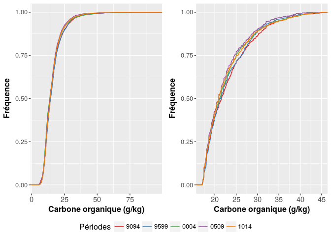
<figcaption>
</figcaption>
</figure>
    ## TableGrob (2 x 1) "arrange": 2 grobs
    ##   z     cells    name              grob
    ## 1 1 (1-1,1-1) arrange   gtable[arrange]
    ## 2 2 (2-2,1-1) arrange gtable[guide-box]

La distribution des teneurs en carbone organique par période est présentée dans la figure <A HREF="#boxplot_fr">2</A> et les principales statistiques sont présentées dans le tableau ci-dessus. La tendance de diminution des teneurs observée dans la figure <A HREF="#cdf_fr">1</A> est également constatée dans ces deux éléments. La période 2000-2004 montre la valeur médiane la plus faible avec une valeur de 13.81 g/kg. Les valeurs les plus importantes sont observées pour les périodes 1990-1994 et 1995-1999 avec respectivement des teneurs en carbone organique de 14.06 et 14.53. En terme de tendance, on remarque une augmentation des teneurs pour la période 2010-2014 avec une médiane des valeurs de 14. Ces évolutions sont très légèrement marquées sur la figure <A HREF="#boxplot_fr">2</A> où l'évolution moyenne des teneurs en carbone organique baisse légèrement après la période 1995-1999.

<table style="width:83%;">
<caption>Statistiques descriptives des teneurs en carbone organique pour les différentes périodes</caption>
<colgroup>
<col width="15%" />
<col width="9%" />
<col width="13%" />
<col width="12%" />
<col width="9%" />
<col width="13%" />
<col width="8%" />
</colgroup>
<thead>
<tr class="header">
<th align="center"> </th>
<th align="center">Min.</th>
<th align="center">1st Qu.</th>
<th align="center">Median</th>
<th align="center">Mean</th>
<th align="center">3rd Qu.</th>
<th align="center">Max.</th>
</tr>
</thead>
<tbody>
<tr class="odd">
<td align="center"><strong>9094</strong></td>
<td align="center">4.58</td>
<td align="center">11.04</td>
<td align="center">14.06</td>
<td align="center">16.03</td>
<td align="center">18.52</td>
<td align="center">65.58</td>
</tr>
<tr class="even">
<td align="center"><strong>9599</strong></td>
<td align="center">5.23</td>
<td align="center">11.15</td>
<td align="center">14.53</td>
<td align="center">16.27</td>
<td align="center">18.9</td>
<td align="center">94.85</td>
</tr>
<tr class="odd">
<td align="center"><strong>0004</strong></td>
<td align="center">4.6</td>
<td align="center">10.76</td>
<td align="center">13.81</td>
<td align="center">15.61</td>
<td align="center">18.01</td>
<td align="center">90.23</td>
</tr>
<tr class="even">
<td align="center"><strong>0509</strong></td>
<td align="center">3.78</td>
<td align="center">10.91</td>
<td align="center">13.96</td>
<td align="center">15.44</td>
<td align="center">18</td>
<td align="center">78.37</td>
</tr>
<tr class="odd">
<td align="center"><strong>1014</strong></td>
<td align="center">4.7</td>
<td align="center">11</td>
<td align="center">14</td>
<td align="center">15.7</td>
<td align="center">18.27</td>
<td align="center">63.75</td>
</tr>
</tbody>
</table>

<figure style="text-align:center;">
<a name="boxplot_fr"></a>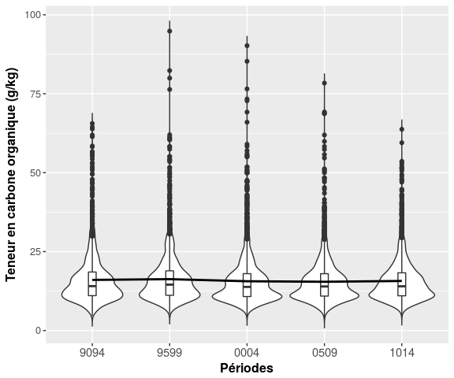
<figcaption>
</figcaption>
</figure>
Les résultats du test de Wilcoxon présentés ci-dessous montrent que **les différences globales entre les périodes sont significatives pour \[1990-1994 et 2000-2004\], \[1995-1999 et 2000-2004\], \[1995-1999 et 2005-2009\] et \[2000-2004 et 2010-2014\]**. Ces résulats sont à prendre avec mesure, car réalisés sur l'ensemble des cantons. Ils confirment néanmoins les tendances observées sur les courbes de fréquences cumulées (voir figure <A HREF="#cdf_fr">1</A>).

``` r
pairwise.wilcox.test(melted.bdat[,"value"], melted.bdat[,"annees"])
```

    ## 
    ##  Pairwise comparisons using Wilcoxon rank sum test 
    ## 
    ## data:  melted.bdat[, "value"] and melted.bdat[, "annees"] 
    ## 
    ##      9094    9599    0004    0509   
    ## 9599 0.29250 -       -       -      
    ## 0004 0.04997 1.1e-05 -       -      
    ## 0509 0.29250 0.00047 0.75842 -      
    ## 1014 0.77627 0.11941 0.04997 0.29250
    ## 
    ## P value adjustment method: holm

### Cartographie des teneurs en carbone organique

Bien que l'hétérogénéité spatiale et temporelle des analyses de la BDAT soient assez importante (certaines zones souffrent d'un manque de données), la cartographie des teneurs en carbone organique (ci-dessous) montre une distribution spatiale organisée et globalement similaire pour les différentes périodes analysées. De façon générale, cette organisation suit la lithologie du pays avec de fortes teneurs en carbone organique présentes dans les zones de socles et de piemonds et des valeurs plus faibles dans les principaux bassins sédimentaires (parisien et aquitain).

La section suivante s'attache à analyser la distribution spatiale des teneurs en carbone organique pour comprendre par la suite les leviers agissant sur les évolutions des teneurs.

 

Analyse des facteurs contrôlant la distribution spatiale
--------------------------------------------------------

Dans cette partie, les facteurs contrôlant la distribution spatiale des teneurs en carbone organique des différentes périodes sont analysés. Le travail est dans un premier porté par une analyse en composante principale pour identifier les relations entre les facteurs potentiellement explicatif et dans un deuxième temps par une modélisation avec la méthode des arbres de régression boostés pour affiner l'analyser et classer les variables explicatives par ordre d'importance (contribution).

### Analyse en composante principale

La figure <A HREF="#pca_fr">3</A> présente la distribution des variables sur les axes 1 et 2 de l'ACP. Environ 62 pourcent de l'information est contenu dans ces deux premiers axes. Description de la distribution des variables dans l'espace des ACP :

-   L'axe 1 représente 43% de l'information. Cet axe est fortement associé à l'occupation du sol. Les différentes variables associées aux grandes cultures et à l'élevage sont bien représentées et ont une forte contribution dans la variance du jeu de données. Les statistiques liées à la part d'STH, de prairies, de SFP et d'OTEX polyculture élevage sont corrélées et sont opposées aux variables associées aux grandes cultures (proportion des surfaces de céréales/SAU et OTEX grandes cultures).
-   L'axe 2 représente 19% de l'information. La correlation avec les variables est moins nette que l'axe 1. Les variables de type climat et topographie sont légèrement correlées à cet axe. D'autres variables d'occupation du sol sont associées à l'axe 2. Celles-ci concernent les zones agricoles hétérogènes (*c**l**c*<sub>25<sub>90</sub></sub>), les zones de maïs fourrage et les zones qui ont une densité importante en UGBTA. Logiquement, ces deux dernière variables sont liées.

-   Plusieurs variables ont un faible impact et seront écartées par la suite :
-   Pour l'occupation du sol : les variables liées à Corine Land Cover
-   Pour le climat : *jpluie\_juillet*, *ttemp\_an*, *jchauds\_an (voir peut être aussi hpluie\_an)*

Dans cet espace, la teneur en carbone organique initiale (période 90-94) est moyennement représentée (-50% de contribution). Cette variable est directement opposée aux variables climatiques ce qui met en valeur l'importance de ce facteur dans la distribution spatiale des teneurs à l'échelle de la France.
Dans une moindre mesure, la teneur en CO est correlée aux surfaces fourragères principales et aux UGBTA.

<figure style="text-align:center;">
<a name="pca_fr"></a>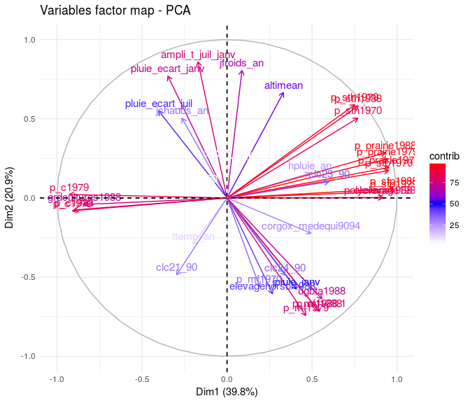
<figcaption>
</figcaption>
</figure>
Dans la figure <A HREF="#pcabiplot_fr">4</A>, les échantillons sont rajoutés dans l'espace de correlation des variables. La représentation des échantillons classés par teneurs en carbone organique permet de visualiser le lien entre les variables et ...(mal dit).

<figure style="text-align:center;">
<a name="pcabiplot_fr"></a>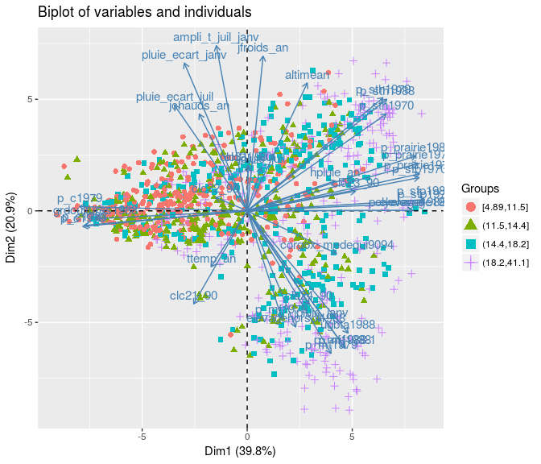
<figcaption>
</figcaption>
</figure>
### Modélisation avec GBM

Bien spécifier que GBM est utilisé juste pour appréhender l'importance et le comportement des variables explicatives.

L'application de ces modèles demande une bonne configuration de leurs paramètres. Pour déterminer la meilleur combinaison de paramètres, la fonction *train* du package *caret* est utilisée.

1.  Boosted regression tree (BRT)
    Les modèles d'arbres de régression boostés sont connus pour améliorer la précision de prédiction par rapport aux simples arbres de régression.
    L'algo permet d'ajuster un modèle en fonction d'un processus itératif. A chaque itération, les arbres de régresssions sont ajustés et montés sur une fraction de l'ensemble des données échantillongées. Les principaux paramètres d'un modèle sont :
    1.  le taux d'apprentissage *(skrinkage)* : il correspond à une constante déterminant l'influence de la combinaison individuelle des arbres qui forme le forme le modèle final. Lorsque ce coefficient est faible, le modèle est très spécialisé et est difficilement applicable sur un autre jeu de données.
    2.  la taille des arbres *(interaction depth)* correspond à la taille des arbres de régression. Lorsque la taille est égale à 1, chaque arbre est constitué d'un seul noeud, on modélise l'effet d'une seule variable prédictive. Ainsi, le modèle final additionne séparément l'effet prédictif des variables et les intéractions des variables ne sont pas explicitement prise en compte. Lorsque la taille des arbres est supérieur à 1, chaque arbre de régression individuelle modélise l'interaction d'au moins deux variables prédictives. Celà permet l'utilisation de modèle prenant en compte les intéractions d'ordre i entre les variables prédictives. La capacité de représenter les interactions entre les variables prédictives sans connaissance a priori est l'un des avantages des arbres de régression.
    3.  le nombre d'arbre *(n.tree)*correspond au nombre d'arbre pour l'ajustement. C'est l'équivalent du nombre d'itérations.

Les principales variables explicatives de la distribution des teneurs en carbone organique sont présentées figure <A HREF="#gbm_fr">5</A>. Les facteurs les plus importants sont d'ordre climatiques et topographiques. Ces résultats confirment les premières observations de l'ACP.
Les variables d'occupation du sol ont une influence secondaire et celles qui agissent significativement sont la proportion des exploitations ayant une OTEX de type élevage en 1988, la proportion de surface fourragère principale en 1988 et les proportions de maïs fourrage dans la SAU pour les années 1988, 1979 et 1970. Parmis ces variables d'occupation du sol, l'années 1988 explique bien les teneurs en carbone organique pour la période 1995-1999.

**En conclusion** Ces résultats montrent le caractère multifactoriel de la répartition des teneurs en carbone organique à l'échelle national. Pour évaluer l'effet de l'évolution de l'occupation du sol sur les teneurs en C, il est nécessaire de travailler sur des zones géographiques contextes topographiques et climatiques homogènes.

    ## Loading required package: gbm

    ## Loading required package: splines

    ## Loaded gbm 2.1.1

<figure style="text-align:center;">
<a name="gbm_fr"></a>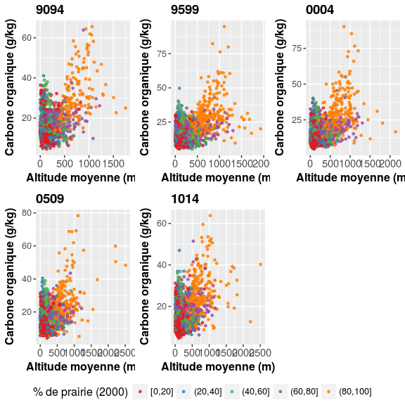
<figcaption>
</figcaption>
</figure>
<figure style="text-align:center;">
<a name="gbm_classeC_fr"></a>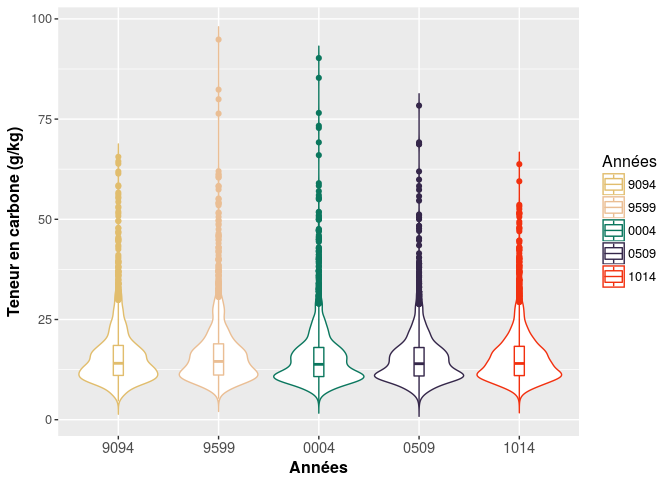
<figcaption>
</figcaption>
</figure>
    ## TableGrob (2 x 1) "arrange": 2 grobs
    ##   z     cells    name              grob
    ## 1 1 (1-1,1-1) arrange   gtable[arrange]
    ## 2 2 (2-2,1-1) arrange gtable[guide-box]

Ci-dessous, commenter les résultats de la stratification avec les types de climat

<figure style="text-align:center;">
<a name="gbm_strat_fr"></a>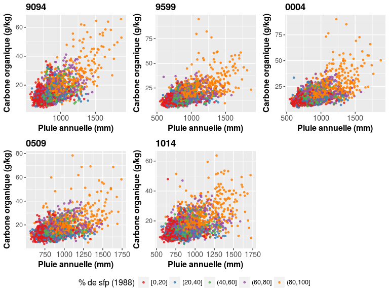
<figcaption>
</figcaption>
</figure>
    ## TableGrob (2 x 1) "arrange": 2 grobs
    ##   z     cells    name              grob
    ## 1 1 (1-1,1-1) arrange   gtable[arrange]
    ## 2 2 (2-2,1-1) arrange gtable[guide-box]

Ci-dessous, commenter les résultats de la stratification avec les principales régions d'élevage

<figure style="text-align:center;">
<a name="gbm_strat_elevage"></a>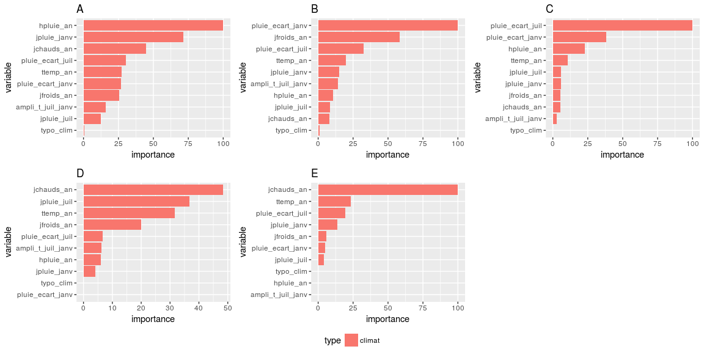
<figcaption>
</figcaption>
</figure>
    ## TableGrob (2 x 1) "arrange": 2 grobs
    ##   z     cells    name              grob
    ## 1 1 (1-1,1-1) arrange   gtable[arrange]
    ## 2 2 (2-2,1-1) arrange gtable[guide-box]

Ci-dessous, commenter les résultats de la stratification avec les types de climat

<figure style="text-align:center;">
<a name="gbm_region_fr"></a>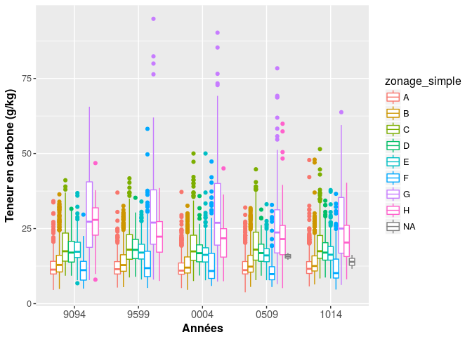
<figcaption>
</figcaption>
</figure>
    ## TableGrob (2 x 1) "arrange": 2 grobs
    ##   z     cells    name              grob
    ## 1 1 (1-1,1-1) arrange   gtable[arrange]
    ## 2 2 (2-2,1-1) arrange gtable[guide-box]

#### Graphiques de correlation

<figure style="text-align:center;">
<a name="correlation"></a>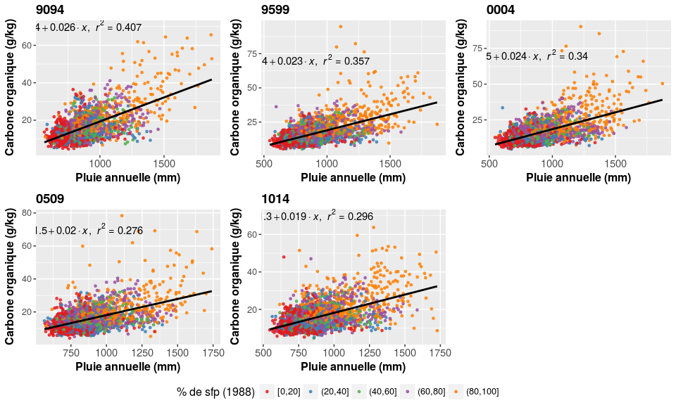
<figcaption>
</figcaption>
</figure>
    ## TableGrob (2 x 1) "arrange": 2 grobs
    ##   z     cells    name              grob
    ## 1 1 (1-1,1-1) arrange   gtable[arrange]
    ## 2 2 (2-2,1-1) arrange gtable[guide-box]

<figure style="text-align:center;">
<a name="altitude"></a>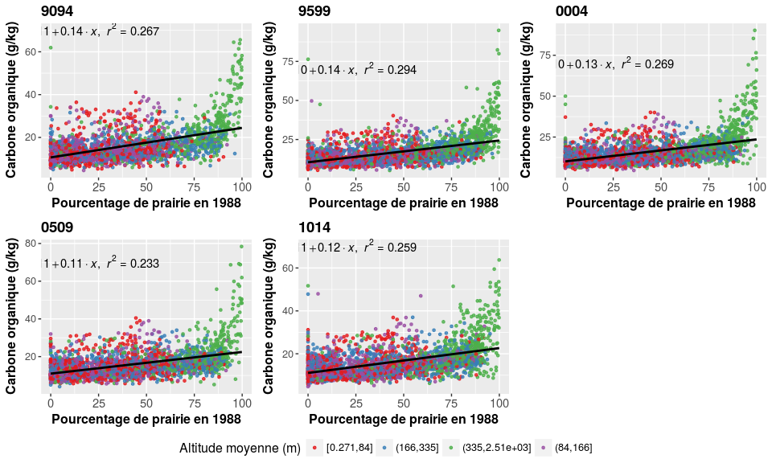
<figcaption>
</figcaption>
</figure>
    ## TableGrob (2 x 1) "arrange": 2 grobs
    ##   z     cells    name              grob
    ## 1 1 (1-1,1-1) arrange   gtable[arrange]
    ## 2 2 (2-2,1-1) arrange gtable[guide-box]

<figure style="text-align:center;">
<a name="cor_polyelevage"></a>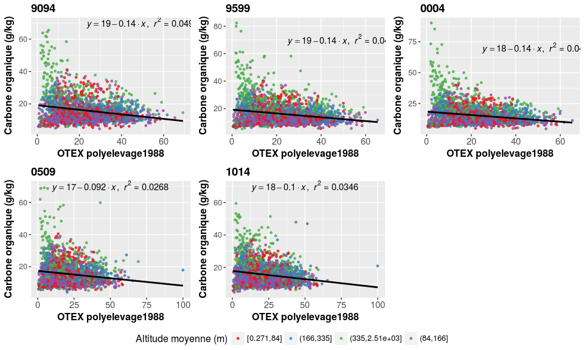
<figcaption>
</figcaption>
</figure>
    ## TableGrob (2 x 1) "arrange": 2 grobs
    ##   z     cells    name              grob
    ## 1 1 (1-1,1-1) arrange   gtable[arrange]
    ## 2 2 (2-2,1-1) arrange gtable[guide-box]

<figure style="text-align:center;">
<a name="cor_elevagehorssol"></a>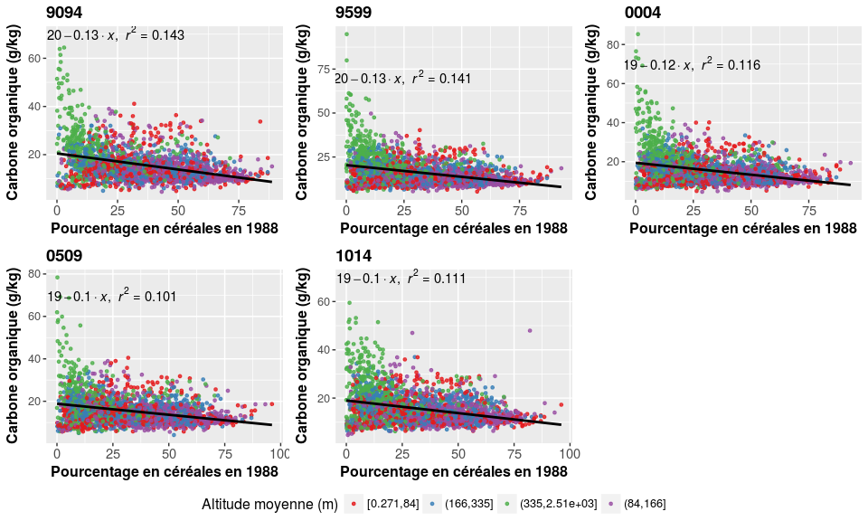
<figcaption>
</figcaption>
</figure>
    ## TableGrob (2 x 1) "arrange": 2 grobs
    ##   z     cells    name              grob
    ## 1 1 (1-1,1-1) arrange   gtable[arrange]
    ## 2 2 (2-2,1-1) arrange gtable[guide-box]

<figure style="text-align:center;">
<a name="cor_prairie1988"></a>
<figcaption>
</figcaption>
</figure>
    ## TableGrob (2 x 1) "arrange": 2 grobs
    ##   z     cells    name              grob
    ## 1 1 (1-1,1-1) arrange   gtable[arrange]
    ## 2 2 (2-2,1-1) arrange gtable[guide-box]

<figure style="text-align:center;">
<a name="cor_ugbta"></a>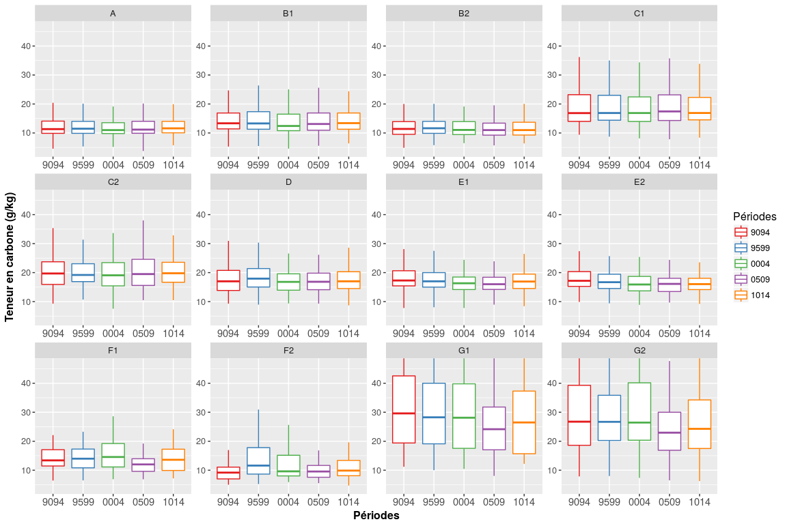
<figcaption>
</figcaption>
</figure>
    ## TableGrob (2 x 1) "arrange": 2 grobs
    ##   z     cells    name              grob
    ## 1 1 (1-1,1-1) arrange   gtable[arrange]
    ## 2 2 (2-2,1-1) arrange gtable[guide-box]

<figure style="text-align:center;">
<a name="cor_cereal"></a>
<figcaption>
</figcaption>
</figure>
    ## TableGrob (2 x 1) "arrange": 2 grobs
    ##   z     cells    name              grob
    ## 1 1 (1-1,1-1) arrange   gtable[arrange]
    ## 2 2 (2-2,1-1) arrange gtable[guide-box]

### Conclusion

Ici, conclure en disant que l'analyse des teneurs france entière et des dynamiques n'est pas facile en raison de :

-   les dynamiques régionales spécifiques peuvent être noyées (pourquoi?) dans la masse...
-   la part des facteurs contrôlant la distribution (climat, l'occup du sol...)

Par type de climat
------------------

Compte tenu de l'importance des variables climatiques dans le contrôle de la distribution spatiale des teneurs en carbone organique, une stratification des analyses précédemment réalisées est proposée. Celle-ci est basée sur une typologie des types de climat (rajouter ref). En raison de l'hétérogénéité spatiale des analyses de la BDAT (rajouter carte avec distribution du nombre d'effectif par canton), l'analyse est seulement portée sur les zones 1, 2, 3, 4 et 5.

### Cartographie des types de climat

La carte ci-dessous présente la typologie.


### Courbes de fréquence cumulées

<figure style="text-align:center;">
<a name="cdf_clim"></a>
<figcaption>
</figcaption>
</figure>
La figure <A HREF="#cdf_clim">17</A> présente les courbes de fréquence cumulées pour les différents types de climats.

<figure style="text-align:center;">
<a name="boxplot_clim"></a>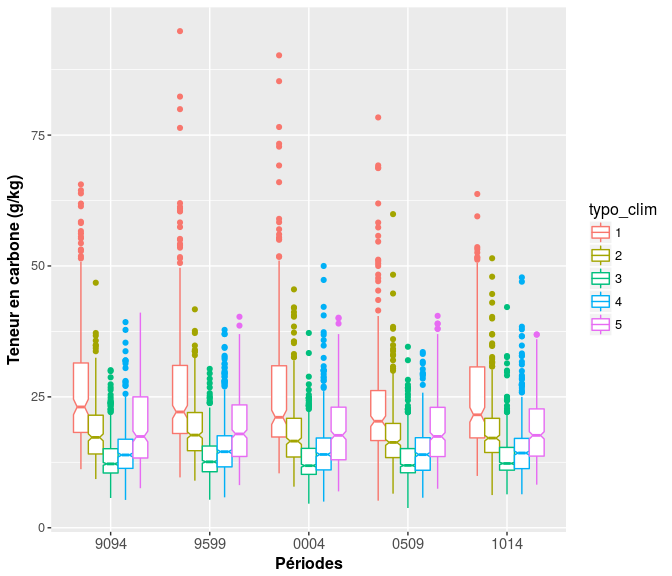
<figcaption>
</figcaption>
</figure>
La figure <A HREF="#boxplot_clim">18</A> représente la distribution des teneurs en carbone organique sous forme de boxplot pour les différentes périodes et les différentes zones climatiques. COMMENTER

Par régions d'élevage
---------------------

Cette section développe une analyse des teneurs en carbone organique pour les principales régions d'élevage. En raison de l'hétérogénéité spatiale des analyses de la BDAT (rajouter carte avec distribution du nombre d'effectif par canton), l'analyse est uniquement réalisée sur les régions d'élevage suivante :
- A :
- B1 :
- B2 :
- C1 :
- C2 :
- D :

### Cartographie des régions d'élevage

 

### Analyses par régions d'élevage

La figure <A HREF="#cdf_regelevage">19</A> présente les courbes de fréquences cumulées pour les différentes régions d'élevage.

<figure style="text-align:center;">
<a name="cdf_regelevage"></a>
<figcaption>
</figcaption>
</figure>
Ci-dessous, on regarde la répartition des teneurs en C pour les différentes périodes et par les principales régions d'élevage. (voir figure <A HREF="#boxplot_regelevage">20</A>).

<figure style="text-align:center;">
<a name="boxplot_regelevage"></a>
<figcaption>
</figcaption>
</figure>
<figure style="text-align:center;">
<a name="boxplot_regelevage2"></a>
<figcaption>
</figcaption>
</figure>
