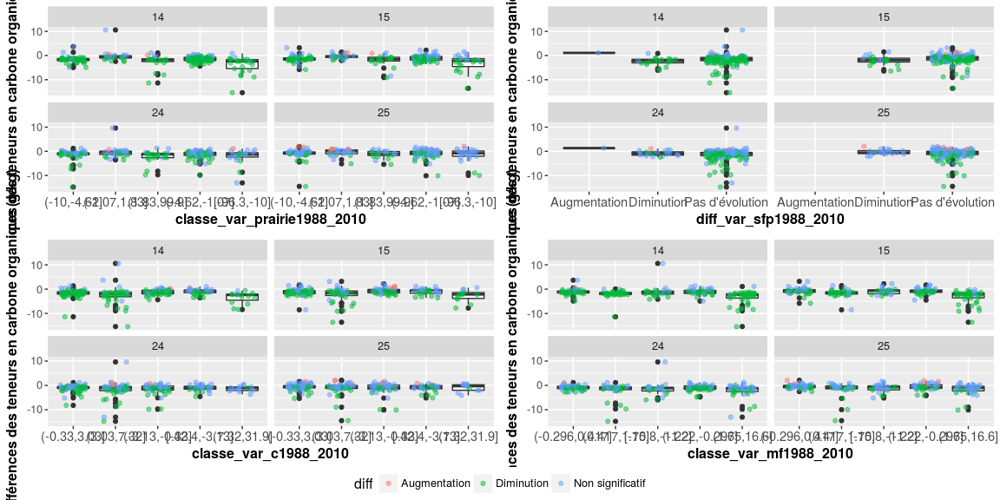

Traitement des données de la BDAT : Evolution des teneurs en carbone organique
================
Jean-Baptiste Paroissien
27/01/2017

-   [Objectifs](#objectifs)
-   [Analyse de l'évolution des teneurs en carbone organique à l'échelle nationale](#analyse-de-levolution-des-teneurs-en-carbone-organique-a-lechelle-nationale)
    -   [Analyse du nombre d'évolution significative par canton](#analyse-du-nombre-devolution-significative-par-canton)
    -   [Analyse sur les périodes identifiées](#analyse-sur-les-periodes-identifiees)
    -   [Cartographie des évolutions](#cartographie-des-evolutions)
    -   [Focus sur la Picardie et le Nord-Pas-De-Calais](#focus-sur-la-picardie-et-le-nord-pas-de-calais)
-   [Analyse sur les régions d'élevage B, C et D](#analyse-sur-les-regions-delevage-b-c-et-d)
    -   [Histogrammes](#histogrammes)
    -   [Graphiques de correlation](#graphiques-de-correlation)
-   [Analyse avec une ACP](#analyse-avec-une-acp)
-   [Modélisation de l'évolution des teneurs ?](#modelisation-de-levolution-des-teneurs)
-   [Modélisation spatio-temporelle](#modelisation-spatio-temporelle)

``` r
Sys.Date()
```

    ## [1] "2017-02-02"

``` r
sessionInfo()
```

    ## R version 3.3.2 (2016-10-31)
    ## Platform: x86_64-pc-linux-gnu (64-bit)
    ## Running under: Ubuntu 16.04.1 LTS
    ## 
    ## locale:
    ##  [1] LC_CTYPE=fr_FR.UTF-8       LC_NUMERIC=C              
    ##  [3] LC_TIME=fr_FR.UTF-8        LC_COLLATE=fr_FR.UTF-8    
    ##  [5] LC_MONETARY=fr_FR.UTF-8    LC_MESSAGES=fr_FR.UTF-8   
    ##  [7] LC_PAPER=fr_FR.UTF-8       LC_NAME=C                 
    ##  [9] LC_ADDRESS=C               LC_TELEPHONE=C            
    ## [11] LC_MEASUREMENT=fr_FR.UTF-8 LC_IDENTIFICATION=C       
    ## 
    ## attached base packages:
    ## [1] parallel  grid      stats     graphics  grDevices utils     datasets 
    ## [8] methods   base     
    ## 
    ## other attached packages:
    ##  [1] raster_2.5-8       doMC_1.3.4         iterators_1.0.8   
    ##  [4] foreach_1.4.3      plyr_1.8.4         caret_6.0-73      
    ##  [7] factoextra_1.0.3   GGally_1.3.0       pander_0.6.0      
    ## [10] knitr_1.15.1       FactoMineR_1.34    wesanderson_0.3.2 
    ## [13] mapproj_1.2-4      gridExtra_2.2.1    Hmisc_4.0-0       
    ## [16] Formula_1.2-1      survival_2.40-1    lattice_0.20-34   
    ## [19] reshape2_1.4.2     devtools_1.12.0    classInt_0.1-23   
    ## [22] RColorBrewer_1.1-2 maptools_0.8-40    rgdal_1.2-4       
    ## [25] sp_1.2-3           ggplot2_2.2.0      stringr_1.1.0     
    ## [28] fields_8.4-1       maps_3.1.1         spam_1.4-0        
    ## [31] gdata_2.17.0       RODBC_1.3-14      
    ## 
    ## loaded via a namespace (and not attached):
    ##  [1] splines_3.3.2        gtools_3.5.0         assertthat_0.1      
    ##  [4] stats4_3.3.2         latticeExtra_0.6-28  yaml_2.1.14         
    ##  [7] ggrepel_0.6.5        backports_1.0.4      quantreg_5.29       
    ## [10] digest_0.6.10        minqa_1.2.4          colorspace_1.2-7    
    ## [13] htmltools_0.3.5      Matrix_1.2-7.1       SparseM_1.74        
    ## [16] scales_0.4.1         lme4_1.1-12          MatrixModels_0.4-1  
    ## [19] htmlTable_1.7        tibble_1.2           mgcv_1.8-16         
    ## [22] car_2.1-4            withr_1.0.2          nnet_7.3-12         
    ## [25] lazyeval_0.2.0       pbkrtest_0.4-6       magrittr_1.5        
    ## [28] memoise_1.0.0        evaluate_0.10        nlme_3.1-128        
    ## [31] MASS_7.3-45          foreign_0.8-67       class_7.3-14        
    ## [34] tools_3.3.2          data.table_1.10.0    munsell_0.4.3       
    ## [37] cluster_2.0.5        flashClust_1.01-2    e1071_1.6-7         
    ## [40] nloptr_1.0.4         leaps_2.9            rmarkdown_1.3       
    ## [43] gtable_0.2.0         ModelMetrics_1.1.0   codetools_0.2-15    
    ## [46] reshape_0.8.6        rprojroot_1.1        stringi_1.1.2       
    ## [49] Rcpp_0.12.7          rpart_4.1-10         acepack_1.4.1       
    ## [52] scatterplot3d_0.3-37

Objectifs
=========

Ici, on s'intéresse aux résultats sur les évolutions des teneurs en carbone. Les résultats ont été fournis par InfoSol et résultent d'un ré-échantillonnage des analyses de la bdat communales réalisées 100 fois. Plusieurs analyses sont réalisées :

-   Identifier la distribution spatiale de l'évolution à l'échelle de la france : Cartographie, boxplot du nombre de canton qui évolue par différents niveaux de stratification
-   Analyse de la distribution. Quelle sont les principaux facteurs qui expliquent ces évolutions ?

Analyse de l'évolution des teneurs en carbone organique à l'échelle nationale
=============================================================================

A l'échelle nationale, on souhaite avoir une vision des évolutions générales des teneurs en C, appréhender les zones les plus touchées, savoir si ces évolutions sont significatives ou non.

Analyse du nombre d'évolution significative par canton
------------------------------------------------------

La figure <A HREF="#histo_evolution">1</A> présente un histogramme du nombre de canton ayant connu une augmentation ou une diminution significative des teneurs en carbone organique. L'histogramme est appliqué sur toutes les périodes et stratifié par zones d'élevage.
La figure montre un équilibre entre le nombre de canton ayant eu une augmentation et le nombre de canton ayant eu une diminution de la teneur en carbone organique. La proportion des zones d'élevage entre les classes d'augmentation et de diminution est relativement équilibrée mais quelques zones se distinguent :

-   Les régions B1, C2 et D sont davantage affectées par la diminution des teneurs en C
-   Les région A et C1 sont plus affectées par des augmentations que des diminutions.

<figure style="text-align:center;">
<a name="histo_evolution"></a>
<figcaption>
</figcaption>
</figure>
Dans la figure <A HREF="#histo_evolution_period">2</A>, les histogrammes sont analysés pour des écarts entre les périodes étudiées d'au moins 10 ans. La figure montre des différences importantes entre les périodes analysées :

-   L'évolution des teneurs est équilibrée entre les périodes \[1994-1999\]-\[2010-2014\] et les périodes \[1990-1994\]-\[2010-2014\],
-   Les différences entre les périodes \[1990-1994\]-\[2000-2004\] et \[1994-1999\]-\[2005-2009\] montrent une part importante pour la diminution des teneurs en C. Dans une moindre mesure, la différence entre les périodes \[1990-1994\]-\[2005-2009\] présente une part de diminution des teneurs en C plus importante que l'augmentation.
-   A l'inverse, les teneurs en C ont augmenté majoritairement entre les périodes \[2000-2004\]-\[2010-2014\].

<figure style="text-align:center;">
<a name="histo_evolution_period"></a>
<figcaption>
</figcaption>
</figure>
**En conclusion** de cette section, on constate plusieurs points :

-   Les évolutions des teneurs en C entre les différentes périodes ne suivent pas les mêmes tendances. Les premières observation vues dans [FS\_traitements\_bdat.Rmd](https://github.com/Rosalien/GISEDSol/tree/master/Fichiers_suivis/Traitements/Suivis/FS_traitements_bdat.Rmd) se confirment. Les teneurs en C ont augmenté sur la période \[2010-2014\] et cette augmentation est particulièrement prononcée entre les périodes \[2000-2004\]-\[2010-2014\].
-   La diminution des teneurs est surtout observée entre \[1990-1994\]-\[2000-2004\] et \[1994-1999\]-\[2005-2009\] et \[1990-1994\]-\[2005-2009\].
-   Les principales zones d'élevage affectées par ces changements sont : A, B1, C1, C2 et D. Ce résultat provient surtout de la densité d'analyse dans ces zones et de leur étendue spatiale.

Analyse sur les périodes identifiées
------------------------------------

Dans la suite, on s'intéressera uniquement aux périodes concernées par les changements importants idenfiés dans le paragraphe précédent, à savoir : \[2000-2004\]-\[2010-2014\], \[1990-1994\]-\[2000-2004\],\[1994-1999\]-\[2005-2009\] et \[1990-1994\]-\[2005-2009\].

<figure style="text-align:center;">
<a name="bar_prairie"></a>
<figcaption>
</figcaption>
</figure>
De la figure ci-dessous, les 10 principales régions touchées par des évolutions significatives sont présentées dans le tableau ci-dessous.

|         |     diff     |     nom\_region    | period | freq |
|:-------:|:------------:|:------------------:|:------:|:----:|
| **115** |  Diminution  | NORD-PAS-DE-CALAIS |   14   |  103 |
| **114** |  Diminution  | NORD-PAS-DE-CALAIS |   13   |  96  |
|  **26** | Augmentation |       CENTRE       |   35   |  73  |
| **116** |  Diminution  | NORD-PAS-DE-CALAIS |   24   |  66  |
|  **21** | Augmentation |      BRETAGNE      |   24   |  54  |
|  **20** | Augmentation |      BRETAGNE      |   14   |  49  |
| **122** |  Diminution  |      PICARDIE      |   13   |  48  |
|  **61** | Augmentation |  PAYS DE LA LOIRE  |   35   |  47  |
| **123** |  Diminution  |      PICARDIE      |   14   |  43  |
| **126** |  Diminution  |  POITOU-CHARENTES  |   13   |  42  |

La région Centre et les pays de la Loire ont une fréquence importante de canton ayant une augmentation de C.
Le Nord-pas-de-Calais, la Bretagne, la Picardie et le Poitou-Charentes sont les principales régions touchées par des diminutions en C.

Cartographie des évolutions
---------------------------

On retrouve ces observations sur les cartes d'évolution des teneurs. Dans le détail, c'est le morbihan qui est surtout affecté par des chutes de teneurs en carbone organique et en région Centre, on observe une augmentation des teneurs concentrée dans le Perche.
Ces résultats très ciblés font penser à un effet de bord, surtout pour les régions Picardie, Nord-Pas-De-Calais et le département du Morbihan. **La suite des analyses se concentrera sur ces zones.**


Focus sur la Picardie et le Nord-Pas-De-Calais
----------------------------------------------

### Cartographie


### Analyses des facteurs explicatifs

#### ACP

``` r
########################
Rcovarclimato <- c("std_temp_janv","std_temp_juil","std_pluie_janv","std_pluie_juil")
typeclimato <- replicate(length(Rcovarclimato), "climat")
#
Rcovaroccup <- c("var_sth1970_2010","var_sth1979_2010","var_sth1988_2010","var_c1970_2010","var_c1979_2010","var_c1988_2010","var_sfp1970_2010","var_sfp1979_2010","var_sfp1988_2010","var_mf1970_2010","var_mf1979_2010","var_mf1988_2010","var_prairie1970_2010","var_prairie1979_2010","var_prairie1988_2010","var_ugb1988_2010")
typeoccup <- replicate(length(Rcovaroccup), "occup")

type <- c(typeclimato,typeoccup)
Rcovar <- c(Rcovarclimato,Rcovaroccup,"diff24")
vNames <- c("diffmedian24",Rcovar) #9599 car meilleure représentation spatiale
########################

# Lecture de la table sans les NA
lvNames <- length(vNames)
dcast.focus <- dcast.bdat[(dcast.bdat$code_reg %in% reg_focus) & complete.cases(dcast.bdat[,vNames]),][,vNames]

res.pca <- PCA(dcast.focus[,!names(dcast.focus) %in% "diff24"], graph = FALSE)
#fviz_screeplot(res.pca, ncp=10)

pca <- fviz_pca_var(res.pca, axes = c(1,2),col.var="contrib") +
scale_color_gradient2(low="white", mid="blue", 
                  high="red", midpoint=50) + theme_minimal()
pca

fviz_pca_biplot(res.pca, label="var",habillage=dcast.focus$diff24,axes=c(1,2),
     addEllipses=FALSE, ellipse.level=0.95, ggtheme = theme_minimal())
```

Pour l'analyse des facteurs explicatifs, on regardera la distribution des différences des teneurs (boxplot) en fonction de différentes classes d'évolution de l'occupation du sol.
Des graphiques de correlation, pour voir si il existe des relations linéaires entre les évolutions des teneurs et l'évolution de l'occupation du sol.

<figure style="text-align:center;">
<a name="boxplot_NPC_picardie"></a>
<figcaption>
</figcaption>
</figure>
    ## TableGrob (2 x 1) "arrange": 2 grobs
    ##   z     cells    name              grob
    ## 1 1 (1-1,1-1) arrange   gtable[arrange]
    ## 2 2 (2-2,1-1) arrange gtable[guide-box]

Analyse sur les régions d'élevage B, C et D
===========================================

Histogrammes
------------

Graphiques de correlation
-------------------------

Rajouter les droites de régressions
Rajouter les variation climatiques

Figure ci-dessous à commenter pour aller plus loin.

``` r
# Voir le développement de ce type de graphique
dcast.bdatBCD <- dcast.bdat[dcast.bdat$zonage_simple %in% c("B","C","D"),]

ggplot(dcast.bdatBCD, aes(var_ugb8810, diffmedian15,shape=factor(diff15))) +
  geom_point(aes(colour = factor(diff15)), size = 2) +
  geom_point(colour="grey10", size = 1.5)


ggplot(dcast.bdatBCD, aes(var_sth1970_2010, diffmedian15,shape=factor(diff15))) +
  geom_point(aes(colour = factor(diff15)), size = 2) +
  geom_point(colour="grey10", size = 1.5)


ggplot(melted.bdatdiff, aes(var_cereale1970_2010, diffmedian15,shape=factor(diff15))) +
  geom_point(aes(colour = factor(diff15)), size = 2) +
  geom_point(colour="grey10", size = 1.5)
```

Analyse avec une ACP
====================

``` r
########################
Rcovarclimato <- c("std_temp_janv","std_temp_juil","std_pluie_janv","std_pluie_juil")
typeclimato <- replicate(length(Rcovarclimato), "climat")
#
Rcovaroccup <- c("var_sth1970_2010","var_sth1979_2010","var_sth1988_2010","var_c1970_2010","var_c1979_2010","var_c1988_2010","var_sfp1970_2010","var_sfp1979_2010","var_sfp1988_2010","var_mf1970_2010","var_mf1979_2010","var_mf1988_2010","var_prairie1970_2010","var_prairie1979_2010","var_prairie1988_2010","var_ugb1988_2010")
typeoccup <- replicate(length(Rcovaroccup), "occup")

type <- c(typeclimato,typeoccup)
Rcovar <- c(Rcovarclimato,Rcovaroccup,"diff24")
vNames <- c("diffmedian24",Rcovar) #9599 car meilleure représentation spatiale
########################

# Lecture de la table sans les NA
lvNames <- length(vNames)
dcast.bdat_variables <- dcast.bdat[complete.cases(dcast.bdat[,vNames]),]

res.pca <- PCA(dcast.bdat_variables[,!names(dcast.bdat_variables) %in% "diff24"], graph = FALSE)
#fviz_screeplot(res.pca, ncp=10)

pca <- fviz_pca_var(res.pca, axes = c(1,2),col.var="contrib") +
scale_color_gradient2(low="white", mid="blue", 
                  high="red", midpoint=50) + theme_minimal()
pca

fviz_pca_biplot(res.pca, label="var",habillage=dcast.bdat_variables$diff24,axes=c(1,2),
     addEllipses=FALSE, ellipse.level=0.95, ggtheme = theme_minimal())
```

Modélisation de l'évolution des teneurs ?
=========================================

``` r
######################
Rcovarclimato <- c("std_temp_janv","std_temp_juil","std_pluie_janv","std_pluie_juil")
typeclimato <- replicate(length(Rcovarclimato), "climat")

Rcovaroccup <- c("var_sth1970_2010","var_sth1979_2010","var_sth1988_2010","var_c1970_2010","var_c1979_2010","var_c1988_2010","var_sfp1970_2010","var_sfp1979_2010","var_sfp1988_2010","var_mf1970_2010","var_mf1979_2010","var_mf1988_2010","var_prairie1970_2010","var_prairie1979_2010","var_prairie1988_2010","var_ugb1988_2010")
typeoccup <- replicate(length(Rcovaroccup), "occup")

type <- c(typeclimato,typeoccup)
Rcovar <- c(Rcovarclimato,Rcovaroccup)
vNames <- c("diffmedian24",Rcovar) #9599 car meilleure représentation spatiale
######################

# Sélection du jeu de données
id <- "id_geofla"# Nom du champs présentant un identifiant unique
dcast.bdat_gbm <- dcast.bdat[complete.cases(dcast.bdat[,vNames]),c(vNames,id)] # Pour supprimer les NA
datax <- dcast.bdat_gbm[, vNames[-1]]
datay <- dcast.bdat_gbm[, vNames[1]]

tuneGrid <- expand.grid(interaction.depth = c(1, 5, 9),n.trees = (1:20)*150,shrinkage = 0.1,n.minobsinnode = 20)
trControl <- trainControl(method = "cv",p=0.8)

#registerDoMC(4) # Nombre de processeurs activés
#mgbm <- train(x = datax , y = datay,method="gbm",tuneGrid = tuneGrid,trControl = trControl,verbose = F,keep.data = T)
#plot(varImp(mgbm), top = 10)

set.seed(157)#Pour assurer la reproductibilité
nbl <- 2
prob <- 0.8
model <- "gbm"

# Pour le stockage des résultats
rest <- array(NA, dim = c(length(datay), nbl, 1),list(id = dcast.bdat_gbm[,id], loop = 1:nbl, mod = model))
  
for (j in 1:nbl){
  gc()  
  # randomizes the mask 
  print(j)
  masko <- createDataPartition(dcast.bdat_gbm[,1],p = prob, list = FALSE)
  
  donneeL <- dcast.bdat_gbm[masko,]
  donneeV <- dcast.bdat_gbm[-masko,]
  learningx <- datax[masko,]
  learningy <- datay[masko]
  indepx <- datax[-masko,]
  indepy <- datay[-masko]

  mgbm <- train(x = learningx , y = learningy,"gbm",tuneGrid = tuneGrid,trControl = trControl,verbose = F,keep.data = T)
  #best.iter <- gbm.perf(mgbm,method="cv")
  #save(mgbm,file=paste(fold,"mfinal",titre,"_",model,"_",j,".RData",sep=""))
                  
  f.predict <- predict(mgbm$finalModel, learningx , n.trees = mgbm$bestTune$n.trees)
  #save(f.predict,file=paste("fpredict",titre,"_",model,".RData",sep=""))

  indep.pred <- predict(mgbm$finalModel, indepx , n.trees=mgbm$bestTune$n.trees)

  # Si transformation log du c        
  #indep.pred <- exp(indep.pred)
        
  rest[-masko, j, model] <- indep.pred  
  residue <- learningy - f.predict
  donneeL$residues <- residue
        
  # Construire la moyenne des résidus dans un dataframe!
  write.csv(donneeL,paste(repsortie,"donneeL",model,"_",j,".csv",sep=""))  
}

#Calcul de la moyenne des résidus
restResidues <- array(NA, dim = c(nrow(donneeL),nbl,2),list(idresidues = seq(1,nrow(donneeL),1),loop=1:nbl,data=c("residues","idresidues")))

for(i in 1:nbl){
  print(i)
  donnee <- read.csv(paste(repsortie,"donneeL",model,"_",i,".csv",sep=""))

  #donnee <- donnee[with(donnee, order(id)),]# revoir ce point

  residues <- donnee$residues
  id <- donnee$id
  restResidues[,i,"residues"] <- residues
  restResidues[,i,"idresidues"] <- id
}
restResidues <- as.data.frame(restResidues)

dfcomplet <- as.data.frame(pt@data["id"][with(pt@data["id"],order(id)),])
colnames(dfcomplet) <- "id"

# Revoir...      
dfcomplet <- as.data.frame(dcast.bdat_gbm[id][with(dcast.bdat_gbm[id],order(id)),])
colnames(dfcomplet) <- "id"

restMeanResidues <- array(NA, dim = c(nrow(pt),nbl+1),list(id=1:nrow(pt@data["id"]),data=c("idresidues",paste(1:nbl,".residues",sep=""))))

for(i in 1:nbl){
  print(i)
  dtmerge <- merge(restResidues[c(paste(i,".residues",sep=""),paste(i,".idresidues",sep=""))],dfcomplet,by.x=paste(i,".idresidues",sep=""),by.y="id",all=TRUE)
  restMeanResidues[,paste(i,".residues",sep="")] <- dtmerge[[2]]
}

restMeanResidues[,"idresidues"] <- dfcomplet[["id"]]
dfMeanResidues <- as.data.frame(restMeanResidues)
dfMeanResidues <- rowMeans(dfMeanResidues,na.rm=TRUE)
##>> export!

rest <- cbind(as.data.frame(rest),pt@data[vNames[1]])
```

Modélisation spatio-temporelle
==============================

Regarder :

multivariate regression-kriging and generalized linear models par Nickel2014;
et generalized least squares regression par Begueria2013.

``` r
# Logistic Regression
# where F is a binary factor and
# x1-x3 are continuous predictors
fit <- glm(F~x1+x2+x3,data=mydata,family=binomial())
summary(fit) # display results
confint(fit) # 95% CI for the coefficients
exp(coef(fit)) # exponentiated coefficients
exp(confint(fit)) # 95% CI for exponentiated coefficients
predict(fit, type="response") # predicted values
residuals(fit, type="deviance") # residuals 
```
