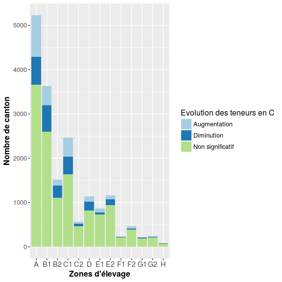
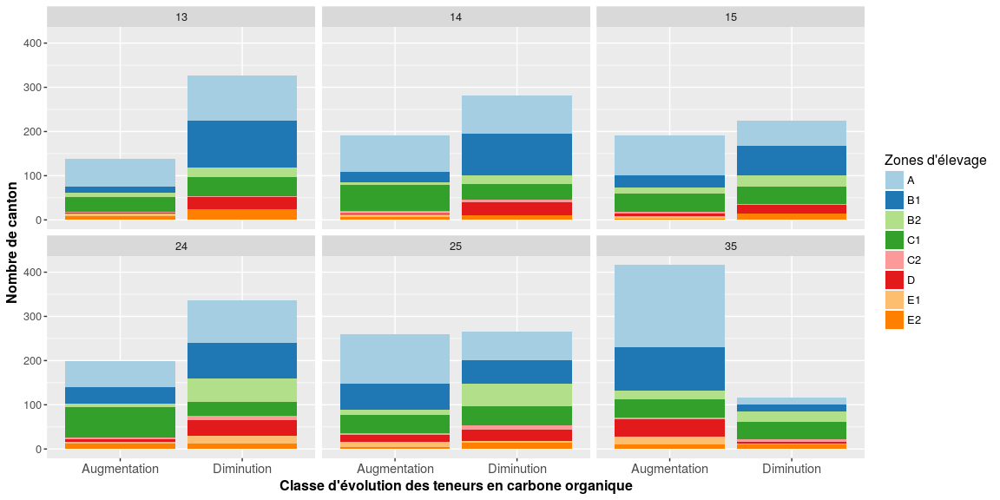
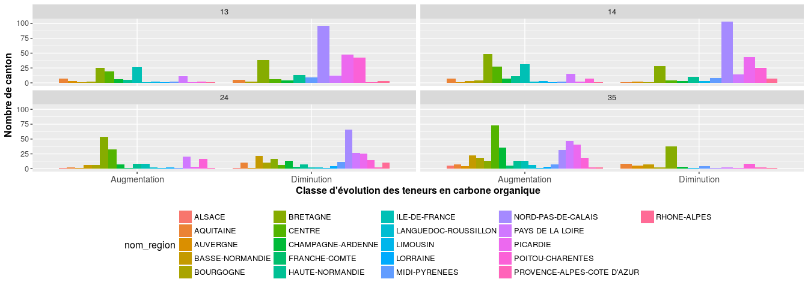
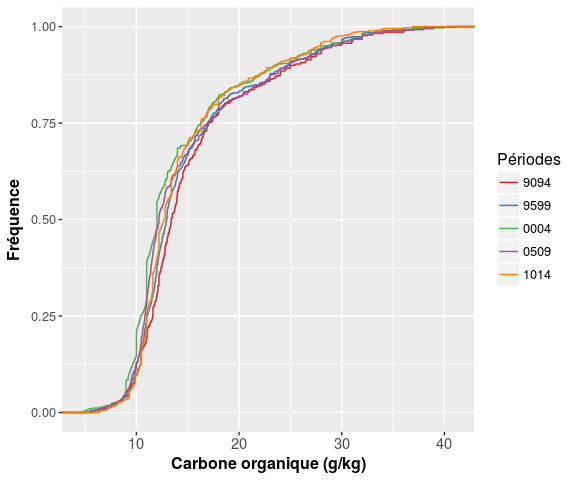
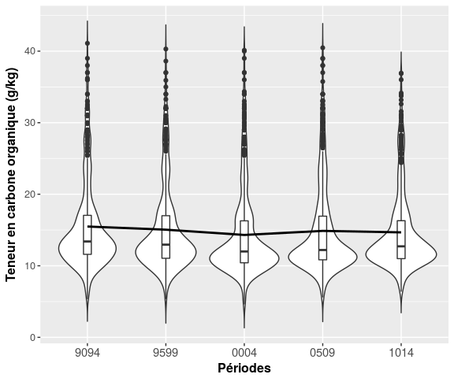
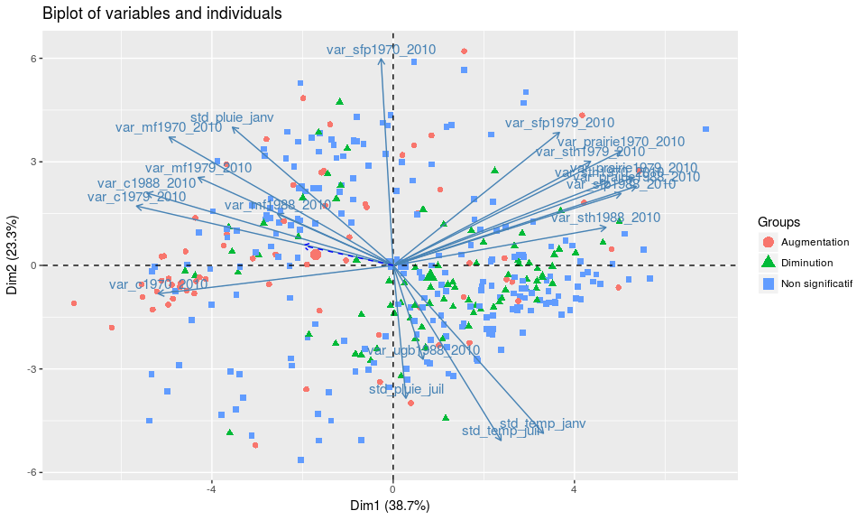
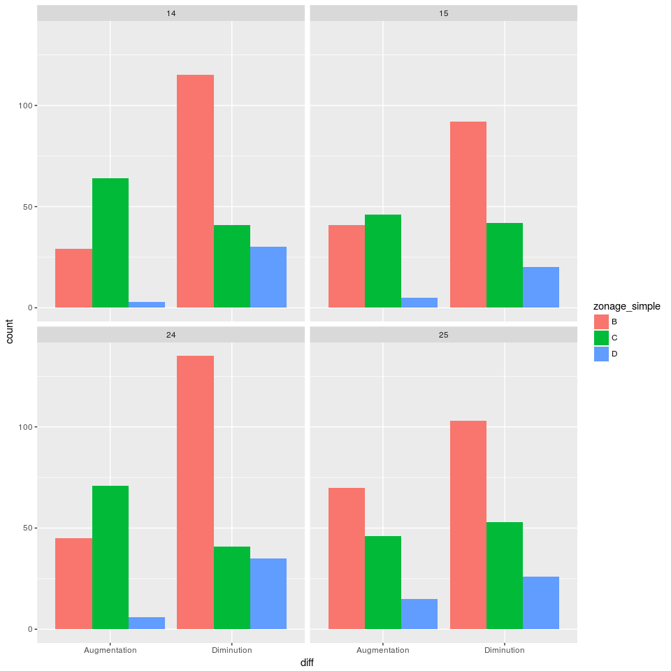
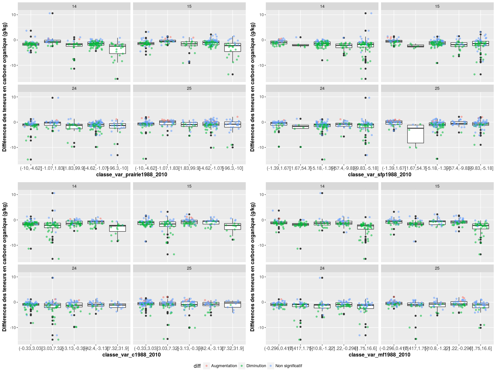
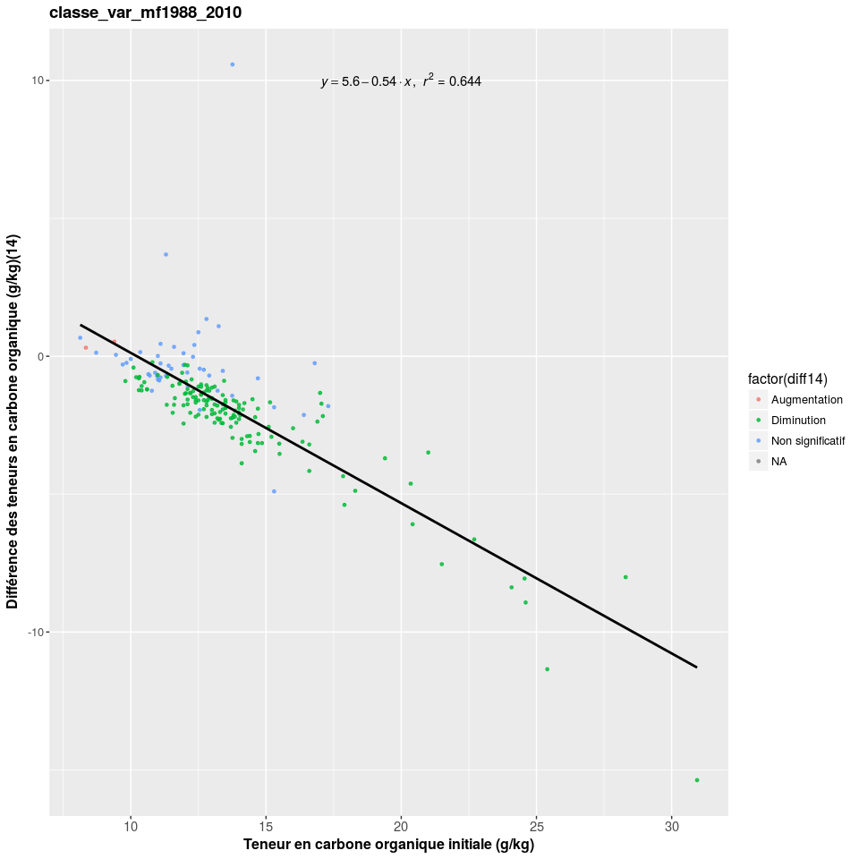

Traitement des données de la BDAT : Evolution des teneurs en carbone organique
================
Jean-Baptiste Paroissien
27/01/2017

-   [Objectifs](#objectifs)
-   [Analyse de l'évolution des teneurs en carbone organique à l'échelle nationale](#analyse-de-levolution-des-teneurs-en-carbone-organique-a-lechelle-nationale)
    -   [Analyse du nombre d'évolution significative par canton](#analyse-du-nombre-devolution-significative-par-canton)
    -   [Analyse sur les périodes identifiées](#analyse-sur-les-periodes-identifiees)
    -   [Cartographie des évolutions](#cartographie-des-evolutions)
    -   [Focus sur la Picardie et le Nord-Pas-De-Calais](#focus-sur-la-picardie-et-le-nord-pas-de-calais)

Objectifs
=========

Ici, on s'intéresse aux résultats sur les évolutions des teneurs en carbone. Les résultats ont été fournis par InfoSol et résultent d'un ré-échantillonnage des analyses de la bdat communales réalisées 100 fois. Plusieurs analyses sont réalisées :

-   Identifier la distribution spatiale de l'évolution à l'échelle de la france : Cartographie, boxplot du nombre de canton qui évolue par différents niveaux de stratification
-   Analyse de la distribution. Quelle sont les principaux facteurs qui expliquent ces évolutions ?

Analyse de l'évolution des teneurs en carbone organique à l'échelle nationale
=============================================================================

A l'échelle nationale, on souhaite avoir une vision des évolutions générales des teneurs en C, appréhender les zones les plus touchées, savoir si ces évolutions sont significatives ou non.

Analyse du nombre d'évolution significative par canton
------------------------------------------------------

La figure <A HREF="#histo_evolution">1</A> présente un histogramme du nombre de canton ayant connu une augmentation ou une diminution significative des teneurs en carbone organique. L'histogramme est appliqué sur toutes les périodes et stratifié par zones d'élevage.
La figure montre un équilibre entre le nombre de canton ayant eu une augmentation et le nombre de canton ayant eu une diminution de la teneur en carbone organique. La proportion des zones d'élevage entre les classes d'augmentation et de diminution est relativement équilibrée mais quelques zones se distinguent :

-   Les régions B1, C2 et D sont davantage affectées par la diminution des teneurs en C
-   Les région A et C1 sont plus affectées par des augmentations que des diminutions.

<figure style="text-align:center;">

<figcaption>
</figcaption>
</figure>
Dans la figure <A HREF="#histo_evolution_period">2</A>, les histogrammes sont analysés pour des écarts entre les périodes étudiées d'au moins 10 ans. La figure montre des différences importantes entre les périodes analysées :

-   L'évolution des teneurs est équilibrée entre les périodes \[1994-1999\]-\[2010-2014\] et les périodes \[1990-1994\]-\[2010-2014\],
-   Les différences entre les périodes \[1990-1994\]-\[2000-2004\] et \[1994-1999\]-\[2005-2009\] montrent une part importante pour la diminution des teneurs en C. Dans une moindre mesure, la différence entre les périodes \[1990-1994\]-\[2005-2009\] présente une part de diminution des teneurs en C plus importante que l'augmentation.
-   A l'inverse, les teneurs en C ont augmenté majoritairement entre les périodes \[2000-2004\]-\[2010-2014\].

<figure style="text-align:center;">

<figcaption>
</figcaption>
</figure>
**En conclusion** de cette section, on constate plusieurs points :

-   Les évolutions des teneurs en C entre les différentes périodes ne suivent pas les mêmes tendances. Les premières observation vues dans [FS\_traitements\_bdat.Rmd](https://github.com/Rosalien/GISEDSol/tree/master/Fichiers_suivis/Traitements/Suivis/FS_traitements_bdat.Rmd) se confirment. Les teneurs en C ont augmenté sur la période \[2010-2014\] et cette augmentation est particulièrement prononcée entre les périodes \[2000-2004\]-\[2010-2014\].
-   La diminution des teneurs est surtout observée entre \[1990-1994\]-\[2000-2004\] et \[1994-1999\]-\[2005-2009\] et \[1990-1994\]-\[2005-2009\].
-   Les principales zones d'élevage affectées par ces changements sont : A, B1, C1, C2 et D. Ce résultat provient surtout de la densité d'analyse dans ces zones et de leur étendue spatiale.

Analyse sur les périodes identifiées
------------------------------------

Dans la suite, on s'intéressera uniquement aux périodes concernées par les changements importants idenfiés dans le paragraphe précédent, à savoir : \[2000-2004\]-\[2010-2014\], \[1990-1994\]-\[2000-2004\],\[1994-1999\]-\[2005-2009\] et \[1990-1994\]-\[2005-2009\].

<figure style="text-align:center;">

<figcaption>
</figcaption>
</figure>
De la figure ci-dessus, les 10 principales régions touchées par des évolutions significatives sont présentées dans le tableau ci-dessous.

|         |     diff     |     nom\_region    | period | freq |
|:-------:|:------------:|:------------------:|:------:|:----:|
| **115** |  Diminution  | NORD-PAS-DE-CALAIS |   14   |  103 |
| **114** |  Diminution  | NORD-PAS-DE-CALAIS |   13   |  96  |
|  **26** | Augmentation |       CENTRE       |   35   |  73  |
| **116** |  Diminution  | NORD-PAS-DE-CALAIS |   24   |  66  |
|  **21** | Augmentation |      BRETAGNE      |   24   |  54  |
|  **20** | Augmentation |      BRETAGNE      |   14   |  49  |
| **122** |  Diminution  |      PICARDIE      |   13   |  48  |
|  **61** | Augmentation |  PAYS DE LA LOIRE  |   35   |  47  |
| **123** |  Diminution  |      PICARDIE      |   14   |  43  |
| **126** |  Diminution  |  POITOU-CHARENTES  |   13   |  42  |

La région Centre et les pays de la Loire ont une fréquence importante de canton ayant une augmentation de C.
Le Nord-pas-de-Calais, la Bretagne, la Picardie et le Poitou-Charentes sont les principales régions touchées par des diminutions en C.

Cartographie des évolutions
---------------------------

On retrouve ces observations sur les cartes d'évolution des teneurs. Dans le détail, c'est le morbihan qui est surtout affecté par des chutes de teneurs en carbone organique et en région Centre, on observe une augmentation des teneurs concentrée dans le Perche.
Ces résultats très ciblés font penser à un effet de bord (différences liés aux laboratoires?), surtout pour les régions Picardie, Nord-Pas-De-Calais et le département du Morbihan. **La suite des analyses se concentrera sur ces zones.**

Focus sur la Picardie et le Nord-Pas-De-Calais
----------------------------------------------

### Cartographie

### Analyse de la distribution pour les différentes périodes

<figure style="text-align:center;">

<figcaption>
</figcaption>
</figure>
<figure style="text-align:center;">

<figcaption>
</figcaption>
</figure>
<table style="width:83%;">
<caption>Statistiques descriptives des teneurs en carbone organique par périodes 
### Analyses des facteurs explicatifs</caption>
<colgroup>
<col width="15%" />
<col width="9%" />
<col width="13%" />
<col width="12%" />
<col width="9%" />
<col width="13%" />
<col width="8%" />
</colgroup>
<thead>
<tr class="header">
<th align="center"> </th>
<th align="center">Min.</th>
<th align="center">1st Qu.</th>
<th align="center">Median</th>
<th align="center">Mean</th>
<th align="center">3rd Qu.</th>
<th align="center">Max.</th>
</tr>
</thead>
<tbody>
<tr class="odd">
<td align="center"><strong>9094</strong></td>
<td align="center">5.34</td>
<td align="center">11.6</td>
<td align="center">13.4</td>
<td align="center">15.49</td>
<td align="center">17.05</td>
<td align="center">41.1</td>
</tr>
<tr class="even">
<td align="center"><strong>9599</strong></td>
<td align="center">5.35</td>
<td align="center">11.05</td>
<td align="center">12.96</td>
<td align="center">15.05</td>
<td align="center">17</td>
<td align="center">40.3</td>
</tr>
<tr class="odd">
<td align="center"><strong>0004</strong></td>
<td align="center">4.6</td>
<td align="center">10.42</td>
<td align="center">12</td>
<td align="center">14.31</td>
<td align="center">16.28</td>
<td align="center">40.12</td>
</tr>
<tr class="even">
<td align="center"><strong>0509</strong></td>
<td align="center">5.58</td>
<td align="center">10.84</td>
<td align="center">12.2</td>
<td align="center">14.88</td>
<td align="center">16.93</td>
<td align="center">40.47</td>
</tr>
<tr class="odd">
<td align="center"><strong>1014</strong></td>
<td align="center">6.38</td>
<td align="center">11</td>
<td align="center">12.72</td>
<td align="center">14.67</td>
<td align="center">16.3</td>
<td align="center">36.92</td>
</tr>
</tbody>
</table>

Rapidement, on regarde les acp puis tentative de modélisation avec GBM

#### ACP

<figure style="text-align:center;">

<figcaption>
</figcaption>
</figure>
#### GBM

    ## Loading required package: gbm

    ## Loading required package: splines

    ## Loaded gbm 2.1.1

<figure style="text-align:center;">

<figcaption>
</figcaption>
</figure>
#### Autres représentations

<figure style="text-align:center;">

<figcaption>
</figcaption>
</figure>
    ## TableGrob (2 x 1) "arrange": 2 grobs
    ##   z     cells    name              grob
    ## 1 1 (1-1,1-1) arrange   gtable[arrange]
    ## 2 2 (2-2,1-1) arrange gtable[guide-box]

    ## Warning: In lm.fit(x, y, offset = offset, singular.ok = singular.ok, ...) :
    ##  extra argument 'na.rm' will be disregarded

    ## Warning: Removed 109 rows containing non-finite values (stat_smooth).

    ## Warning: Removed 109 rows containing missing values (geom_point).

<figure>

<figcaption>
</figcaption>
</figure>
