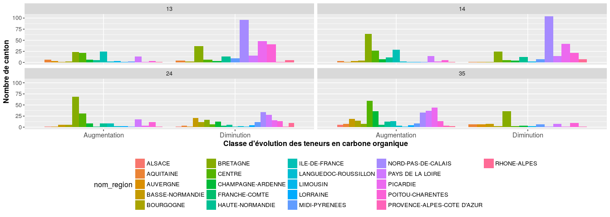

Traitement des données de la BDAT : Evolution des teneurs en carbone organique
================
Jean-Baptiste Paroissien
09/03/2017

-   [Objectifs](#objectifs)
-   [Analyse de l'évolution des teneurs en carbone organique à l'échelle nationale](#analyse-de-levolution-des-teneurs-en-carbone-organique-a-lechelle-nationale)
    -   [Etat des lieux général](#etat-des-lieux-general)
    -   [Analyse du nombre d'évolution significative par canton](#analyse-du-nombre-devolution-significative-par-canton)
    -   [Analyse sur les périodes identifiées](#analyse-sur-les-periodes-identifiees)
    -   [Cartographie des évolutions](#cartographie-des-evolutions)
    -   [Conclusion](#conclusion)
-   [Evolution globale des teneurs en CO par rapport aux teneurs initiales](#evolution-globale-des-teneurs-en-co-par-rapport-aux-teneurs-initiales)
    -   [A l'échelle de la France](#a-lechelle-de-la-france)
    -   [Analyse par strates](#analyse-par-strates)
-   [Modélisation test avec GBM et Cubist](#modelisation-test-avec-gbm-et-cubist)
    -   [Analyse par stratification](#analyse-par-stratification)

Objectifs
=========

L'objectif de ce travail est d'analyser les différences l'évolution des teneurs en carbone organique enregistrée à l'échelle du canton. Ces résultats ont été fournis par InfoSol et résultent d'un ré-échantillonnage des analyses de la bdat communale réalisée 100 fois. Au cours de ces répétitions, les teneurs en CO sont comparées pour 2 périodes données et un test statistique est réalisé pour connaître la significacité des différences à l'échelle du canton. Pour une description de la méthode utilisée, le lecteur intéressé peut consulter les articles suivants :

-   [Lemercier et al.,2006](https://www.google.fr/url?sa=t&rct=j&q=&esrc=s&source=web&cd=1&ved=0ahUKEwj9uNzhwNPSAhXKfRoKHVxVBtIQFggcMAA&url=http%3A%2F%2Fwww.afes.fr%2Fafes%2Fegs%2FEGS_13_3_lemercier.pdf&usg=AFQjCNHmQCmyJgF7DgYTWGYn3XDTPIHSlA)
-   [Saby et al.,2008](http://onlinelibrary.wiley.com/doi/10.1111/j.1475-2743.2008.00159.x/abstract)
-   [Swiderski et al.,2012](https://www.google.fr/url?sa=t&rct=j&q=&esrc=s&source=web&cd=1&cad=rja&uact=8&ved=0ahUKEwjXi4-DwdPSAhVIbBoKHYalCcwQFggcMAA&url=http%3A%2F%2Fwww.afes.fr%2Fafes%2Fegs%2FEGS_19_3_swideski_web.pdf&usg=AFQjCNEKtp34NnAEJ6_BEZURnh_DC-Lf3A)

Les résultats sont analysés à l'échelle de la France et à l'échelle de plusieurs strates géographiques selon le plan suivant :

1.  Etat des lieux de l'évolution des teneurs en CO à l'échelle nationale.

-   Analyse de la distribution. Quelle sont les principaux facteurs qui expliquent ces évolutions ?

Analyse de l'évolution des teneurs en carbone organique à l'échelle nationale
=============================================================================

Dans cette section, les évolutions des teneurs en CO à l'échelle nationale sont présentées globalement sous forme d'état des lieux.

Etat des lieux général
----------------------

La figure ci-dessous présente pour toutes les périodes comparées, la proportion du type d'évolution des teneurs en CO par canton.
Sur toutes les périodes comparées, la proportion de canton ayant une évolution significative des teneurs en CO (augmentation ou diminution) est inférieure à 30%. Dans cette part, il y a quasiment autant de canton enregistrant une augmentation qu'une diminution des teneurs (2191 et `table(melted.bdatdiff[,"diff_corgox"])[[2]]` respectivement). **Une large part des cantons (plus de 70%) n'a donc pas enregistrés d'évolution significative des teneurs en CO.**

<figure style="text-align:center;">

<figcaption>
</figcaption>
</figure>
Analyse du nombre d'évolution significative par canton
------------------------------------------------------

La figure <A HREF="#histo_evolution_elevage_climat">2</A> présente un histogramme du nombre de canton ayant connu une augmentation ou une diminution significative des teneurs en carbone organique. L'histogramme est appliqué sur toutes les périodes et stratifié par zones d'élevage et par type de climat.

La figure présente les mêmes proportion générales observée à l'échelle nationale précédemment. La part de canon aux évolutions des teneurs en CO non significative est toujours très importante. Globalement, le nombre de canton ayant eu une augmentation ou une diminution de la teneur en CO est équilibré à l'échelle des strates géographiques. Quelques zones se distinguent toutefois :

-   Les régions B1, C2 et D sont davantage affectées par la diminution des teneurs en C
-   Les région A et C1 sont plus affectées par des augmentations que des diminutions. A noter que cette zone est davantage affectées par évolutions significatives que les autres strates.
-   La région climatique 5 (climat océanique franc) est également plus exposée aux évolutions significatives et notamment aux diminutions.

<figure style="text-align:center;">

<figcaption>
</figcaption>
</figure>
Dans la figure <A HREF="#histo_evolution_period_elevage">3</A>, les histogrammes sont analysés pour des écarts entre les périodes étudiées d'au moins 10 ans. La figure montre des différences importantes entre les périodes analysées :

-   L'évolution des teneurs est équilibrée entre les périodes \[1994-1999\]-\[2010-2014\] et les périodes \[1990-1994\]-\[2010-2014\],
-   Les différences entre les périodes \[1990-1994\]-\[2000-2004\] et \[1994-1999\]-\[2005-2009\] montrent une part importante pour la diminution des teneurs en CO. Dans une moindre mesure, la différence entre les périodes \[1990-1994\]-\[2005-2009\] présente une part de diminution des teneurs en CO plus importante que l'augmentation.
-   A l'inverse, les teneurs en CO ont augmenté majoritairement entre les périodes \[2000-2004\]-\[2010-2014\].

<figure style="text-align:center;">

<figcaption>
</figcaption>
</figure>
> **En conclusion** de cette section, on constate plusieurs points :
> - Les évolutions des teneurs en C entre les différentes périodes ne suivent pas les mêmes tendances. Les premières observation vues dans [FS\_traitements\_bdat.Rmd](https://github.com/GisEDSol/Carbo_elevage/tree/master/Fichiers_suivis/Traitements/Suivis/FS_traitements_bdat.Rmd) se confirment. Les teneurs en C ont augmenté sur la période \[2010-2014\] et cette augmentation est particulièrement prononcée entre les périodes \[2000-2004\]-\[2010-2014\].
> - La diminution des teneurs est surtout observée entre \[1990-1994\]-\[2000-2004\] et \[1994-1999\]-\[2005-2009\] et \[1990-1994\]-\[2005-2009\].
> - Les principales zones d'élevage affectées par ces changements sont : A, B1, C1, C2 et D. Ce résultat provient surtout de la densité d'analyse dans ces zones et de leur étendue spatiale.

Analyse sur les périodes identifiées
------------------------------------

Dans la suite, on s'intéressera uniquement aux périodes concernées par les changements importants idenfiés dans le paragraphe précédent, à savoir :

-   35 \[2000-2004\]-\[2010-2014\],
-   13 \[1990-1994\]-\[2000-2004\],
-   24 \[1995-1999\]-\[2005-2009\],
-   14 \[1990-1994\]-\[2005-2009\].

<figure style="text-align:center;">

<figcaption>
</figcaption>
</figure>
De la figure ci-dessus, les 10 principales régions touchées par des évolutions significatives sont présentées dans le tableau ci-dessous.

|         |     diff     |     nom\_region    | period | freq |
|:-------:|:------------:|:------------------:|:------:|:----:|
| **112** |  Diminution  | NORD-PAS-DE-CALAIS |   14   |  104 |
| **111** |  Diminution  | NORD-PAS-DE-CALAIS |   13   |  96  |
|  **24** | Augmentation |       CENTRE       |   35   |  57  |
|  **18** | Augmentation |      BRETAGNE      |   14   |  52  |
|  **19** | Augmentation |      BRETAGNE      |   24   |  52  |
| **119** |  Diminution  |      PICARDIE      |   13   |  48  |
| **120** |  Diminution  |      PICARDIE      |   14   |  42  |
|  **62** | Augmentation |      PICARDIE      |   35   |  40  |
| **123** |  Diminution  |  POITOU-CHARENTES  |   13   |  40  |
|  **86** |  Diminution  |      BRETAGNE      |   13   |  37  |

La région Centre et les pays de la Loire ont une fréquence importante de canton ayant une augmentation de C.
Le Nord-pas-de-Calais, la Bretagne, la Picardie et la région Poitou-Charentes sont les principales régions touchées par des diminutions en C.

Cartographie des évolutions
---------------------------

On retrouve ces observations sur les cartes d'évolution des teneurs. Dans le détail, c'est le morbihan qui est surtout affecté par des chutes de teneurs en carbone organique et en région Centre, on observe une augmentation des teneurs concentrée dans le Perche.
Ces résultats très ciblés font penser à un effet de bord (différences liés aux laboratoires?), surtout pour les régions Picardie, Nord-Pas-De-Calais et le département du Morbihan. **La suite des analyses se concentrera sur ces zones.**

 

Conclusion
----------

Evolution globale des teneurs en CO par rapport aux teneurs initiales
=====================================================================

A l'échelle de la France
------------------------

Analyse par strates
-------------------

### Type de climat

Figure à commenter

### Région d'élevage

Modélisation test avec GBM et Cubist
====================================

Analyse par stratification
--------------------------

    ## Warning: Removed 49 rows containing non-finite values (stat_boxplot).

<figure>

<figcaption>
</figcaption>
</figure>
### Régression linéaire multiple

#### Par type de climat

#### Avec les régions d'élevage
