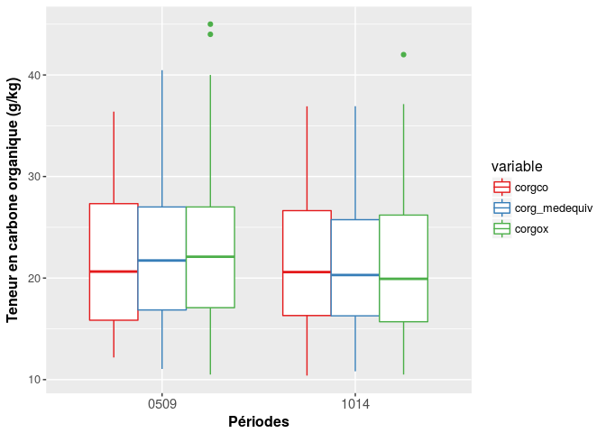
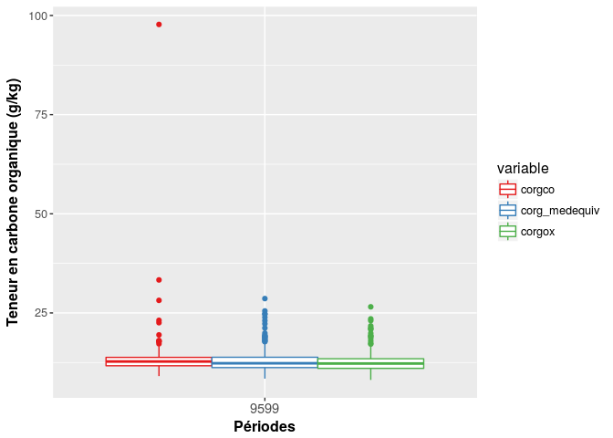
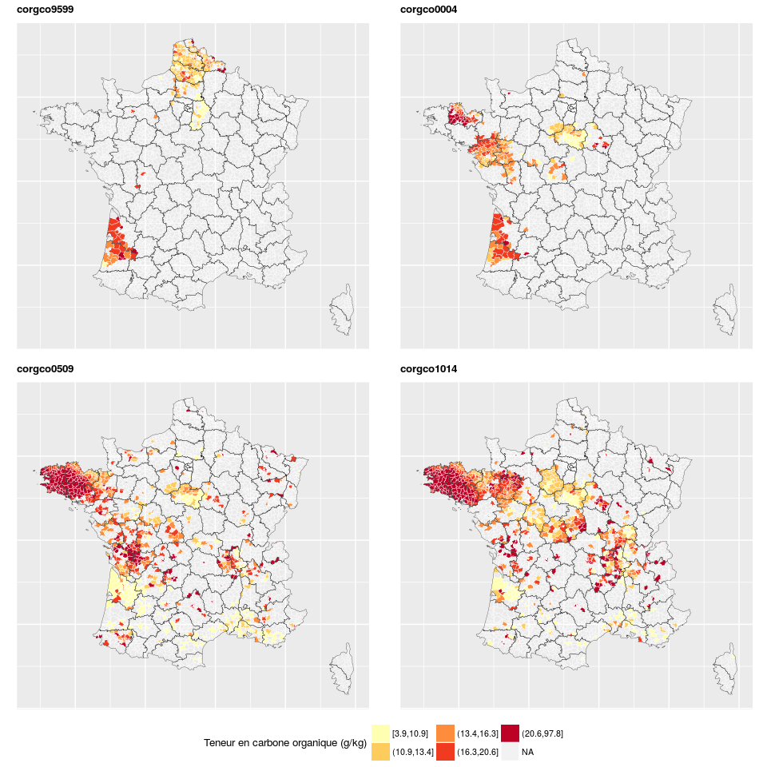
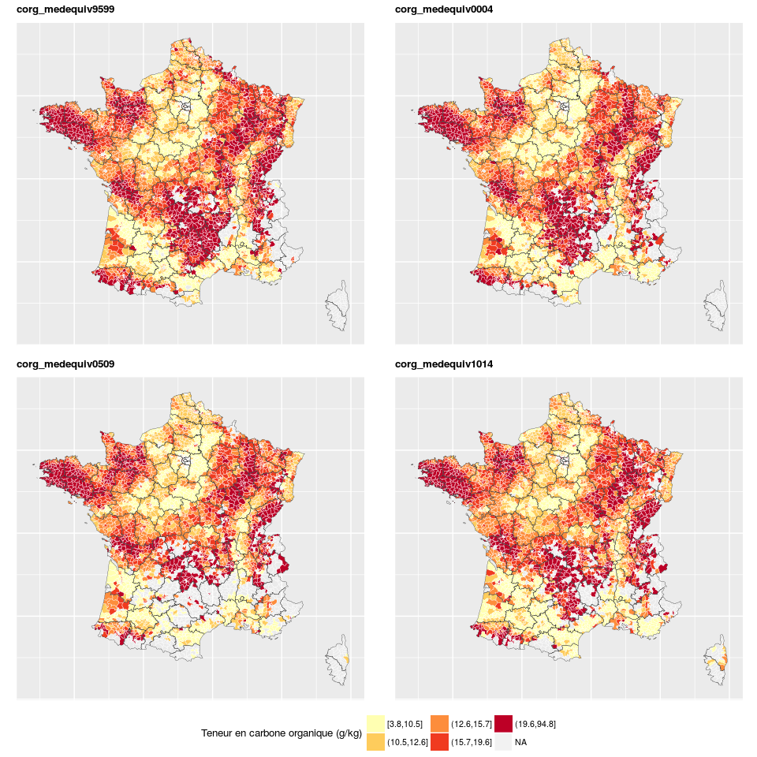
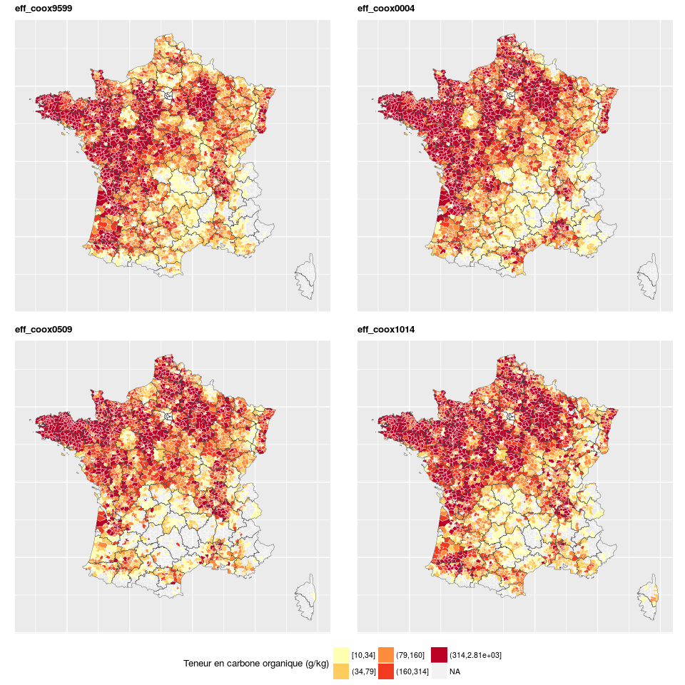
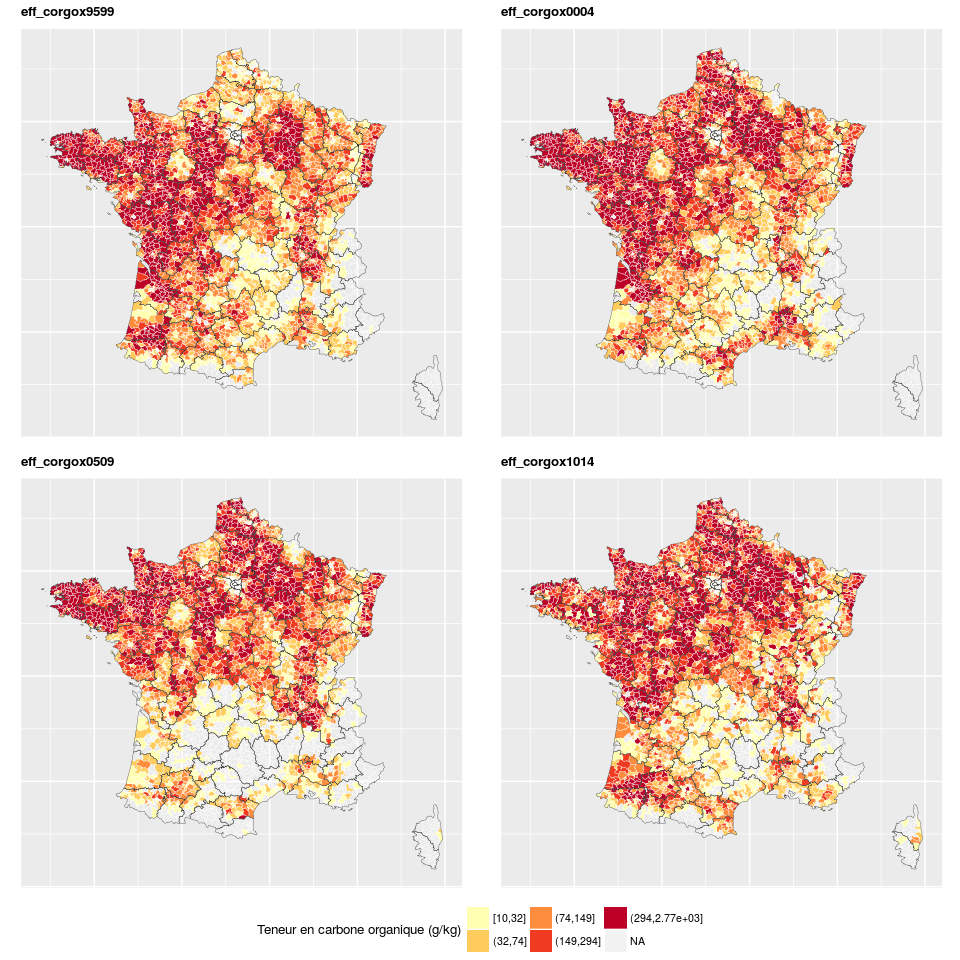
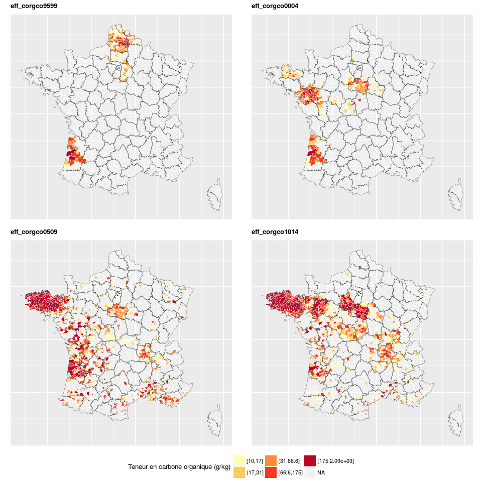
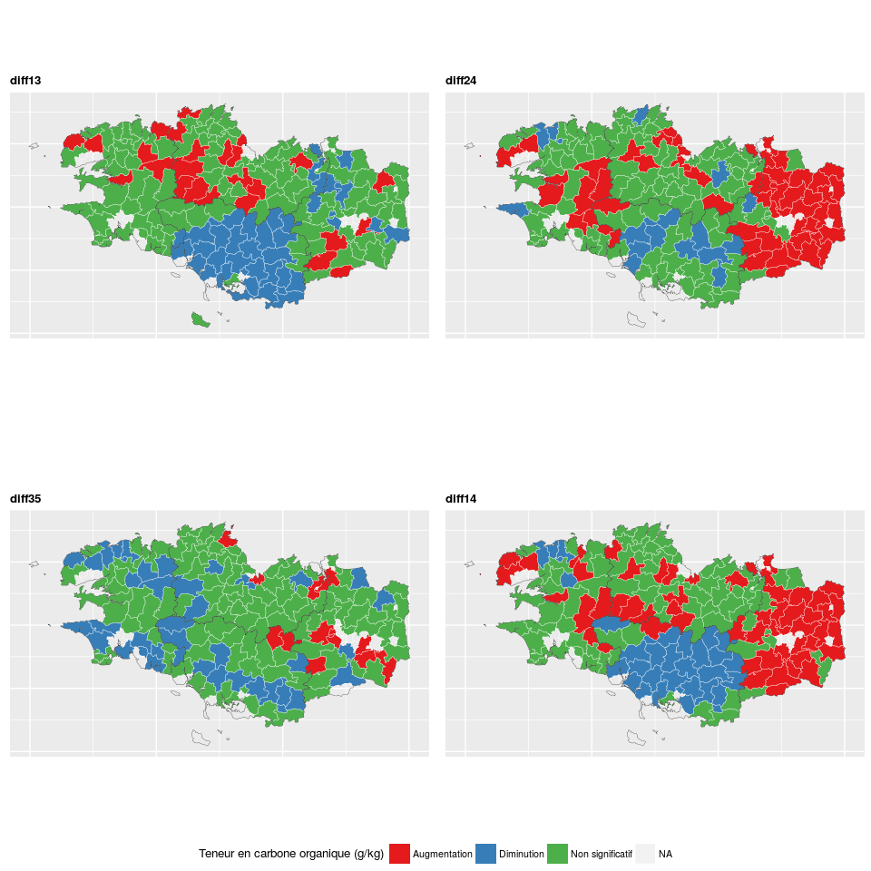
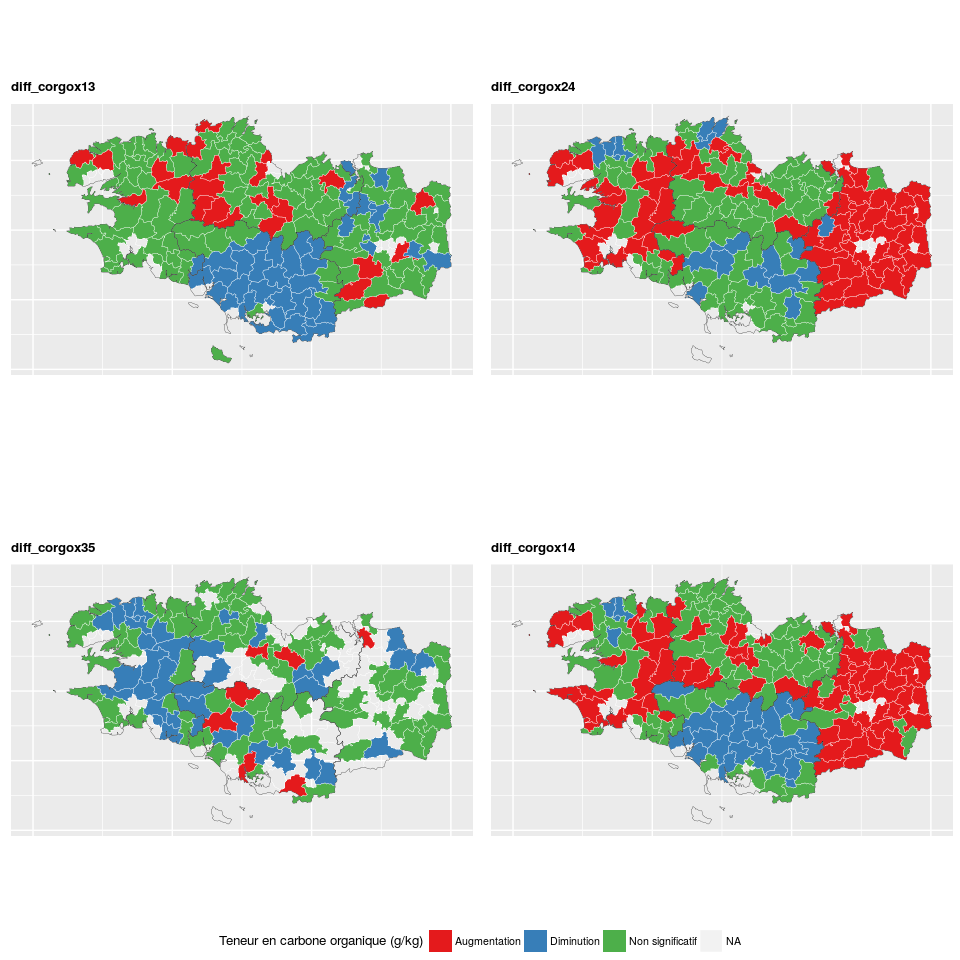

Analyse rapide des différences de résultats entre les méthode d'analyses
================
Jean-Baptiste Paroissien
27/01/2017

-   [Objectifs](#objectifs)
    -   [Analyse de l'effet des méthodes](#analyse-de-leffet-des-methodes)

Objectifs
=========

Analyse de l'effet des méthodes
-------------------------------

Dans cette partie, on vérifie les différences entre les méthodes de mesure. L'objectif est de savoir si la méthode de mesure influence les résultats d'analyse par période et les évolutions observées entre les périodes.

### Statistiques

Ci-dessous, on regarde rapidement la distribution des analyses pour la Bretagne

<figure style="text-align:center;">
<a name="cdf_fr"></a>
<figcaption>
</figcaption>
</figure>
    ## $corgco
    ##       Min. 1st Qu. Median  Mean 3rd Qu.  Max.
    ## 0509 12.18   15.85  20.64 21.57   27.33 36.39
    ## 1014 10.40   16.31  20.59 21.50   26.64 36.91
    ## 
    ## $corg_medequiv
    ##       Min. 1st Qu. Median  Mean 3rd Qu.  Max.
    ## 0509 11.05   16.86  21.73 22.26   27.00 40.47
    ## 1014 10.82   16.28  20.30 20.91   25.75 36.92
    ## 
    ## $corgox
    ##      Min. 1st Qu. Median  Mean 3rd Qu. Max.
    ## 0509 10.5   17.08  22.10 22.66    27.0   45
    ## 1014 10.5   15.70  19.92 20.88    26.2   42

La même chose pour le haut de France (données uniquement 9599)

<figure style="text-align:center;">
<a name="boxplotHF"></a>
<figcaption>
</figcaption>
</figure>
    ## $corgco
    ##      Min. 1st Qu. Median Mean 3rd Qu.  Max.
    ## 9599 9.08   11.67  12.75 13.9    13.8 97.75
    ## 
    ## $corg_medequiv
    ##      Min. 1st Qu. Median  Mean 3rd Qu.  Max.
    ## 9599 8.43   11.22  12.31 13.08   13.82 28.62
    ## 
    ## $corgox
    ##      Min. 1st Qu. Median  Mean 3rd Qu.  Max.
    ## 9599 8.11   11.02  12.24 12.79   13.44 26.54

### Cartographie

``` r
tablecarto <- "dm_vecteurs.canton" #Nom de la table utilisée pour la cartographie (table postgis)
#period <- c("9094","9599","0004","0509","1014") #
period <- c("9599","0004","0509","1014") #
nclasse <- 5 
style_classe <- "quantile"#Nombre de classes de valeurs pour la cartographie
couleur <- "YlOrRd" #Nom de la palette couleur (selon RColorBrewer)display.brewer.all() pour connaître les différentes palettes
l_variable <- "Teneur en carbone organique (g/kg)" #label de la variable

variable <- c("corgox","corgco","corg_medequiv","eff_coox","eff_corgox","eff_corgco")
# Cartographie des teneurs et des effectifs
for (i in variable){
  variablecarto <- paste(i,period,sep="")#variables à cartographier
  nomfichier <- paste(i,"_period_fr",sep="") #Nom du fichier

  carto(dsn,tablecarto,variablecarto,nclasse,style_classe,couleur,l_legend=l_variable,repsortie,nomfichier,dept=FALSE,reg=FALSE,nrowlayout=2,ncollayout=2,position="bottom",ggsaveheight=7,ggsavewidth=7)
}
```

    ## Warning in gpclibPermit(): support for gpclib will be withdrawn from
    ## maptools at the next major release

    ## No id variables; using all as measure variables

    ## Warning in classIntervals(melt.map, n = nclasse, style = style_classe,
    ## digits = 2, : var has missing values, omitted in finding classes

    ## Warning in classIntervals(melt.map, n = nclasse, style = style_classe,
    ## digits = 2, : var has missing values, omitted in finding classes

    ## Warning in classIntervals(melt.map, n = nclasse, style = style_classe,
    ## digits = 2, : var has missing values, omitted in finding classes

    ## Warning in classIntervals(melt.map, n = nclasse, style = style_classe,
    ## digits = 2, : var has missing values, omitted in finding classes

    ## Warning in gpclibPermit(): support for gpclib will be withdrawn from
    ## maptools at the next major release

    ## No id variables; using all as measure variables

    ## Warning in classIntervals(melt.map, n = nclasse, style = style_classe,
    ## digits = 2, : var has missing values, omitted in finding classes

    ## Warning in classIntervals(melt.map, n = nclasse, style = style_classe,
    ## digits = 2, : var has missing values, omitted in finding classes

    ## Warning in classIntervals(melt.map, n = nclasse, style = style_classe,
    ## digits = 2, : var has missing values, omitted in finding classes

    ## Warning in classIntervals(melt.map, n = nclasse, style = style_classe,
    ## digits = 2, : var has missing values, omitted in finding classes

<figure>

<figcaption>
</figcaption>
</figure>
    ## Warning in gpclibPermit(): support for gpclib will be withdrawn from
    ## maptools at the next major release

    ## No id variables; using all as measure variables

    ## Warning in classIntervals(melt.map, n = nclasse, style = style_classe,
    ## digits = 2, : var has missing values, omitted in finding classes

    ## Warning in classIntervals(melt.map, n = nclasse, style = style_classe,
    ## digits = 2, : var has missing values, omitted in finding classes

    ## Warning in classIntervals(melt.map, n = nclasse, style = style_classe,
    ## digits = 2, : var has missing values, omitted in finding classes

    ## Warning in classIntervals(melt.map, n = nclasse, style = style_classe,
    ## digits = 2, : var has missing values, omitted in finding classes

<figure>

<figcaption>
</figcaption>
</figure>
    ## Warning in gpclibPermit(): support for gpclib will be withdrawn from
    ## maptools at the next major release

    ## No id variables; using all as measure variables

    ## Warning in classIntervals(melt.map, n = nclasse, style = style_classe,
    ## digits = 2, : var has missing values, omitted in finding classes

    ## Warning in classIntervals(melt.map, n = nclasse, style = style_classe,
    ## digits = 2, : var has missing values, omitted in finding classes

    ## Warning in classIntervals(melt.map, n = nclasse, style = style_classe,
    ## digits = 2, : var has missing values, omitted in finding classes

    ## Warning in classIntervals(melt.map, n = nclasse, style = style_classe,
    ## digits = 2, : var has missing values, omitted in finding classes

<figure>

<figcaption>
</figcaption>
</figure>
    ## Warning in gpclibPermit(): support for gpclib will be withdrawn from
    ## maptools at the next major release

    ## No id variables; using all as measure variables

    ## Warning in classIntervals(melt.map, n = nclasse, style = style_classe,
    ## digits = 2, : var has missing values, omitted in finding classes

    ## Warning in classIntervals(melt.map, n = nclasse, style = style_classe,
    ## digits = 2, : var has missing values, omitted in finding classes

    ## Warning in classIntervals(melt.map, n = nclasse, style = style_classe,
    ## digits = 2, : var has missing values, omitted in finding classes

    ## Warning in classIntervals(melt.map, n = nclasse, style = style_classe,
    ## digits = 2, : var has missing values, omitted in finding classes

<figure>

<figcaption>
</figcaption>
</figure>
    ## Warning in gpclibPermit(): support for gpclib will be withdrawn from
    ## maptools at the next major release

    ## No id variables; using all as measure variables

    ## Warning in classIntervals(melt.map, n = nclasse, style = style_classe,
    ## digits = 2, : var has missing values, omitted in finding classes

    ## Warning in classIntervals(melt.map, n = nclasse, style = style_classe,
    ## digits = 2, : var has missing values, omitted in finding classes

    ## Warning in classIntervals(melt.map, n = nclasse, style = style_classe,
    ## digits = 2, : var has missing values, omitted in finding classes

    ## Warning in classIntervals(melt.map, n = nclasse, style = style_classe,
    ## digits = 2, : var has missing values, omitted in finding classes

<figure>

<figcaption>
</figcaption>
</figure>
<figure>

<figcaption>
</figcaption>
</figure>
``` r
# Cartographie des différences
l_legend <- "Evolution des teneurs en C"#label de la variable
nclasse <- 4 #Nombre de classes de valeurs pour la cartographie
style_classe <- "fixed" #"pretty"#"jenks","fixed"
couleur <- "Set1"#nom de la palette couleur (selon RColorBrewer)display.brewer.all() pour connaître les différentes palettes

period <- c("13","24","35","14")
variable <- c("","corgox")

for (i in variable){
    if(i==""){
        variablecarto <- paste("diff",period,sep="")
        }else{
        variablecarto <- paste("diff_",i,period,sep="")
    }

  nomfichier <- paste(i,"median_diff_c",sep="") #Nom du fichier

  carto(dsn,tablecarto,variablecarto,nclasse,style_classe,couleur,l_legend=l_variable,repsortie,nomfichier,dept=FALSE,reg="53",nrowlayout=2,ncollayout=2,position="bottom",ggsaveheight=7,ggsavewidth=7)
}
```

    ## Warning in gpclibPermit(): support for gpclib will be withdrawn from
    ## maptools at the next major release

    ## Using diff13, diff24, diff35, diff14 as id variables

    ## Warning in gpclibPermit(): support for gpclib will be withdrawn from
    ## maptools at the next major release

    ## Using diff_corgox13, diff_corgox24, diff_corgox35, diff_corgox14 as id variables

<figure>

<figcaption>
</figcaption>
</figure>
<figure>

<figcaption>
</figcaption>
</figure>
