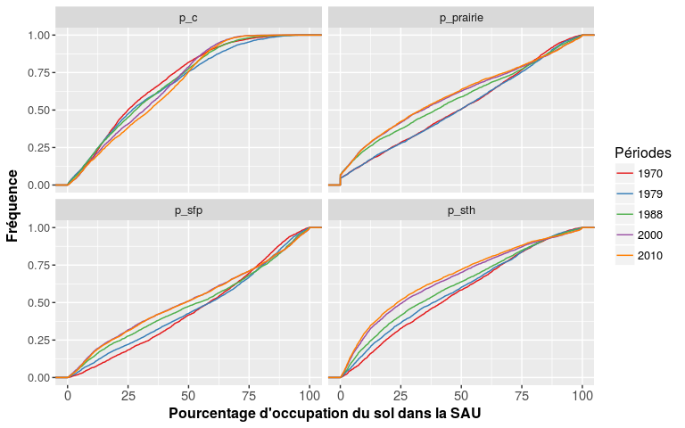
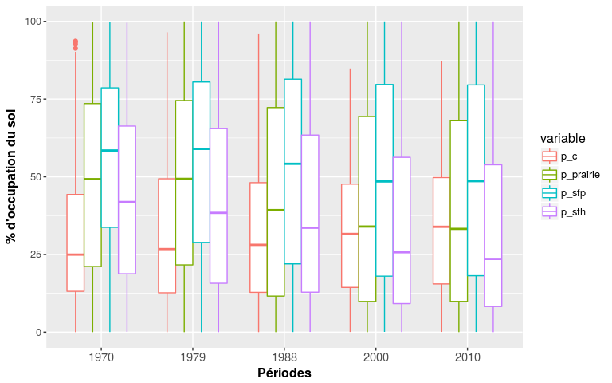
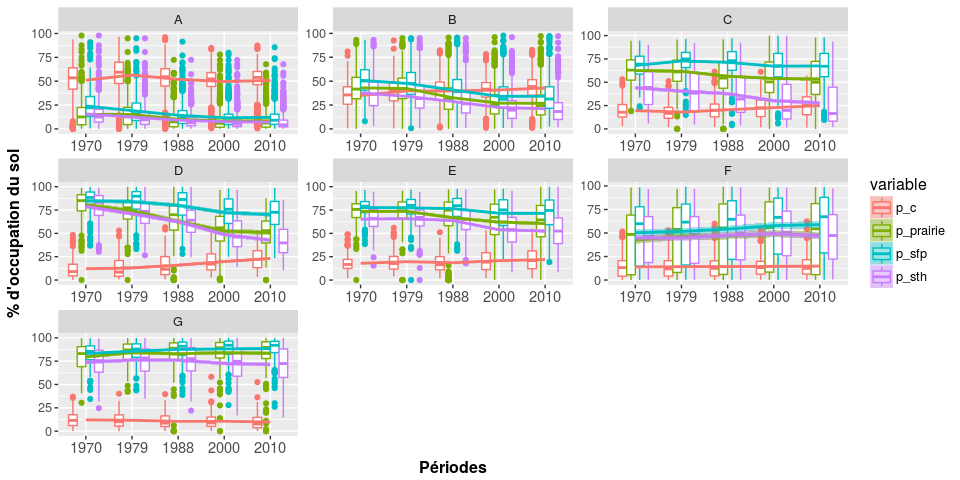
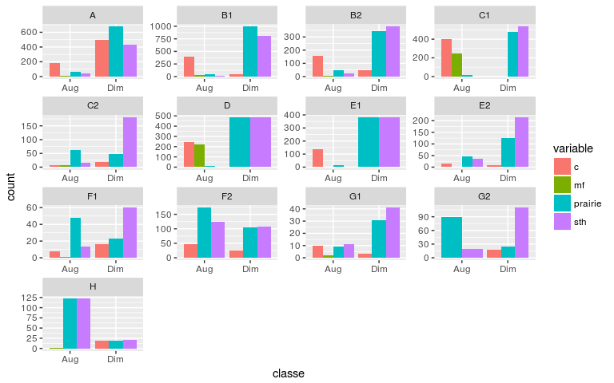
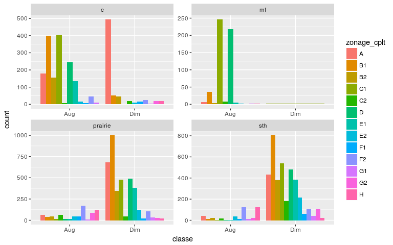
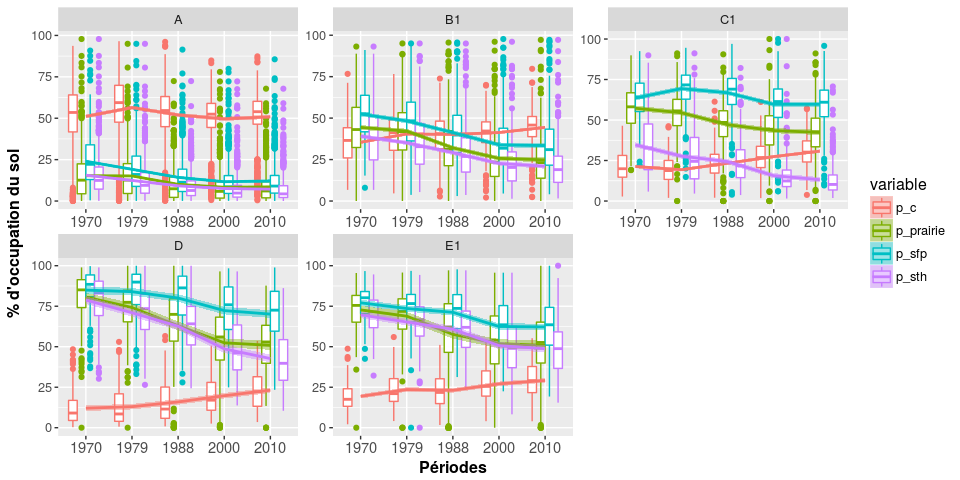

Analyse des données du recencement agricole
================
Jean-Baptiste Paroissien
19/06/2017

-   [Objectifs](#objectifs)
-   [Cartographie](#cartographie)
    -   [Occupation du sol](#occupation-du-sol)
    -   [Les UGB](#les-ugb)
    -   [Autres](#autres)
-   [Statistiques descriptives](#statistiques-descriptives)
    -   [Courbes des fréquences cumulées et boxplot](#courbes-des-frequences-cumulees-et-boxplot)
    -   [Résumé des statistiques et tests](#resume-des-statistiques-et-tests)
-   [Analyse de l'évolution par stratification](#analyse-de-levolution-par-stratification)
    -   [Stratification par les principales régions d'élevage](#stratification-par-les-principales-regions-delevage)
    -   [Analyse des différences d'occupation](#analyse-des-differences-doccupation)
    -   [Zoom sur les principales régions concernées par les évolutions](#zoom-sur-les-principales-regions-concernees-par-les-evolutions)
    -   [Observation par régions administratives](#observation-par-regions-administratives)
-   [Cartographie de l'évolution des classes d'occupation du sol](#cartographie-de-levolution-des-classes-doccupation-du-sol)

Objectifs
=========

Dans ce travail, les données du recensement agricole construites avec les scripts d'intégration de [FS\_bdd\_elab\_ra.Rmd](https://github.com/Rosalien/GISEDSol/tree/master/Fichiers_suivis/BDD/Suivis/FS_bdd_elab_ra.Rmd) sont analysées pour porter un regard sur la distribution spatiale et l'évolution de plusieurs variables d'occupation du sol en lien avec l'activité d'élevage. Cette étude exploratoire a pour objectif d'identifier les principales tendances des changements d'occupation du sol pour faciliter l'analyse de l'évolution des teneurs en carbone organique (voir [FS\_traitements\_bdat.Rmd](https://github.com/Rosalien/GISEDSol/tree/master/Fichiers_suivis/Traitements/Suivis/FS_traitements_bdat.Rmd) et [FS\_traitements\_bdatdiff.Rmd](https://github.com/Rosalien/GISEDSol/tree/master/Fichiers_suivis/Traitements/Suivis/FS_traitements_bdat.Rmd)).

Dans un premier temps, plusieurs cartographies des variables à analyser sont réalisées. Des statistiques descriptives sont ensuite développées. Celle-ci sont portées à l'échelle de la France et sur différents niveaux géographiques (classes de type de sol, principales grandes régions d'élevage).

Cartographie
============

Pour ce travail, les cartes ont été générées avec le paquet **`ggplot2`** et la fonction [F\_carto.R](https://github.com/Rosalien/GISEDSol/tree/master/Fonctions/R/F_carto.R).

Occupation du sol
-----------------

``` r
# Paramètres ###########################

tablecarto <- "dm_vecteurs.canton" 
period <- c("1970","1979","1988","2000","2010") #Périodes de temps prise en compte
variablecarto <- c("p_prairie","p_sth","p_sfp","p_c")#variable(s) à cartographier
l_legend <- c("Prairie/SAU (%)","STH/SAU (STH)", "SFP/SAU (%)","Céréale/SAU (%)")# 

cpt <- 0
for(v in variablecarto){
  #variables à cartographier
  variablecarto <- paste(v,period,sep="")
  nclasse <- 6
  style_classe <- "pretty"#Nombre de classes de valeurs pour la cartographie
  couleur <- viridis(nclasse)
  l_variable <- l_legend[cpt]
  nomfichier <- paste(v,style_classe,sep="")
  titleperiod <- variablecarto

  carto(dsn,tablecarto,variablecarto,nclasse,style_classe,couleur,l_legend=l_variable,repsortie,nomfichier,title=titleperiod,caption="",dept=FALSE,reg=FALSE,nrowlayout=1,ncollayout=5,position="bottom",ggsaveheight=5,ggsavewidth=20)
}

# Ajout du maïs fourrage
l_variable <- "MF/SAU (%)"
period <- c("1970","1979","1988","2000","2010") #Périodes de temps prise en compte
variablecarto <- paste("p_mf",period,sep="")
nclasse <- 7
style_classe <- "pretty"#Nombre de classes de valeurs pour la cartographie
couleur <- viridis(nclasse)
nomfichier <- paste("p_mf",style_classe,sep="")
titleperiod <- variablecarto

carto(dsn,tablecarto,variablecarto,nclasse,style_classe,couleur,l_legend=l_variable,repsortie,nomfichier,title=titleperiod,caption="",dept=FALSE,reg=FALSE,nrowlayout=1,ncollayout=5,position="bottom",ggsaveheight=5,ggsavewidth=20)
```

    

Les UGB
-------

``` r
# Paramètres ###########################
tablecarto <- "dm_vecteurs.canton" 
period <- c("1988","2000","2010") #Périodes de temps prise en compte
variablecarto <- "ugbta" #variable(s) à cartographier
#variablecarto <- "p_prairie"
l_legend <- "Densité d'UGBTA (UGBTA/SAU)" # Nom des labels associés aux variables à cartographier. Vecteur utilisé pour les titres des cartes

nclasse <- 5 #Nombre de classes de valeurs pour la cartographie
style_classe <- "quantile" #"pretty"#"jenks"
couleur <- viridis(nclasse)

# Lancement
cpt <- 0
for(v in variablecarto){
  cpt <- cpt + 1
  nomfichier <- paste(v,style_classe,sep="")
  l_legendvaria <- l_legend[cpt]
  variableperiod <- paste(v,period,sep="")

  carto(dsn,tablecarto,variableperiod,nclasse,style_classe,couleur,l_legend=l_legend,repsortie,nomfichier,title=period,caption="",dept=FALSE,reg=FALSE,nrowlayout=1,ncollayout=3,position="bottom",ggsaveheight=5,ggsavewidth=18)  
}
```


Autres
------

``` r
# Paramètres ###########################
tablecarto <- "dm_vecteurs.canton" 

period <- c("1988","2000","2010") #Périodes de temps prise en compte
variablecarto <- c("elevage","polyelevage","grdcultures","elevagehorsol")#variable(s) à cartographier
l_legend <- c("OTEX en élevage (%)","OTEX en polyélevage (%)", "OTEX en grandes cultures (%)", "OTEX en élevage hors sol (%)")# Nom des labels associés aux variables à cartographier. Vecteur utilisé pour les titres des cartes

nclasse <- 5 #Nombre de classes de valeurs pour la cartographie
style_classe <- "quantile" #"pretty"#"jenks"
couleur <- viridis(nclasse)

# Lancement
cpt <- 0
for(v in variablecarto){
  cpt <- cpt + 1
  nomfichier <- paste(v,style_classe,sep="")
  l_legendvaria <- l_legend[cpt]
  variableperiod <- paste(v,period,sep="")

  carto(dsn,tablecarto,variableperiod,nclasse,style_classe,couleur,l_legend=l_legendvaria,repsortie,nomfichier,title=period,caption="",dept=FALSE,reg=FALSE,nrowlayout=1,ncollayout=3,position="bottom",ggsaveheight=5,ggsavewidth=15)  
}
```

  

Statistiques descriptives
=========================

L'objectif de cett section est d'observer globalement les principales tendances dans l'évolution des changements d'occupation du sol sur les données du recencement agricole pour les périodes de 1970 à 2010.

Courbes des fréquences cumulées et boxplot
------------------------------------------

Les courbes de fréquences cumulées présentées ci-dessous mettent en exergue plusieus points :

-   **Pourcentage de cérélale dans la SAU (p\_c):** Une augmentation de la part des céréales dans la SAU est clairement identifiée. Celle-ci concerne surtout les zones aux pourcentages moyens. A l'inverse, on constate une diminution de la part des céréales pour les zones densément occupées par les céréales.
-   **Pourcentage de prairie dans la SAU (p\_prairie) :** Une diminution du pourcentage des prairies est observée entre 1979 et les années 1988, 2000 et 2010. La plus grosse diminution concerne les années 1979-1988. Cette tendance implique surtout les zones faiblement et moyennement occupées par les prairies. *A contrario*, les zones fortement occupées par les prairies (80 à 90% de la SAU) ont profitée une légère augmentation entre 1970 et 2010.
-   **Pourcentage des surfaces toujours en herbe dans la SAU (p\_sth) :** Les surfaces toujours en herbe suivent globalement la même tendance que les prairies mais avec une intensité différente. La diminution de la STH (principalement les zones entre 0 et 75% de la SAU) est bien prononcée (surtout entre 1988 et 2000) tandis l'augmentation observée sur les prairies est peu tangible dans le cas des STH.
-   **Pourcentage des surfaces fourragères principales (p\_sfp) :** La dynamique de la SFP suit de très près la dynamique des prairies.

<figure>

<figcaption>
</figcaption>
</figure>
La distribution des valeurs par années et par type d'occupation du sol présentée dans la figure ci-dessous illustre également les même tendances décrites précédemment.

<figure>

<figcaption>
</figcaption>
</figure>
Résumé des statistiques et tests
--------------------------------

Commenter les statistiques par périodes et type d'occupation du sol

Principaux résultats du test des différences entre les années pour les principales occupations du sol :

-   **Proportion en céréales** : Seules les évolutions entre 1979-1988, 1979-2000, 1988-2000 ne sont pas significatives.

``` r
  melted.test <- melted.ra[melted.ra$variable %in% "p_c",]
  pairwise.wilcox.test(melted.test[,"value"], melted.test[,"annees"])
```

    ## 
    ##  Pairwise comparisons using Wilcoxon rank sum test 
    ## 
    ## data:  melted.test[, "value"] and melted.test[, "annees"] 
    ## 
    ##      1970    1979    1988    2000   
    ## 1979 0.00726 -       -       -      
    ## 1988 0.01563 0.57299 -       -      
    ## 2000 2.8e-07 0.24409 0.08333 -      
    ## 2010 1.4e-15 0.00034 8.4e-06 0.01563
    ## 
    ## P value adjustment method: holm

-   **Proportion en STH** : Les tendances observées sur les surfaces toujours en herbe sont toutes significatives.

``` r
  melted.test <- melted.ra[melted.ra$variable %in% "p_sth",]
  pairwise.wilcox.test(melted.test[,"value"], melted.test[,"annees"])
```

    ## 
    ##  Pairwise comparisons using Wilcoxon rank sum test 
    ## 
    ## data:  melted.test[, "value"] and melted.test[, "annees"] 
    ## 
    ##      1970    1979    1988    2000  
    ## 1979 0.0021  -       -       -     
    ## 1988 3.6e-13 7.9e-05 -       -     
    ## 2000 < 2e-16 < 2e-16 3.0e-11 -     
    ## 2010 < 2e-16 < 2e-16 < 2e-16 0.0308
    ## 
    ## P value adjustment method: holm

-   **Proportion en prairie** : Seule les évolutions entre 1970-1979 et 2000-2010 ne sont pas significatives.

``` r
  melted.test <- melted.ra[melted.ra$variable %in% "p_prairie",]
  pairwise.wilcox.test(melted.test[,"value"], melted.test[,"annees"])
```

    ## 
    ##  Pairwise comparisons using Wilcoxon rank sum test 
    ## 
    ## data:  melted.test[, "value"] and melted.test[, "annees"] 
    ## 
    ##      1970    1979    1988  2000 
    ## 1979 0.903   -       -     -    
    ## 1988 4.0e-12 3.4e-14 -     -    
    ## 2000 < 2e-16 < 2e-16 0.023 -    
    ## 2010 < 2e-16 < 2e-16 0.005 0.903
    ## 
    ## P value adjustment method: holm

-   **Proportion en surface fourragère principale** : Seule les évolutions entre 1970-1979 et 2000-2010 ne sont pas significatives.

``` r
  melted.test <- melted.ra[melted.ra$variable %in% "p_sfp",]
  pairwise.wilcox.test(melted.test[,"value"], melted.test[,"annees"])
```

    ## 
    ##  Pairwise comparisons using Wilcoxon rank sum test 
    ## 
    ## data:  melted.test[, "value"] and melted.test[, "annees"] 
    ## 
    ##      1970    1979    1988    2000   
    ## 1979 1.00000 -       -       -      
    ## 1988 0.00095 0.00580 -       -      
    ## 2000 5.3e-14 8.0e-11 0.00245 -      
    ## 2010 3.9e-13 4.5e-10 0.00580 1.00000
    ## 
    ## P value adjustment method: holm

-   **Proportion en UGBTA** : Les différences entre toutes les années sont significatives

``` r
  melted.test <- melted.ra[melted.ra$variable %in% "ugbta",]
  pairwise.wilcox.test(melted.test[,"value"], melted.test[,"annees"])
```

    ## 
    ##  Pairwise comparisons using Wilcoxon rank sum test 
    ## 
    ## data:  melted.test[, "value"] and melted.test[, "annees"] 
    ## 
    ## <0 x 0 matrix>
    ## 
    ## P value adjustment method: holm

### Conclusion

Globalement, les changements d'occupation du sol observées sur les cartes sont conséquentes et significatives pour une large part de périodes. Ces évolutions occasionnent :

-   Une diminution des surfaces en prairies et toujours en herbe,
-   Une augmentation des surfaces utilisées pour la culture des céréales.

L'évolution de ces surfaces s'est surtout faites entre les périodes 1979 et 2000. (ce serait intéressant d'avoir le pourcentage moyen de perte en tel ou tel surface. Par exemple, les surfaces en céréales ont doublé en XX tmps)

Analyse de l'évolution par stratification
=========================================

L'objectif de cette section est d'identifier les principales zones touchées par les changements d'occupations du sol.

Stratification par les principales régions d'élevage
----------------------------------------------------

Dans la figure ci-dessous, la distribution des pourcentages d'occupation du sol par SAU est représentée par années et pour les principales régions d'élevage.
Cette figure met en évidence plusieurs points :

-   Les zones F et G (respectivement zones pastorales et montagnes humide) ont subi peu d'évolution. Les surfaces en céréales dans ces zones sont relativement basses et ont très peu évoluées. Les surfaces associées à la pratique de l'élevage ont légèrement augmentées dans la zone F et quasi-stagnées pour le cas de la zone G.
-   A l'inverse, la zone A associée aux zones de grandes cultures présente une progression des surfaces de céréales et une diminution nette des surfaces d'occupation du sol liées à l'élevage.
-   La zone B (zones de polycultures-élevages) présentent une proportion équilibrée entre la part de céréale et la part d'occupation du sol type élevage. Néanmoins, une dynamique similaire à la zone A est observée avec une augmentation des surfaces en céréales et une diminution des surfaces prairiales et fourragères.

Les zones C, D et E présentent les contrastes les plus importants :

-   la zone C (cultures fourragères), les surfaces prairiales ont nettement diminuées au profil des céréales. La part des surfaces fourragères a stagné.
-   la zone D a connu une diminution importante des prairies, sth et sfp. La part des céréales a quasiment doublé.
-   On retrouve cette même dynamique pour la zone E mais avec une intensité moindre.

<figure>

<figcaption>
</figcaption>
</figure>
A la suite de ces observations, les zones B, C, D et E semblent intéressantes à étudier.

Analyse des différences d'occupation
------------------------------------

Cette figure présente le nombre de canton impacté par des évolutions d'occupation du sol pour les différentes régions d'élevage. Ces évolutions sont classées en deux catégories selon les règles suivantes :

-   Augmentation : le pourcentage d'évolution toutes années confondues est supérieur à 5%
-   Diminution : le pourcentage d'évolution toutes années confondues est inférieur à -5%

Cette figure est difficilement commentable...voir si c'est intéressant de la conserver.(à conserver, l'autre figure est bien mieux)

<figure>

<figcaption>
</figcaption>
</figure>
Voici les principales observations :

-   Les prairies et les STH sont surtout en diminution. Les principales zones en diminution sont : A,B1,C1,D et dans une moindre mesure E.
-   Les surfaces de maïs fourrage sont essentiellement en augmentation et les zones mobilisées par cette dynamique sont C1 et D.
-   Les surfaces en céréales ont davantage tendance à augmenter. Ces augmentations concernent surtout les zones B1 et C1. A noter que la zone A est surtout concernée par une diminution des surfaces en céréales.

<figure>

<figcaption>
</figcaption>
</figure>
On se concentre sur les principales zones

<figure>

<figcaption>
</figcaption>
</figure>
<figure>

<figcaption>
</figcaption>
</figure>
Zoom sur les principales régions concernées par les évolutions
--------------------------------------------------------------

<figure>

<figcaption>
</figcaption>
</figure>
Observation par régions administratives
---------------------------------------

Cartographie de l'évolution des classes d'occupation du sol
===========================================================

                                  
