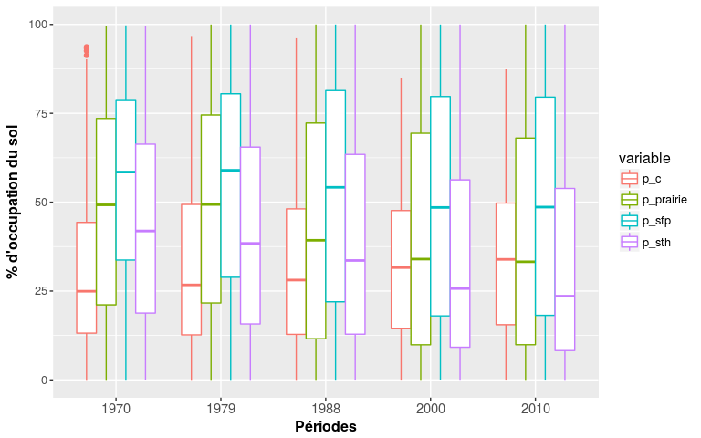
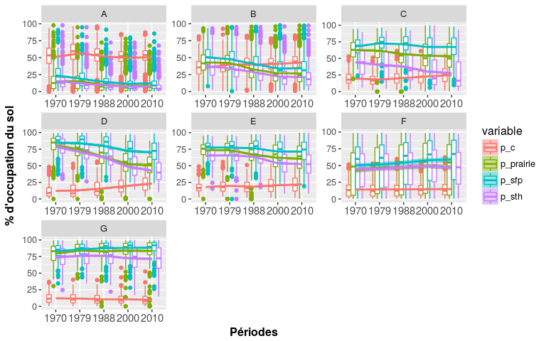
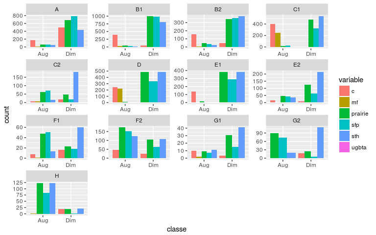
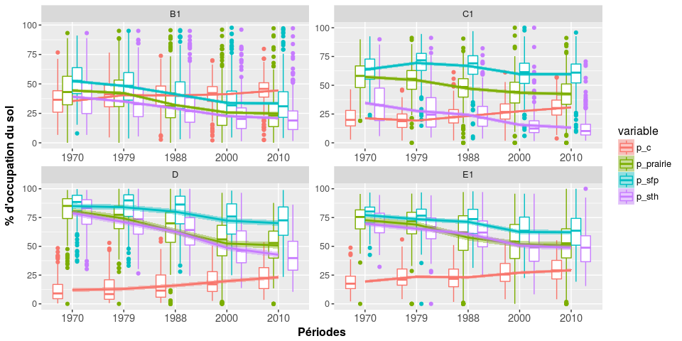
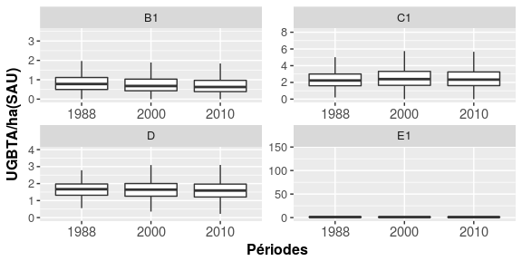

Analyse des données du recencement agricole
================
Jean-Baptiste Paroissien
17/01/2017

-   [Objectifs](#objectifs)
-   [Cartographie](#cartographie)
    -   [Occupation du sol](#occupation-du-sol)
    -   [Les UGB](#les-ugb)
-   [Statistiques descriptives](#statistiques-descriptives)
    -   [Courbes des fréquences cumulées et boxplot](#courbes-des-frequences-cumulees-et-boxplot)
    -   [Résumé des statistiques](#resume-des-statistiques)
-   [Analyse de l'évolution par stratification](#analyse-de-levolution-par-stratification)
    -   [Analyse des différences d'occupation](#analyse-des-differences-doccupation)
    -   [Zoom sur les principales régions concernées par les évolutions](#zoom-sur-les-principales-regions-concernees-par-les-evolutions)
    -   [Exploration et fouille de données](#exploration-et-fouille-de-donnees)

Objectifs
=========

Dans ce travail, les données du recensement agricole construites avec les scripts d'intégration de [FS\_bdd\_elab\_ra.Rmd](https://github.com/Rosalien/GISEDSol/tree/master/Fichiers_suivis/BDD/Suivis/FS_bdd_elab_ra.Rmd) sont analysées pour porter un regard sur la distribution spatiale et l'évolution de plusieurs variables d'occupation du sol en lien avec l'activité d'élevage. Cette étude exploratoire a pour objectif d'identifier les principales tendances des changements d'occupation du sol pour faciliter l'analyse de l'évolution des teneurs en carbone organique (voir [FS\_traitements\_bdat.Rmd](https://github.com/Rosalien/GISEDSol/tree/master/Fichiers_suivis/Traitements/Suivis/FS_traitements_bdat.Rmd) et [FS\_traitements\_bdatdiff.Rmd](https://github.com/Rosalien/GISEDSol/tree/master/Fichiers_suivis/Traitements/Suivis/FS_traitements_bdat.Rmd)).

Dans un premier temps, plusieurs cartographies des variables à analyser sont réalisées. Des statistiques descriptives sont ensuite développées. Celle-ci sont portées à l'échelle de la France et sur différents niveaux géographiques (classes de type de sol, principales grandes région d'élevage).

Cartographie
============

Pour ce travail, les cartes ont été générées avec le paquet **`ggplot2`** et la fonction [F\_carto.R](https://github.com/Rosalien/GISEDSol/tree/master/Fonctions/R/F_carto.R).

Occupation du sol
-----------------

Les figures suivantes

``` r
# Paramètres ###########################
tablecarto <- "dm_vecteurs.canton" 
period <- c("1970","1979","1988","2000","2010") #Périodes de temps prise en compte
variablecarto <- c("p_prairie","p_sth","p_sfp","p_mf","p_c")#variable(s) à cartographier
#variablecarto <- "p_prairie"
l_legend <- c("Prairie/SAU (%)","STH/SAU (STH)", "SFP/SAU (%)", "MFL/SAU (%)","Céréale/SAU (%)")# Nom des labels associés aux variables à cartographier. Vecteur utilisé pour les titres des cartes

nclasse <- 5 #Nombre de classes de valeurs pour la cartographie
style_classe <- "pretty" #"pretty"#"jenks"
couleur <- "Spectral"#nom de la palette couleur (selon RColorBrewer)display.brewer.all() pour connaître les différentes palettes

# Lancement
cpt <- 0
for(v in variablecarto){
  cpt <- cpt + 1
  nomfichier <- paste(v,style_classe,sep="")
  l_legendvaria <- l_legend[cpt]
  variablecarto <- paste(v,period,sep="")

  carto(dsn,tablecarto,variablecarto,nclasse,style_classe,couleur,l_legend,repsortie,nomfichier,dept=FALSE,reg=FALSE,nrowlayout=1,ncollayout=5,position="bottom",ggsaveheight=5,ggsavewidth=20)  
}
```

    

Les UGB
-------

``` r
# Paramètres ###########################
tablecarto <- "dm_vecteurs.canton" 
period <- c("1988","2000","2010") #Périodes de temps prise en compte
variablecarto <- "ugbta" #variable(s) à cartographier
#variablecarto <- "p_prairie"
l_legend <- "Densité d'UGBTA (UGBTA/SAU)" # Nom des labels associés aux variables à cartographier. Vecteur utilisé pour les titres des cartes

nclasse <- 5 #Nombre de classes de valeurs pour la cartographie
style_classe <- "quantile" #"pretty"#"jenks"
couleur <- "Spectral"#nom de la palette couleur (selon RColorBrewer)display.brewer.all() pour connaître les différentes palettes

# Lancement
cpt <- 0
for(v in variablecarto){
  cpt <- cpt + 1
  nomfichier <- paste(v,style_classe,sep="")
  l_legendvaria <- l_legend[cpt]
  variablecarto <- paste(v,period,sep="")

  carto(dsn,tablecarto,variablecarto,nclasse,style_classe,couleur,l_legend,repsortie,nomfichier,dept=FALSE,reg=FALSE,nrowlayout=1,ncollayout=3,position="bottom",ggsavewidth=18,ggsaveheight=5)  
}
```

Ici, on rajoute la carte sur les ugb tout aliments


Statistiques descriptives
=========================

Courbes des fréquences cumulées et boxplot
------------------------------------------

<figure>

<figcaption>
</figcaption>
</figure>
La distribution des valeurs par années et par type d'occupation du sol présentée dans la figure ci-dessous illustre également les même tendances.

``` r
melted.ra_occup <- melted.ra[melted.ra$variable != "ugbta",]

p <- ggplot(melted.ra_occup) +
            geom_boxplot(aes(x=annees,y=value,col=variable))+
            #scale_color_manual(values=colors,name="Années")+
            scale_x_discrete("Périodes")+scale_y_continuous("% d'occupation du sol")+
            theme(plot.title = element_text(size = 14, face = "bold"), 
                  text = element_text(size = 12),
                  axis.title = element_text(face="bold"),
                  axis.text.x=element_text(size = 11))
p  
```

<figure>

<figcaption>
</figcaption>
</figure>
Résumé des statistiques
-----------------------

Commenter les statistiques par périodes et type d'occupation du sol

<table class="kable_wrapper">
<tbody>
<tr>
<td>
|      |  Min.|  1st Qu.|  Median|   Mean|  3rd Qu.|   Max.|
|------|-----:|--------:|-------:|------:|--------:|------:|
| 1970 |  0.00|    13.16|   24.95|  29.57|    44.31|  93.68|
| 1979 |  0.00|    12.67|   26.73|  32.02|    49.36|  96.50|
| 1988 |  0.00|    12.80|   28.09|  31.10|    48.12|  96.11|
| 2000 |  0.04|    14.40|   31.60|  31.77|    47.64|  84.86|
| 2010 |  0.08|    15.52|   33.91|  33.25|    49.76|  87.36|

</td>
<td>
|      |  Min.|  1st Qu.|  Median|   Mean|  3rd Qu.|    Max.|
|------|-----:|--------:|-------:|------:|--------:|-------:|
| 1970 |     0|    21.12|   49.25|  47.55|    73.56|   99.67|
| 1979 |     0|    21.64|   49.34|  48.04|    74.53|  100.00|
| 1988 |     0|    11.60|   39.28|  42.40|    72.27|  100.00|
| 2000 |     0|     9.88|   33.99|  40.22|    69.39|  100.00|
| 2010 |     0|     9.90|   33.24|  39.74|    68.03|  100.00|

</td>
<td>
|      |  Min.|  1st Qu.|  Median|   Mean|  3rd Qu.|    Max.|
|------|-----:|--------:|-------:|------:|--------:|-------:|
| 1970 |  0.03|    33.72|   58.46|  55.14|    78.60|   99.74|
| 1979 |  0.00|    28.87|   58.97|  54.41|    80.50|  100.00|
| 1988 |  0.03|    21.98|   54.18|  51.70|    81.41|  100.00|
| 2000 |  0.08|    18.01|   48.51|  48.85|    79.73|  100.00|
| 2010 |  0.07|    18.16|   48.61|  49.05|    79.56|  100.00|

</td>
<td>
|      |  Min.|  1st Qu.|  Median|   Mean|  3rd Qu.|    Max.|
|------|-----:|--------:|-------:|------:|--------:|-------:|
| 1970 |  0.09|   18.810|   41.89|  43.64|    66.33|   99.57|
| 1979 |  0.00|   15.740|   38.39|  41.69|    65.49|  100.00|
| 1988 |  0.07|   12.860|   33.60|  39.02|    63.43|  100.00|
| 2000 |  0.04|    9.192|   25.71|  34.51|    56.27|  100.00|
| 2010 |  0.01|    8.240|   23.56|  33.03|    53.86|  100.00|

</td>
<td>
|      |  Min.|  1st Qu.|  Median|    Mean|  3rd Qu.|    Max.|
|------|-----:|--------:|-------:|-------:|--------:|-------:|
| 1988 |     0|     0.38|    0.83|  0.9876|     1.25|  144.00|
| 2000 |     0|     0.31|    0.76|  0.9240|     1.23|   16.57|
| 2010 |     0|     0.26|    0.72|  0.8982|     1.20|   57.43|

</td>
</tr>
</tbody>
</table>
Analyse de l'évolution par stratification
=========================================

<figure>

<figcaption>
</figcaption>
</figure>
Analyse des différences d'occupation
------------------------------------

Le graphique ci-dessous n'est pas très parlant. Pour mieux appréhender les zones où il y a eu pas mal de changements, nous pourrions sélectionner uniquement les cantons ayant connun un bouleversement de plus de X% (par exemple 25 ou 50%) et compter ces cantons par zones de stratification (façon histogramme, avec diminution ou augmentation de plus de X%).Il faudra également rajouter les UGB

<figure>

<figcaption>
</figcaption>
</figure>
<figure>

<figcaption>
</figcaption>
</figure>
Zoom sur les principales régions concernées par les évolutions
--------------------------------------------------------------

<figure>

<figcaption>
</figcaption>
</figure>
    ## <ggproto object: Class CoordCartesian, Coord>
    ##     aspect: function
    ##     distance: function
    ##     expand: TRUE
    ##     is_linear: function
    ##     labels: function
    ##     limits: list
    ##     range: function
    ##     render_axis_h: function
    ##     render_axis_v: function
    ##     render_bg: function
    ##     render_fg: function
    ##     train: function
    ##     transform: function
    ##     super:  <ggproto object: Class CoordCartesian, Coord>

<figure>

<figcaption>
</figcaption>
</figure>
Ici, prendre du recul sur l'occupation du sol et son évolution. On pourra s'appuyer sur d'autres types de graphiques, comme les boxplots avec des stats du type (% de prairies retournées...?)

``` r
# Lecture de la table de travail
#reg <- "54|23|83|25"
reg <- c("26","23","83","54","74","52","53","25","74")
melted.ra_reg <- melted.ra[melted.ra$code_reg %in% reg,]

p_variable <- cbind("p_prairie","p_sth","p_sfp")#,"p_mf")#,"p_c")

cpt <- 0
for(i in p_variable){
  cpt <- cpt + 1
  melted.raplot <- melted.ra_reg[melted.ra_reg["variable"] == i,]
  melted.raplot[,"annees"] <- as.factor(melted.raplot[,"annees"])
  melted.raplot[,"nom_region"] <- as.factor(melted.raplot[,"nom_region"])
  
  p <- ggplot(melted.raplot) +
            geom_boxplot(aes(x=annees,y=value,col=nom_region))+
            geom_smooth(aes(x=as.integer(annees),y=value,color=nom_region,fill=nom_region),method=loess)+
            scale_x_discrete("Années")+scale_y_continuous("Pourcentage")+labs(title=i)+
            theme(plot.title = element_text(size = 14, face = "bold"), 
                  text = element_text(size = 12),
                  axis.title = element_text(face="bold"),
                  axis.text.x=element_text(size = 11))
  
  ggsave(p,file = paste(repsortie,"evolregion",i,".png",sep=""), width = 15, height = 10)  
  }
  
  #tt <- do.call("grid.arrange",p)
  #ggsave(tt, file = paste("map_",reg,"_",v,".png",sep=""), width = 10, height = 10)  
```

``` r
##################Autre méthode#######################

sth <- c("p_sth1979","p_sth1988","p_sth2000","p_sth2010")
sfp <- c("p_sfp1979","p_sfp1988","p_sfp2000","p_sfp2010")

pdf(paste("STH_SFP.pdf",sep=""),width=7, height=7)
boxplot(mapcanton@data[,sth],at = 1:4 - 0.15,col = "white",xlab="Années",ylab="% de SAU",boxwex = 0.15,xaxt = "n",ylim=c(0,100))
axis(1, at = 1:4, labels=c("1979","1988","2000","2010"))
boxplot(mapcanton@data[,sfp],boxwex = 0.15,at = 1:4 + 0.15,col = "grey",xaxt = "n",outline=FALSE,add=TRUE,axes=FALSE)
box()
legend("bottomleft",c("sth", "sfp"),fill = c("white", "grey"),bty="n")
dev.off()

summary(mapcanton@data$p_sth1979)
summary(mapcanton@data$p_sth1988)
summary(mapcanton@data$p_sth2000)
summary(mapcanton@data$p_sth2010)
```

Boxplot pour le poitou charentes

``` r
# Lecture de la table de travail
reg <- "54" # Nom de la région à sélectionner
melted.RAreg <- sqlQuery(loc,paste("select * from ra.melted_RA where code_reg like '",reg,"'",sep=""))
melted.RAreg <- melted.RA[complete.cases(melted.RAreg),]

p1 <- ggplot(melted.RAreg, aes(x=as.factor(annees), y=value, col=variable))+
              geom_boxplot(alpha=0.7)+
              scale_x_discrete("Années")+scale_y_continuous("Pourcentage")+
              theme(plot.title = element_text(size = 14, face = "bold"), 
                    text = element_text(size = 12),
                    axis.title = element_text(face="bold"),
                    axis.text.x=element_text(size = 11))+
              scale_fill_brewer(palette = "Dark2")
p1
ggsave(p1, file = paste("boxplot_",reg,".png",sep=""), width = 10, height = 10)  
```

Exploration et fouille de données
---------------------------------

``` r
# Pour l'exploration, on se basera sur les fichiers sources du RA (différent melted)

dsn <- "PG:dbname='sol_elevage' host='localhost' port='5432' user='jb'" # Configuration de la connexion vers le PostGIS
varia <- c("p_sth","p_sfp","p_prairie") # Variable à analyser 
period <- c("1979","1988","2000","2010") #Période de temps
id <- c("code_canton","code_reg") #Nom de l'identifiant

variable <- paste()

# Lecture du postgis
mapcanton <- readOGR(dsn = dsn, "canton")

sth <- c("p_sth1979","p_sth1988","p_sth2000","p_sth2010")
sfp <- c("p_sfp1979","p_sfp1988","p_sfp2000","p_sfp2010")

mapcanton.active <- mapcanton@data[,c("corgox_med9094","corgox_med9599","corgox_med0004","corgox_med0509",sth,sfp)]
res.pca <- PCA(mapcanton.active, graph = FALSE)
fviz_pca_var(res.pca)

#fviz_pca_var(res.pca, col.var="cos2") +
#scale_color_gradient2(low="white", mid="blue", 
                    #high="red", midpoint=0.5) + theme_minimal()
```
